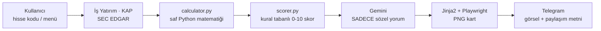

# 📊 Bilanço Radar

**QuaxisLabs** ürünü — BİST ve NASDAQ hisseleri için Telegram üzerinden çalışan,
**kural tabanlı** temel analiz botu. Kullanıcı bir hisse kodu yazar (veya bot
menüsünden seçer); sistem son çeyreklik finansal tabloları çeker (İş Yatırım +
KAP / SEC EDGAR), YoY/QoQ değişimlerini hesaplar, 10 üzerinden bir **Bilanço
Skoru** üretir, Gemini ile kısa sözel bir yorum ekler ve koyu temalı bir PNG
kart + paylaşıma hazır metin olarak Telegram'dan gönderir.

> ⚠️ Bu proje/repo yatırım tavsiyesi vermez; ürettiği her kart ve metin bunu
> açıkça belirtir. Amaç, dağınık finansal veriyi tek bakışta okunur hale
> getirmek — yatırım kararı vermek değil.

### 🧭 Öne çıkan ilke

> **Hiçbir sayıyı yapay zeka üretmez.** Yüzde değişim, oran, puan, tahmin —
> hepsinin arkasında test edilmiş, kural tabanlı Python matematiği var. Gemini
> API'si SADECE bu zaten hesaplanmış, Türkçe biçimlendirilmiş sayıları kısa bir
> cümleye çevirir; tek bir rakam bile üretmez, kopyalar. LLM devre dışı kalsa
> bile (kota, ağ hatası) kart yine üretilir — kural tabanlı bir yedek metinle.

## 🖼️ Ekran görüntüleri

<table>
<tr>
<td width="50%"></td>
<td width="50%"></td>
</tr>
<tr>
<td align="center"><b>Bilanço analizi kartı</b> — <code>THYAO</code> örneği:<br>gelir tablosu, bilanço, çeyreklik grafikler, artış/azalışlar, 6 bileşenli skor</td>
<td align="center"><b>/takvim</b> — Yaklaşan Bilanço Tarihleri:<br>kesinleşen (KAP bildirimi) ve tahmini (geçmiş davranış medyanı) tarihler ayrı bölümlerde</td>
</tr>
</table>

## ✅ Neler yapabiliyor

| Alan | Durum |
|---|---|
| **BİST** | Sanayi/ticaret (XI_29), konvansiyonel banka (UFRS), katılım bankası, sigorta (UFRS_K) — dördü de KAP tazelik yamasıyla |
| **NASDAQ/ABD** | SEC EDGAR üzerinden **herhangi bir ticker** (sabit bir listeyle sınırlı değil), $ para birimi, "FYyy Çn" mali dönem etiketi |
| **Değerleme** | Piyasa Değeri, F/K, PD/DD, FD/FAVÖK, FD/Hasılat, PD/EFK |
| **KAP entegrasyonu** | Son 90 günün önemli bildirimleri + kural tabanlı önem sınıflandırması |
| **Yorum** | Gemini ile sözel özet, LLM olmadan da çalışan güvenli yedek mod |
| **Takvim** | `/takvim` — kesinleşen (KAP) ve tahmini (istatistiksel) bilanço tarihleri, tek bakışta PNG kart |
| **Teknik Görünüm** | SMA/EMA/RSI/MACD/Bollinger/ATR/52 hafta/hacim — SKORSUZ, sinyalsiz, sadece olgu; temel analiz kartından görsel olarak ayrı bir kart |
| **Telegram UX** | Buton menüsü (`/menu`) + serbest metin ticker girişi, otomatik BİST/NASDAQ yönlendirmesi |
| **Kalite** | 569 test (gerçek Playwright render dahil), her yeni veri eşlemesi canlı bir referansla doğrulanır |

## 🔄 Nasıl çalışıyor



Hiçbir aşamada LLM'e ham finansal veri veya hesaplama görevi verilmez — 4.
aşamaya (Gemini) giden tek şey, 3. aşamada zaten üretilmiş, biçimlendirilmiş
bulgu listesidir.

## 🚀 Kurulum

```bash
cd bilanco-radar
python -m venv .venv
.venv\Scripts\activate        # Windows
pip install -r requirements.txt
playwright install chromium
copy .env.example .env        # ve API anahtarlarini gir (GEMINI_API_KEY, TELEGRAM_BOT_TOKEN)
```

## ▶️ Çalıştırma

```bash
python main.py
```

## 🧪 Test

```bash
pytest tests/ -v
```

## 📁 Daha fazla bilgi

Bu README genel bir tanıtımdır. Aşağıdaki "Faz Durumu" bölümü projenin faz faz
**detaylı değişiklik geçmişidir** — her fazda ne yapıldığı, hangi canlı hata
bulunup nasıl çözüldüğü, hangi kaynakla (Fintables, KAP, SEC EDGAR, kullanıcı
karşılaştırması) doğrulandığı satır satır kayıtlıdır. Modül modül mimari, veri
kaynağı eşlemeleri ve iş kuralları bu repoya dahil olmayan, geliştirme
sürecinde tutulan ayrı bir proje belleğinde tutulur.

## Faz Durumu

- [x] **Faz 1** — Proje iskeleti, config.py, loglama (dosya + konsol), .env
      yonetimi, temel test altyapisi.
- [x] **Faz 2** — `src/fetchers/isyatirim.py`: MaliTablo uc noktasindan
      ceyreklik bilanco/gelir tablosu cekme, XI_29/UFRS/UFRS_K otomatik
      grup tespiti, kumulatif->ceyreklik turetme, standart kalem eslemesi
      (sadece XI_29 dogrulandi). Demo: `python scripts/demo_fetch.py THYAO`.
      `src/fetchers/kap.py`: KAP'in guncel (Next.js) API'sinden bildirim
      cekme (`api/search/combined` + `api/disclosure/members/byCriteria`),
      kural tabanli onem siniflandirmasi, `get_top_disclosures()`. Demo:
      `python scripts/demo_kap.py TAVHL`.
- [x] **Faz 3** — `src/db/models.py`: Company/FinancialPeriod/Disclosure/
      GeneratedCard SQLAlchemy modelleri (PostgreSQL'e gecise hazir,
      `create_engine_and_session()` ile izole engine uretilebilir).
      `src/db/repository.py`: upsert_financials (mukerrer satir OLUSTURMAZ,
      var olan degeri gunceller), get_financials, save_disclosures (url
      benzersizligiyle dedup), get_recent_disclosures, is_data_fresh
      (onbellek kontrolu), save_generated_card. `src/analysis/calculator.py`
      henuz yapilmadi. Test: `pytest tests/test_db.py` (13 test, izole
      SQLite dosyasiyla, gercek data/bilanco_radar.db'ye dokunmaz).
- [x] **Faz 4 (kismi)** — `src/analysis/calculator.py`: LLM'siz saf matematik
      motoru. YoY (gelir tablosu) / QoQ (bilanco) degisim bloklari, marjlar
      (brut/FAVOK/net + puan degisimi), net borc/FAVOK (TTM), cari oran,
      ROE (yillikandirilmis/TTM), borc/ozkaynak, son 5 ceyrek serisi, LLM
      icin yapilandirilmis bulgu listesi. Kenar durumlari: zarar<->kar
      gecisleri (yuzde yerine ozel etiket), sifira bolme, eksik donem
      verisi, banka/sigortada FAVOK otomatik gizlenir (amortisman verisi
      yoksa). `src/analysis/scorer.py` (puanlama motoru) henuz yapilmadi.
      Test: `pytest tests/test_calculator.py` (40 test, esik sinirlari
      dahil elle hesaplanmis degerlerle).
- [x] **Faz 4** — `src/analysis/scorer.py`: kural tabanli, agirlikli 0-10
      puanlama motoru (LLM yok, gerekce metinleri f-string ile uretilir).
      Sanayi/holding varsayilan sablonu (6 bilesen, agirlik toplami %100):
      Nakit Uretimi/FAVOK %25, Kaldirac (net borc/FAVOK) %20, Karlilik %15,
      Buyume %15, Degerleme (F/K + PD/DD) %20, Bilanco Kalitesi %5. Fiyat
      verisi verilmezse Degerleme bileseni atlanir ve agirligi kalan
      bilesenlere orantisal yeniden dagitilir (ayni mekanizma her turlu
      eksik veri icin gecerli). Toplam skora gore rozet: 8+ SAGLAM, 6-8
      DENGELI, 4-6 KARISIK, <4 RISKLI. Esikler/agirliklar tek bir CONFIG
      sozlugunde. Banka (`score_bank`) ve sigorta (`score_insurance`) icin
      basit iskelet sablonlar da eklendi (ROE + degerleme + sektore ozgu,
      henuz fetcher katmaninda olmayan metrikler icin opsiyonel parametreler).
      Demo: `python scripts/demo_score.py` (fiyatli/fiyatsiz iki senaryo,
      bileşen tablosu). Test: `pytest tests/test_scorer.py` (39 test, esik
      sinirlari ve agirlik yeniden dagitimi dahil).
- [x] **Faz 5** — `src/ai/commentary.py`: hazir hesaplanmis rakamlari sozel
      yoruma cevirir. NOT: proje ilk tasarimda Anthropic Claude API'yi
      hedefliyordu; kullanicinin acik tercihiyle bu modul **Google Gemini
      API**'sine yazildi (REST generateContent, responseSchema ile
      yapilandirilmis JSON cikti). `config.py`'de ANTHROPIC_API_KEY/
      CLAUDE_MODEL -> GEMINI_API_KEY/GEMINI_MODEL olarak degistirildi.
      LLM'e HICBIR ham finansal tablo verilmez, sadece calculator/scorer
      ciktisindaki onceden Turkce formatlanmis (format_number_tr /
      format_currency_short) degerler + onemli KAP basliklari gonderilir;
      istemde "verilen sayilarin disinda sayi uretme" kurali acik yazili.
      Hata/yedek mod: ag hatasi/429/5xx'te 2 kez yeniden dene (toplam 3
      deneme), kalici hatada (401/400) hemen birak; JSON parse basarisiz
      OLURSA VEYA yanitta supheli bir metin artefakti (canli Gemini
      yanitinda gozlemlendi: modelin kendi kendine Ingilizce bir "dusunme
      notunu" bir alanin icine sizdirmasi) tespit edilirse BIR KEZ
      duzeltme istemi; tumu basarisiz olursa LLM'siz sablon tabanli
      mekanik ozete (`Commentary.source="fallback"`) duser -- bu fonksiyon
      hicbir kosulda bos donmez/hata firlatmaz. Zarardan kara / kardan
      zarara gecis bulgulari hem LLM istem kurallarinda hem de yedek
      modun kendi onceliklendirme mantiginda her zaman one alinir.
      Demo: `python scripts/demo_commentary.py` (API anahtari yoksa yedek
      modu, varsa gercek Gemini cagrisini gosterir). Test:
      `pytest tests/test_commentary.py` (26 test; JSON guvenligi, retry
      sayaci, 401'de yeniden denenmeme, supheli-artefakt tespiti, yedek
      mod oncelik kurali dahil, httpx.post monkeypatch ile ag istegi
      gondermeden).
- [x] **Faz 6** — `src/render/templates/card.html` (Jinja2) + `src/render/card.py`
      (Playwright chromium, device_scale_factor=2 PNG). Koyu "terminal
      rontgen" estetigi: sistem monospace font yigini (Google Fonts agi
      YOK -- cevrimdisi guvenilir render icin), uc bant (ust/acilis/alt),
      gelir tablosu + bilanco tablosu (renkli degisim sutunu), saf CSS
      mini bar grafikler (negatif ceyrekler kirmizi, sifir cizgisinin
      altinda), artis/azalis sutunlari, 6 bilesenli radar skoru tablosu
      (kullanici geri bildirimiyle rozet metni/basslik seridi kaldirildi,
      sadece sayi + renk ile ifade ediliyor), KAP notu kutusu. Banka/
      sigorta modunda (show_ebitda=False) FAVOK satiri/grafigi acik bir
      kosullu blokla gizlenir. `build_card_context()` domain nesnelerini
      (AnalysisResult/ScoreResult/Commentary) HICBIR sayi hesaplamadan
      duz bir context dict'ine cevirir. Kesif sirasinda `format_number_tr`'i
      "%" onekiyle zincirleyen her yerde (card.py/commentary.py/scorer.py)
      tutarli negatif yuzde bicimi icin `src/formatting.py`'ye paylasilan
      `format_percent_tr()` eklendi (formatting.py'nin hic testi yoktu,
      o da yazildi). Demo: `python scripts/demo_card.py`. Test:
      `pytest tests/test_card.py` + `tests/test_formatting.py` (26+16
      test; biri gercek Playwright PNG uretimini dogrular).
- [x] **Faz 7** — `src/bot/pipeline.py` (yeni orkestrasyon katmani) +
      `src/bot/telegram_bot.py` (python-telegram-bot v21+, async) +
      `main.py`. pipeline.py, Is Yatirim'in ham itemCode'lu verisini
      calculator.py'nin bekledigi standart alanlara cevirip DB'ye o
      sekilde yazar (repository.py'nin "orkestrasyon kataminda yapilacak"
      notunun karsiligi); SADECE XI_29 (sanayi/ticaret) semasi destekleniyor
      -- banka/sigorta/araci kurum (UFRS/UFRS_K) icin acik bir "desteklenmiyor"
      mesaji doner (varsayimsal parser yazilmadi). En guncel donem henuz
      aciklanmamissa bir ceyrek geriye kayip dener, basarili olursa
      kullaniciya inline Evet/Hayir butonuyla onceki donemi sorar. Butun
      senkron/agir isler (fetch, Playwright) `asyncio.to_thread` ile
      sarilir. Kullanici basina dakikada 3 istek siniri + ayni kullanicinin
      isi bitmeden ikinci istek atamamasi (bellek-ici). Komutlar: /start,
      /son (son 5 kart -- NOT: kullanici bazinda degil, bot genelinde;
      GeneratedCard semasinda chat_id yok), /hakkinda. Canli THYAO ile
      uctan uca dogrulandi (gercek Is Yatirim + KAP verisi, gercek Gemini
      yorumu, gercek PNG). Demo: `python scripts/demo_pipeline.py THYAO`
      (Telegram'siz). Test: `pytest tests/test_pipeline.py` (16 test,
      izole tmp_path DB + sahte fetcher'larla) + `tests/test_telegram_bot.py`
      (18 test, ticker normalizasyonu + hiz siniri).
- [x] **Faz 7 (kullanici geri bildirimi sonrasi duzeltmeler)** —
      (1) **Donem tespiti kritik hata duzeltmesi**: canli TAVHL testinde
      sirket, `guess_last_periods()`'un 75 gunluk tutucu tahmininden cok
      daha erken 2. ceyregi acikladigi halde bot hala 1. ceyregi
      gosteriyordu -- tahmin sadece "asiri iyimser" durumu (henuz
      aciklanmamis donem istemek) ele aliyordu, "asiri kotumser" durumu
      (sirket zaten daha yenisini acikladi) hic kontrol etmiyordu.
      `pipeline._find_true_newest_period()` artik tahminin 1-2 ceyrek
      ILERISINI de (bitmis ceyreklerle sinirli) hafif bir problama
      istegiyle kontrol ediyor. Kesif sirasinda bir API tuhafligi da
      bulundu: TEK BASINA bir donem sorulunca (baska donem eklenmeden)
      uc nokta o donem hicbir grupta yoksa TAMAMEN BOS yanit donuyor,
      bu da fetch_financials'i yanlislikla "sirket bulunamadi" sandiriyor
      -- duzeltme, probe isteklerine dogru financial_group + birkac
      bilinen-dolu donemi de ekliyor. (2) **Canli fiyat eklendi**:
      `isyatirim.fetch_latest_price()` (kesfedilen/dogrulanan uc nokta:
      HisseTekil, startdate/enddate DD-MM-YYYY zorunlu, son eleman en
      guncel kapanis) -- supplementary veri, basarisiz olursa kart
      fiyatsiz uretilir. (3) **Kart yeniden tasarlandi**: kullanici
      geri bildirimiyle DIKEY'den YATAY tek-kare (1600px genislik,
      CSS Grid, Fintables tarzi paylasim karti referans alindi) duzene
      gecildi; "BİLANÇO RADAR" markasi kaldirilip ticker kod kendisi
      buyuk/kalin baslik yapildi; fiyat basligin saginda gosteriliyor;
      radar skoru sutunu kompakt (sadece bilesen adi + puan, uzun
      gerekce metni karttan kaldirildi, sadece kod icinde/loglarda kalir).
      Test: `pytest tests/test_pipeline.py` guncellendi (TAVHL senaryosunun
      regresyon testi dahil, 18 test).
- [x] **Faz 8 (degerleme carpanlari + kart okunurlugu)** —
      (1) **Piyasa degeri artik gercekten hesaplaniyor**: `isyatirim.py`'ye
      odenmis sermaye (itemCode `2OA`) eklendi, `pipeline.py` bunu
      `_STOCK_FIELDS`'e ekleyip fiyatla birlikte `calculator.compute_valuation()`'a
      veriyor. Onceden Degerleme bileseni (agirlik %20) fiyat/sermaye hic
      pipeline'a verilmedigi icin HER ZAMAN atlaniyordu -- artik F/K ve
      PD/DD gercek veriyle hesaplanip `scorer.score_industrial()`'a
      besleniyor. (2) **Yeni carpanlar**: `Ratios`'a `net_debt`,
      `ttm_ebitda`, `ttm_revenue`, `ttm_operating_profit`, `ttm_net_income`
      eklendi; yeni `calculator.ValuationMetrics` + `compute_valuation()`
      Piyasa Degeri, Net Borc, F/K, PD/DD, FD/FAVOK, FD/Hasilat, PD/EFK
      hesaplar (BIST'te nominal pay degeri 1 TL oldugu icin sermaye = pay
      adedi varsayimiyla). Kart ustune yeni bir DEGERLEME bolumu eklendi.
      (3) **Kart okunurlugu**: bolum baslik fontlari buyutuldu/kalinlastirildi
      (arka plan vurgusuyla artik kaybolmuyor), gelir tablosu/bilanco
      bolumlerine tam cerceve + daha buyuk tablo fontu eklendi, RADAR SKORU
      panelinde her bilesenin **nominal agirligi** ve kisa gerekcesi artik
      gorunur (kullanicinin "hangi konuya ne kadar puan verdigimiz net
      olmali" talebi). Agirlik/esik gerekceleri `SCORING_METHODOLOGY.md`'de
      belgelendi. Test: `pytest tests/` (243 test, 8 yeni: compute_valuation
      + kart bicimlendirme).
- [x] **Faz 9 (NASDAQ/ABD veri katmani)** — SADECE veri katmani (analiz/kart
      Faz 10'da). `src/fetchers/sec_edgar.py`: SEC EDGAR companyfacts
      uc noktasindan (`data.sec.gov/api/xbrl/companyfacts/CIK##########.json`,
      API anahtari gerekmez) NASDAQ/ABD sirketlerinin ceyreklik finansal
      verisini ceker. AAPL (urun sirketi), NVDA (takvim yiliyla ORTUSMEYEN
      mali yil -- Ocak sonu biter) VE JPM (banka, XI_29/UFRS ayrimindaki
      gibi FARKLI kalem seti) ile CANLI dogrulandi (bkz.
      `data/exploration/{AAPL,NVDA,JPM}_ozet_*.txt`). **Kesifte bulunan
      canli hata**: SEC'in `fy`/`fp` alanlari fact'in KENDI donemine gore
      degil, ICINDE GECTIGI dosyalamaya (10-Q/10-K) gore atanmis -- bir
      ceyregin bilancosu HEM "bu ceyrek sonu" HEM "onceki mali yil sonu"
      (karsilastirma) kolonunu AYNI (fy,fp) etiketiyle tasiyabiliyor;
      `_select_best_fact()` bunu 'en buyuk end tarihi' kurallyla ayirt
      eder (regresyon testi: `test_aapl_ardisik_ceyreklerde_bilanco_degeri_TEKRARLANMAZ`).
      Kumulatif->ceyreklik turetme `isyatirim.quarterly_value_from_cumulative`
      ile AYNI ilkeyle (`quarterly_value_from_cumulative_us_gaap`) yapildi.
      `models.Company`'ye `market` sutunu ("BIST"/"NASDAQ", ALTER TABLE ile
      geriye donuk migrate edilir, gercek DB kopyasiyla canli test edildi) +
      `financial_group="US_GAAP"` eklendi; ticker cakisma riski (fetcher
      seviyesinde degil) `repository.TickerMarketConflictError` ile
      SESSIZCE EZMEK yerine REDDEDILEREK ele alindi (bkz. sinif docstring'i --
      composite PK'ye GECILMEDI, olgun BIST kod yolunun kapsam disi riskli
      refactoru olurdu). `pipeline._standardize_to_records_us_gaap()`
      DB'ye XI_29 ile AYNI alan adlariyla yazar. Fiyat: yfinance yerine
      onun da kullandigi ayni genel query1.finance.yahoo.com uc noktasina
      dogrudan httpx ile gidiliyor (stooq CSV CANLI denendi, artik JS
      bot-dogrulamasi donduruyor, REDDEDILDI). Demo:
      `python scripts/demo_fetch_us.py AAPL`. Test: `pytest tests/` (399
      test, 23 yeni: test_sec_edgar.py + test_pipeline.py/test_db.py ek).
- [x] **Faz 10 (NASDAQ/ABD analiz -> skor -> kart hattı)** — Faz 9'un veri
      katmanı analiz/skor/kart'a bağlandı. `calculator.analyze_us()`:
      `analyze()` ile TAMAMEN AYNI `_build_analysis_result()` çekirdeğini
      kullanır (KOPYALANMADI), sadece `currency='USD'` farklıdır (yeni
      `AnalysisResult.currency` alanı, varsayılan `'TRY'` — 399 BIST testi
      ETKİLENMEDİ). FAVÖK: US GAAP'te BIST'teki dar/geniş faaliyet kârı
      ayrımı YOK — `OperatingIncomeLoss + D&A` kullanıldı (CANLI doğrulandı:
      AAPL FY2024 = $134,66 mr, kamuya açık FAVÖK rakamıyla birebir eşleşti);
      `pipeline._standardize_to_records_us_gaap()` bu yüzden
      `operating_profit_ebitda_base`'i `operating_profit` ile AYNI yazar,
      `calculator.ebitda()` hiçbir değişiklik gerektirmeden çalışır. Enflasyon:
      BIST tarafında da reel büyüme düzeltmesi zaten UYGULANMIYOR (bilinen
      sınır B6) — ABD için bu doğru davranış (TÜFE ~%2-4, TL'ye kıyasla
      önemsiz), ek mantık EKLENMEDİ. `scorer.CONFIG['abd_sanayi']`: aynı 7
      bileşen/ağırlık (%100), SADECE değerleme (F/K ucuz 12/makul 20/pahalı
      30/tavan 50, PD/DD ucuz 1,5/makul 3/pahalı 6/tavan 12 — S&P 500 CANLI
      araştırıldı, GuruFocus/Multpl/MacroMicro) ve büyüme (güçlü eşik %15→%10,
      taban −20→−15 — enflasyon farkı) eşikleri kalibre edildi; kaldıraç AYNEN
      korundu (Moody's/S&P kaldıraç bantları evrensel). Gerekçeler:
      `SCORING_METHODOLOGY.md`. `card.build_us_card_context()`:
      `build_card_context()`'in `_line_item_row`/`_build_chart`/
      `_valuation_context` gibi TÜM yardımcılarını `currency_symbol="$"` ile
      ÇAĞIRIR — `card.html` şablonuna HİÇBİR satır EKLENMEDİ (`sector_template:
      "abd"` zaten var olan `` — sanayi şeklindeki — dala düşüyor,
      canlı doğrulandı: şablonda hiçbir yerde "₺" hardcode edilmemiş). Mali
      dönem takvim çeyreği yerine "FYyy Çn" (örn. "FY26 Ç3") gösterilir —
      NVDA gibi mali yılı takvim yılıyla örtüşmeyen şirketlerde "1Ç27" gibi
      bir etiket YANLIŞ (uydurma) takvim izlenimi verirdi.
      `commentary.py`: Gemini'ye gönderilen istem metnindeki para birimi
      sembolü artık `analysis.currency`'den okunuyor (CANLI hata bulundu:
      ÖNCEDEN `format_currency_short()` HER YERDE varsayılan "₺" kullanıyordu
      — ABD kartları için Gemini'ye YANLIŞ para birimli rakamlar
      gönderiliyordu, LLM bunu kendi Türkçe özetine SIZDIRABİLİRDİ).
      `run_pipeline(ticker, market="BIST"|"NASDAQ")`: NASDAQ dalında KAP/8-K
      YOK (kapsam dışı, `disclosures_db` her zaman boş liste), İş Yatırım'a
      özgü ileri-probe (`_has_newer_period_available`) SADECE BIST için
      çağrılır (SEC EDGAR zaten her seferinde gerçek en yeni dönemi bulur).
      **CANLI HATA bulundu ve düzeltildi** (`repository.upsert_financials`):
      brand-new bir NASDAQ ticker'ı ilk kez yazılırken Company satırı ÖNCE
      varsayılan `market="BIST"` ile oluşuyor, HEMEN ARDINDAN gelen
      `set_company_info(market="NASDAQ")` bununla ÇAKIŞIYOR ve HER TEK yeni
      NASDAQ ticker'ında `TickerMarketConflictError` fırlatıyordu —
      `upsert_financials(..., market=...)` parametresi eklenerek satır
      BAŞTAN doğru market'le oluşturulacak şekilde düzeltildi. Demo:
      `python scripts/demo_pipeline_us.py AAPL` — AAPL/NVDA/INTC (zarar
      açıklayan şirket, TTM net zarar) ile CANLI uçtan uca doğrulandı;
      üretilen F/K değerleri stockanalysis.com ile karşılaştırıldı (AAPL
      34,97 vs 35,44 — %1,3 fark; NVDA 30,44 vs 30,74 — %1,0 fark; INTC'nin
      TTM net zararı $-11,29 mr, stockanalysis.com'un belirttiği $11,29 mr
      zararla BİREBİR eşleşti) — ikisi de %5 eşiğinin ALTINDA. Test:
      `pytest tests/` (418 test, 19 yeni: test_calculator_us.py +
      test_scorer_us.py + test_card_us.py, hiçbir regresyon yok).
- [x] **Faz 10.1 (veri doğruluğu düzeltmeleri — kullanıcı raporu, 2026-08-02)** —
      Kullanıcı AAPL kartını sosyal medyada paylaşılan gerçek "Q3'26 earnings
      highlights" ile karşılaştırdı ve GELİR TABLOSU'ndaki rakamların (Satışlar
      $364,4 mr) gerçek çeyreklik rakamla ($109,42 mr) UYUŞMADIĞINI bildirdi.
      **Kök neden**: `analyze_us()` BIST'in KÜMÜLATİF (9 aylık YTD) gösterim
      konvansiyonunu miras almıştı — BIST'te doğru (Fintables/Matriks
      konvansiyonu) ama ABD earnings-raporlama kültüründe SADECE tek çeyreklik
      rakam "headline" sayılır. Çeyreklik türetme MATEMATİĞİ zaten baştan
      DOĞRUYDU ($109,417 mr — kullanıcının kaynağıyla 3 kuruş farkla eşleşti);
      sorun SADECE hangi rakamın öne çıkarıldığıydı. **Düzeltme**:
      `_build_analysis_result(..., use_cumulative_display=False)` — `analyze_us()`
      artık GELİR TABLOSU/bulgu listesinde TEK ÇEYREKLİK rakam gösterir,
      `analyze()` (BIST) DEĞİŞMEDİ. **Ek doğrulamalar**: MSFT (Q4, ANNUAL-9AY
      türetme yolu) — $90,01 mr hasılat/$35,77 mr net kâr/$40,6 mr esas
      faaliyet kârı, web araştırmasıyla BİREBİR eşleşti; Alphabet'in
      "$112,1 mr net kâr" gibi olağandışı görünen bir rakamının GERÇEK
      olduğu (tek seferlik $98 mr gerçekleşmemiş yatırım kazancı) canlı
      araştırmayla doğrulandı — VERİ HATASI değildi. **10 resmi NASDAQ
      hissesinin (AAPL/TSLA/NVDA/MSFT/GOOGL/AMZN/META/NFLX/AMD/PYPL) TAMAMI**
      canlı tarandı: hepsinde hasılat/net kâr/toplam varlık/pay adedi doğru
      geliyor; 5'inde (GOOGL/AMZN/META/NFLX/PYPL) "Brüt Kâr" N/A (bu
      şirketlerin XBRL verisinde GrossProfit tag'i güncel dönemde YOK —
      kod hatası değil, bilinen veri sınırı, bkz. `06_BILINEN_SORUNLAR.md`
      B13). **Ayrıca**: META'da Piyasa Değeri/F-K/PD-DD hiç hesaplanamıyordu
      (hem `dei:EntityCommonStockSharesOutstanding` hem `us-gaap:CommonStockSharesOutstanding`
      META'da YOK) — üçüncül yedek (`WeightedAverageNumberOfDilutedSharesOutstanding`,
      dönem ortalaması) eklendi, macrotrends.net ile BİREBİR eşleşti. Şirket
      logoları da düzeltildi: `company_logo.py` TradingView aramasını HER ZAMAN
      "BIST:" öneki ile yapıyordu, bu yüzden hiçbir NASDAQ kartında logo
      görünmüyordu — `market="NASDAQ"` için "NASDAQ:" sonra "NYSE:" fallback
      eklendi (JPM SADECE NYSE ile bulunuyor).
      **Devam eden düzeltmeler (kullanıcı yeniden istedi — "diğer 5 hissedeki
      brüt kârı da türetip doğrula")**: GOOGL/AMZN/META/NFLX'te "Brüt Kâr"ın
      HER ZAMAN N/A çıktığı bulundu (bu 4 şirket "GrossProfit" tag'ini güncel
      dönemde hiç kullanmıyor) — `gross_profit_us_gaap()` eklendi: doğrudan
      tag yoksa Hasılat − Maliyet (`CostOfRevenue`/`CostOfGoodsAndServicesSold`)
      türetir, stockanalysis.com ile BİREBİR doğrulandı (GOOGL $73,853mr,
      AMZN $104,828mr, NFLX $6,523mr). PYPL'de hiçbir maliyet tag'i yok, N/A
      doğru kalıyor. Ayrıca **kritik bir çeyreklik-türetme hatası** bulundu:
      GOOGL 2025 Ç1→Ç2 arasında XBRL etiketini değiştirmiş
      (`RevenueFromContractWithCustomer...` → `Revenues`) — eski kod iki
      dönemi AYNI tek etikette aradığı için "Satışlar (karşılaştırma)"
      satırı sessizce "veri yok" gösteriyordu; `quarterly_standardized_value_us_gaap()`
      artık her dönemi ayrı ayrı (tüm aday etiketleri deneyerek) çözüp SONRA
      çıkarıyor, etiket değişikliğine dayanıklı. Test: `pytest tests/`
      (432 test, 14 yeni, hiçbir regresyon yok).
- [x] **Faz 11 (buton menü arayüzü, 2026-08-02)** — Bot düz-metin-ticker'dan
      butonlu menüye taşındı: `/start`/`/menu` → 📊 Bilanço Analizi (🇹🇷 BİST /
      🇺🇸 NASDAQ) → 📅 Yaklaşan Bilanço Tarihleri (Faz 12/13 için iskelet,
      şimdilik "yakında" mesajı) → 🕘 Son Kartlar → ℹ️ Hakkında, her alt menüde
      "⬅️ Geri". Menü mantığı yeni `src/bot/menu.py` (123 satır) modülüne
      çıkarıldı: navigasyon TAMAMEN `callback_data` içine gömülü (örn.
      `"menu:analiz:nasdaq"`, hepsi 64 byte sınırının altında) — süreç yeniden
      başlasa bile butonlar çalışır. SADECE "hisse kodu bekleniyor" durumu
      `context.user_data["bekleyen_islem"]` içinde TTL'li (10 dk) tutulur;
      süresi dolarsa `handle_ticker_message` sessizce varsayılan BİST akışına
      döner. **Geriye uyumluluk KORUNDU**: kullanıcı menüye hiç girmeden
      doğrudan "THYAO" yazarsa aynen eskisi gibi çalışır (varsayılan market
      BİST, `normalize_ticker_input()` ikinci bir `market` parametresi aldı
      ama varsayılanı `"BIST"`). NASDAQ ticker doğrulaması ayrı bir regex
      (`^[A-Z]{1,5}(\.[A-Z])?$`) ile eklendi — BRK.B gibi sınıf ekli
      sembolleri destekler. `run_pipeline(..., market=...)` artık Telegram
      botundan da NASDAQ ile çağrılabiliyor (Faz 10'dan beri motor hazırdı,
      bota hiç bağlanmamıştı). Menü mesajları her tıklamada `edit_message_text`
      ile güncellenir, yeni mesaj atılmaz. **NASDAQ kapsamı doğrulandı**:
      SEC EDGAR fetcher `company_tickers.json` üzerinden CIK'i ARAR — sabit
      10 hisseyle SINIRLI DEĞİL, herhangi bir SEC'e kayıtlı ticker çalışır
      (canlı doğrulandı: `COST`, önceden test edilen 10 hissenin DIŞINDA,
      `scripts/demo_pipeline_us.py COST` ile uçtan uca başarılı). Bilinen
      sınır DEĞİŞMEDİ: bankalar/sigortalar için "revenue" gibi bazı kalemler
      N/A kalabilir (US GAAP şeması sadece sanayi/ürün şirketleri için
      doğrulanmış, bkz. `06_BILINEN_SORUNLAR.md` B11). Test:
      `pytest tests/` (485 test, 53 yeni — `tests/test_menu.py` + genişletilmiş
      `tests/test_telegram_bot.py`, hiçbir regresyon yok). Canlı doğrulama:
      `python main.py` ile bot başlatıldı, Telegram `getMyCommands` ile
      `/menu` komutunun kayıtlı olduğu doğrulandı.
- [x] **Faz 11.1 (MSFT FAVÖK eksikliği düzeltmesi — kullanıcı raporu, 2026-08-02)** —
      Kullanıcı MSFT kartında GELİR TABLOSU'nun 5 yerine 4 metrik gösterdiğini
      bildirdi (FAVÖK satırı tamamen kayboluyordu, tablo görsel olarak eksik/
      dengesiz görünüyordu). **Kök neden**: MSFT, AAPL/NVDA/JPM'nin kullandığı
      birleşik D&A tag'lerinin (`DepreciationDepletionAndAmortization`/
      `DepreciationAmortizationAndAccretionNet`) HİÇBİRİNİ raporlamıyor —
      amortismanı `Depreciation` (maddi duran varlık) + `AmortizationOfIntangibleAssets`
      (maddi olmayan duran varlık) olarak İKİ AYRI XBRL satırında tutuyor.
      **Düzeltme**: `sec_edgar.depreciation_amortization_us_gaap()`/
      `quarterly_depreciation_amortization_us_gaap()` eklendi — `gross_profit_us_gaap()`
      ile AYNI desen (birleşik tag öncelikli, yoksa iki bileşen TOPLANIR, sadece
      biri varsa None). CANLI DOĞRULANDI (web araması, gurufocus.com): MSFT
      FY26 Ç3 hesaplanan D&A $10,1mr, dış kaynağın raporladığı $10.167mr ile
      %1'in ALTINDA farkla eşleşti; kart yeniden render edildi, FAVÖK satırı
      artık görünüyor. Ayrıca kullanıcının "tüm NASDAQ hisseleri render
      edilebiliyor mu" sorusu için `COST` (önceden test edilmemiş) ve `ADBE`
      canlı test edildi — ikisi de 5/5 metrikle uçtan uca başarılı. Test:
      `pytest tests/` (488 test, 3 yeni — `tests/test_sec_edgar.py`, hiçbir
      regresyon yok).
- [x] **Faz 11.2 ("SKHY bulunamadı" mesaj netliği + AAPL logo araştırması, 2026-08-02)** —
      Kullanıcı "SKHY" (SK hynix) arattığında bot "bulamadım" diyordu; kök neden SK
      hynix'in SEC'te KAYITLI olması ama ABD GAAP/XBRL raporlamayan yabancı bir özel
      ihraççı olması (gerçek bir veri sınırı, kod hatası değil) — eski mesaj bunu
      "yazım hatası" gibi gösteriyordu. `pipeline.FinancialDataNotFoundError`
      eklendi (`TickerNotFoundError`'dan ayrı), bot artık sebebi açıkça belirten
      bir mesaj gösteriyor. AAPL logo şikayeti CANLI olarak reprodüklenemedi —
      hem doğrudan hem tam pipeline testinde logo doğru geldi; muhtemelen
      TradingView arama uç noktasının geçici bir hatasıydı (tasarım gereği
      kalıcı önbelleğe yazılmaz, kendiliğinden düzelir), bu yüzden kod
      değişikliği yapılmadı. Test: `pytest tests/` (491 test, 3 yeni —
      `tests/test_pipeline.py`, hiçbir regresyon yok).
- [x] **Faz 12 (Yaklaşan Bilanço Tarihleri — VERİ katmanı, 2026-08-02)** — BİST için
      "hangi şirket ne zaman bilanço açıklayacak" sorusuna cevap veren tek bir resmi
      API yok — üç yaklaşım araştırılıp (hepsi canlı doğrulandı) güven seviyesine göre
      birleştirildi: (1) KAP **"Finansal Takvim"** bildirimi — kesin ama opsiyonel
      (TAVHL/ASELS yayınlıyor, THYAO yayınlamıyor); (2) geçmiş **"Finansal Rapor"**
      yayın tarihlerinin medyanı — tahmini (THYAO ~37 gün, TAVHL ~27,5 gün, ASELS
      ~35,5 gün, dönem sonundan); (3) **SPK II-14.1 Tebliği** yasal son tarih — her
      zaman hesaplanabilir fallback (yıllık 60/70 gün, ara dönem 30/40+10 gün,
      resmi tatil kayması dahil). NASDAQ için üç aday karşılaştırıldı (Finnhub API
      anahtarı istiyor, Yahoo artık "crumb" oturum tokenı istiyor) —
      **`api.nasdaq.com/api/calendar/earnings`** seçildi (kayıtsız, günlük tüm
      piyasayı tek istekte döndürüyor). Yeni `src/fetchers/earnings_calendar.py`
      (490 satır) + `earnings_calendar` DB tablosu (`repository.upsert_earnings_calendar()`/
      `get_upcoming_earnings()`/`is_earnings_calendar_fresh()`). **Görsel/bot
      entegrasyonu bu fazın KAPSAMI DIŞINDA** (görev talimatı gereği — Faz 13'ün
      konusu; menü hâlâ "yakında eklenecek" gösteriyor). Demo:
      `python scripts/demo_takvim.py bist|nasdaq`. Test: `pytest tests/`
      (537 test, 46 yeni — `tests/test_earnings_calendar.py` + `tests/test_db.py`
      genişletmesi, hiçbir regresyon yok).
- [x] **Faz 13 (Takvim kartı görseli + bot entegrasyonu, 2026-08-02)** — Faz 12'deki
      takvim verisi paylaşılabilir bir PNG'ye ve bota bağlandı.
      **Render altyapısı genelleştirildi**: `card.render_card()`/`render_html()`
      artık `template_name`/`screenshot_selector` parametreleri alıyor (varsayılan
      `"card.html"`/`"#card"` ile TÜM mevcut çağrılar değişmeden çalışır) — bu,
      Faz 14/16/19'un da tabanı. Yeni `src/render/templates/calendar_card.html` +
      `src/render/calendar_card.py::build_calendar_context()`: 1200px sabit
      genişlik, yükseklik TAMAMEN içeriğe göre doğal oluşuyor (sabit bir
      min-height YOK — az kayıtla kart kısa kalır, boş alanla uzatılmaz; çok
      kayıtla doğal olarak büyür). **Kapsam kararı (kullanıcıyla netleştirildi)**:
      kart SADECE `kesin`+`tahmini` güven seviyelerini gösterir, `son_tarih`
      (SPK yasal fallback — taranan HER şirket için her zaman hesaplanabilir)
      BİLEREK dışlanır, yoksa kart pratikte taranan tüm evreni listeler ve
      "gerçek beklenti" ile "yasal tavan" arasındaki fark kaybolurdu. Tarihe
      göre gün gün gruplama, bugün amber sol bordürle vurgulanır, güven rozeti
      (kesin=yeşil dolu, tahmini=amber çerçeveli) + lejant. Yeni orkestrasyon
      (`src/bot/pipeline.py::refresh_earnings_calendar()`/`get_cached_earnings_calendar()`/
      `is_earnings_calendar_fresh()`): BIST100 yaklaşımı ticker başına 1-4 KAP
      isteği gerektirdiği için birkaç dakika sürebiliyor — bu yüzden **Telegram
      botu bunu ASLA senkron tetiklemez**, sadece DB önbelleğini okur; önbellek
      ayrı bir zamanlanmış script'le (`scripts/refresh_takvim_cache.py`, cron/Görev
      Zamanlayıcı ile günde 1-2 kez) doldurulur. `/takvim` komutu + `menu:takvim:bist/nasdaq`
      artık gerçek görsel + kopyala-yapıştır metni (X_BUYUME_RAPORU.md kalıp ⑤
      biçiminde) gönderiyor. Demo: `python scripts/demo_takvim_karti.py bist|nasdaq`.
      Test: `pytest tests/` (555 test, 18 yeni — `tests/test_calendar_card.py` +
      `tests/test_pipeline_takvim.py`, hiçbir regresyon yok).
- [x] **Faz 13.1 (kullanıcı ortamında canlı çökme düzeltmesi, 2026-08-02)** —
      `demo_takvim_karti.py nasdaq` **çöktü**: `fetch_upcoming_nasdaq()` NASDAQ-100 ile
      SINIRLI olmadığı için (bkz. `06_BILINEN_SORUNLAR.md` §B15) 10 günlük bir pencerede
      2287 kayıt döndü, Chromium bu kadar satırlı elementin ekran görüntüsünü alamadı
      (`CardRenderError: Page.captureScreenshot: Unable to capture screenshot`).
      `build_calendar_context(max_rows=60)` eklendi — tavanı aşan kayıtlar günü YARIDA
      keserek kırpılır, hem karta hem paylaşım metnine "+N kayıt daha" notu düşer. Kök
      sorun (NASDAQ kapsamının daraltılmaması) BİLEREK açık bırakıldı, bu sadece render
      katmanını KALICI olarak çökmeye karşı korur. Test: `pytest tests/` (559 test, 4
      yeni, hiçbir regresyon yok).
- [x] **Faz 13.2 (KRİTİK — "Türkçe I" hatası düzeltmesi, kullanıcı raporu, 2026-08-02)** —
      Kullanıcı gerçek bir X paylaşımıyla karşılaştırınca takvim kartımızda BİMAS/İş
      Bankası/Enka gibi dev şirketlerin HİÇ olmadığını fark etti. Kök neden: KAP'in
      arama API'si "I" harfini Türkçe kurala göre NOKTASIZ "ı"ya çevirip dönüyor
      (`BIMAS` → `bımas`), `kap.normalize_ticker()` ise düz Python `.lower()`
      kullandığı için `bimas` (NOKTALI i) üretiyordu — ikisi FARKLI karakter,
      `search_company()` SESSİZCE başarısız oluyordu. "I" harfi içeren HER ticker
      (BIMAS, ISCTR, ENKAI, ISBTR, SISE...) etkileniyordu. Modülde bu TAM sorunu
      çözen `_turkish_lower()` zaten VARDI ama `normalize_ticker()` onu
      KULLANMIYORDU. Düzeltildi + BİST önbelleği `--top 100` ile yeniden dolduruldu.
      Test: `pytest tests/` (561 test, 2 yeni, hiçbir regresyon yok).
- [x] **Faz 13.3 (KRİTİK — Telegram fotoğraf boyut sınırı, kullanıcı raporu, 2026-08-02)** —
      `/takvim` sadece metin gönderiyordu, görsel HİÇ gelmiyordu. Bot logları:
      `telegram.error.BadRequest: Photo_invalid_dimensions` — `max_rows=60` tavanına
      rağmen 57 satır/16 gün grubu içeren gerçek bir kart 2400x8924 piksele ulaşmıştı
      (Telegram sınırı: genişlik+yükseklik <= 10000). Kontrollü render'larla GERÇEK
      piksel yüksekliği kalibre edildi (`844 + 98×satır + 162×grup`, 4 nokta tam
      doğrusal) ve bu formülü kullanan bir piksel bütçesi eklendi — satır sayısı
      tavanı ve piksel bütçesinden hangisi önce dolarsa orada kesiliyor. Aynı 57
      satırlık veriyle şimdi 2400x7248 (toplam 9648) üretiliyor, sınırın altında.
      Test: `pytest tests/` (562 test, 1 yeni, hiçbir regresyon yok).
- [x] **Faz 13.4 (kullanıcı geri bildirimiyle yeniden tasarım, 2026-08-02)** — Takvim
      kartı "bir şirket bir satır" düzeninden "iki katmanlı + yan yana chip" düzenine
      geçti: **KESİNLEŞEN TARİHLER** üstte/büyük/yeşil, **TAHMİNİ TARİHLER** altta/
      küçük/amber, her gün içindeki şirketler logo+ticker "chip" olarak yan yana
      (flex-wrap) diziliyor. Paylaşım metni `#TICKER` formatına (eski `$TICKER`
      yerine) ve kullanıcının referans gösterdiği gerçek X paylaşımlarıyla aynı
      "GG.AA.YYYY - #TICK, #TICK" kalıbına geçti. Sonuç: gerçek 67 kayıtlı BİST
      verisiyle eski tasarım 2400x8924 piksele ulaşıp Telegram sınırını aşarken,
      yeni tasarım 2400x2724'e sığıyor — hiçbir kırpma gerekmedi. Chip genişliği
      CSS'te sabit tutularak piksel bütçesi deterministik hesaplanabiliyor.
      Test: `pytest tests/` (566 test, hiçbir regresyon yok).
- [x] **Faz 13.5 (kullanıcı raporu, 2026-08-03 — ASTS/genç NASDAQ şirketleri +
      menü UX)** — Üç ayrı sorun çözüldü: **(1)** ASTS gibi genç/küçük NASDAQ
      şirketlerinde Satışlar "veri yok" gösteriyordu — şirket 2025'ten itibaren
      3. bir SEC revenue tag'ine geçmişti, haritaya eklendi. **(2)** FAVÖK
      satırı hesaplanamadığında gelir tablosundan TAMAMEN gizleniyordu (5
      yerine 4 satır) — artık HER ZAMAN görünür (N/A dahil). **(3)** Skor
      paneli TÜM bileşenler N/A iken bile "10,00/10 SAĞLAM" gösterebiliyordu
      (sadece %4 ağırlıklı tek bileşenden) — `scorer.py`'ye veri-yeterlilik
      eşiği (%50) eklendi, altında kalınırsa "YETERSİZ VERİ" rozeti gösterilir,
      sayısal skor HİÇ basılmaz. **YENİ**: SEC'te hâlâ eksik kalan Brüt Kâr/
      Esas Faaliyet Kârı için `src/fetchers/stockanalysis.py` — stockanalysis.com'dan
      (investing.com/tradingview.com CANLI test edildi, ikisi de teknik
      olarak uygun değildi — bkz. `PROJE_HAFIZASI/02_VERI_KAYNAKLARI.md` §6.10)
      YEDEK veri çeker; FAVÖK bu sayede SIFIR ek kodla otomatik dolar. Ayrıca
      menüde "son kullanılan piyasa" hafızası + her analiz sonrası "tek
      dokunuşla yeni arama" butonları eklendi (kullanıcı geri bildirimi: menü
      akışı çok adımlıydı). Test: `pytest tests/` (594 test, 28 yeni, hiçbir
      regresyon yok).
- [x] **Faz 15 (Teknik Analiz Katmanı ve Kartı, 2026-08-03)** — BİST/NASDAQ
      için ayrı bir **teknik görünüm** hattı: `src/fetchers/price_history.py`
      (`fetch_ohlcv()`) BİST'te İş Yatırım HisseTekil'in düzeltilmiş
      (HGDG_*) OHLCV serisini, NASDAQ'ta Yahoo chart API'sini birleşik bir
      `OhlcvBar` tipine çevirir (keşif: `scripts/explore_price_history.py`).
      `src/analysis/technical.py` — SAF matematik (I/O yok, Decimal): SMA
      20/50/200, EMA 12/26, RSI(14) Wilder yumuşatması, MACD(12,26,9),
      Bollinger Bantları(20,2σ), ATR(14) Wilder, 52 hafta yüksek/düşük +
      konum%, 20 günlük ortalama hacim + oran, fiyat/SMA200 mesafesi — her
      formül docstring'inde kaynağıyla (Wilder 1978, Appel, Bollinger 2001)
      belgeli. **BAĞLAYICI KISITLAR**: hiçbir SKOR üretilmez (temel analiz
      skoruyla KARIŞTIRILMAZ), "Al/Sat/Tut" sinyali YOK — sadece olgu +
      RSI/Bollinger için klasik eşiklere göre nötr/aşırı bölge etiketi.
      `src/render/technical_card.py` + `technical_card.html` — temel analiz
      kartından GÖRSEL OLARAK AÇIKÇA AYRI kimlik (mor/indigo aksan,
      "TEKNİK GÖRÜNÜM" başlığı): son 6 aylık SAF SVG çizgi grafiği
      (SMA50/SMA200 overlay), gösterge tablosu, 52 hafta aralığı çubuğu,
      hacim şeridi, yasal uyarıya EK "geçmiş performans gelecekteki
      getirinin göstergesi değildir" uyarısı. Demo: `python
      scripts/demo_teknik.py THYAO` / `AAPL --market NASDAQ` (ikisi de
      canlı veriyle uçtan uca doğrulandı). Test: `pytest tests/` (649 test,
      52 yeni — RSI elle hesaplanmış kesir aritmetiğiyle, SMA/EMA/MACD/
      Bollinger/ATR bağımsız referans implementasyonlarıyla doğrulandı,
      hiçbir regresyon yok).
- [x] **FAVÖK N/A düzeltmesi — AMD/TSLA (2026-08-03)** — SEC'in ham XBRL
      verisi tam taranarak kök neden bulundu: AMD'nin `Depreciation` tag'i
      sadece yıllık, TSLA'nın `AmortizationOfIntangibleAssets` tag'i
      2021'den beri hiç raporlanmıyor. Bir bileşen yapısal olarak hiç
      raporlanmamışsa 0 sayılır (TSLA'yı TAM çözer); sadece yıllık
      raporlanan bir bileşen için en son gerçek yıllık değer TTM olarak
      kullanılır (AMD'de "FAVÖK (TTM)" olarak gösterilir, stockanalysis.com'un
      bağımsız TTM EBITDA rakamıyla %3 altında farkla çapraz doğrulandı).
      Test: `pytest tests/` (660 test, 11 yeni, hiçbir regresyon yok).
- [x] **Teknik Görünüm Telegram'a bağlandı (2026-08-03)** — `/teknik`
      komutu eklendi (BİST/NASDAQ seç → ticker yaz → fundamental pipeline'a
      hiç uğramadan doğrudan teknik kart); kök menüye ve her analiz
      sonucunun altına "📈 Teknik Görünüm" butonu eklendi. (Not: ayrıca
      eklenen `/temelanaliz` komutu -- mevcut "📊 Bilanço Analizi" akışına
      kısayoldu -- kullanıcı isteğiyle KALDIRILDI, "Temel Analiz" zaten
      "Bilanço Analizi" ile aynı kart/kavram olduğu için gereksiz/kafa
      karıştırıcı bulundu.)
- [x] **NASDAQ ADR/yabancı özel ihraççı desteği — NVO/TSM/SHEL/BABA
      (2026-08-03)** — bu şirketler SEC'e `us-gaap` yerine `ifrs-full`
      taksonomisiyle raporluyor VE sadece yıllık (20-F, `fp="FY"`) veri
      sunuyor. Yeni bir harita/modül yazılmadı — `ifrs-full` tag adayları
      mevcut `STANDARD_ITEM_MAP_US_GAAP` öncelik listelerine eklendi (us-gaap
      şirketleri etkilenmedi). "Annual-only" (sadece yıllık) şirketler
      otomatik tespit edilip tam yıl kümülatif değer doğrudan "güncel" alana
      yazılıyor (eskiden hem çeyreklik türetme hem de stockanalysis.com yedek
      yolu bu şirketlerde yanlış/eksik sonuç veriyordu — BABA'da canlı
      doğrulanan bir eşleşme hatası dahil). Kart etiketleri ("FY25") ve LLM
      özet metni artık doğru şekilde "yıllık" diyor, "çeyrek" kelimesi hiç
      geçmiyor. SKHY (SEC'e hiç veri yok) hâlâ düzeltilemez, SHEL'in
      yarı-yıllık hibrit deseni bilinçli olarak ayrı bırakıldı. Test:
      `pytest tests/` (698 test, 24 yeni, hiçbir regresyon yok). Detaylar:
      `PROJE_HAFIZASI/06_BILINEN_SORUNLAR.md` §B21.
- [x] **Menü simetrisi — Teknik Görünüm'den Temel Analiz'e dönüş (2026-08-03)** —
      "📊 Bilanço Analizi" sonucunun altında zaten "📈 Teknik Görünüm" butonu
      vardı, tersi yoktu. `menu.build_teknik_sonrasi_menu()` ile Teknik
      Görünüm kartının altına simetrik "📊 Temel Analiz" butonu eklendi
      (callback `temel:{market}:{ticker}` → `handle_temel_callback` →
      mevcut `_execute_and_send` tam pipeline'ı). Test: `pytest tests/`
      (705 test, 7 yeni, hiçbir regresyon yok).
- [x] **Teknik Görünüm kartı — ADX + Golden/Death Cross + kategorize
      gösterge tablosu + grafik ızgara çizgileri (2026-08-03)** — kullanıcı
      isteğiyle yapılan teknik analiz UI/gösterge araştırmasının (RSI/MACD/
      Bollinger eşikleri, SMA50/200 kesişimi, ADX trend gücü filtresi,
      kategorize dashboard tasarımı — bkz. sohbet geçmişi) sonuçları
      uygulandı: `src/analysis/technical.py`'ye `adx_wilder()` (Wilder 1978,
      ATR/RSI ile AYNI kaynak — <20 zayıf/yatay, 20-25 gelişen, >25 güçlü
      trend, K2'ye uygun sadece OLGU) ve `sma_cross_state()` (Golden/Death
      Cross — SMA50/200'ün göreceli konumu + son 20 barda "yakın zamanda"
      olup olmadığı) eklendi. `technical_card.py`: gösterge tablosu artık
      TEK düz liste değil, **Trend / Momentum / Volatilite** olarak
      kategorize (araştırma bulgusu: kategorize dashboard bilişsel yükü
      azaltır); fiyat grafiğine 3 hafif (recessive) yatay referans çizgisi +
      fiyat etiketi eklendi (dataviz skill ilkeleri: "recessive grid/axes",
      okumayı kolaylaştırır, mevcut renk paletini/kimliği DEĞİŞTİRMEZ).
      Test: `pytest tests/` (725 test, 20 yeni — ADX bağımsız float referans
      implementasyonuyla, cross durumu elle kurgulanan senaryolarla
      doğrulandı, hiçbir regresyon yok). Demo: `python scripts/demo_teknik.py
      THYAO` ile canlı veriyle uçtan uca doğrulandı.
- [x] **Faz 16 (Derin Kart — Çok Dönemli Temel Analiz, 2026-08-03, iki tur)** —
      kullanıcı geri bildirimi ("Temel Analiz butonu Bilanço Analizi ile
      AYNI görseli tekrarlıyor, içeriği farklı olsa daha iyi olur mu?")
      üzerine: "bu çeyrek ne oldu" sorusunu cevaplayan tek çeyreklik karta
      EK olarak, "bu şirket ZAMAN İÇİNDE nasıl bir seyir izliyor" sorusunu
      cevaplayan çok dönemli (8-12 çeyrek) bir kart eklendi. YENİ bir ağ
      isteği ATILMADI (sektör verisi HARİÇ, aşağıya bkz.) — DB'de zaten
      biriken (`repository.get_financials`) geçmiş dönemler kullanıldı.

      **1. tur:** `src/analysis/trends.py` (SAF matematik, I/O yok):
      `compute_multi_period_trend()` — her çeyrek için Hasılat/FAVÖK/Net
      Kâr/Özkaynak, marj trendi (brüt/FAVÖK/net), Cari Oran, TTM-bazlı
      Kaldıraç (Net Borç/FAVÖK) ve ROE trendi, mevsimsellik. Hesaplama
      mantığı KOPYALANMADI — `calculator.py`'ye eklenen PUBLIC sarmalayıcılar
      (`net_debt`, `margin_pct`, `safe_div`, `trailing_12m_from_cumulative`)
      zaten doğrulanmış tek kaynağı yeniden kullanır. `repository.
      get_score_history()` (YENİ) skor geçmişini okur.

      **2. tur (kullanıcının referans görseli — grafikler tam istenen
      stilde olsun + sektör ortalaması çizgisi + hızlı erişim komutu):**
      Grafikler TAMAMEN yeniden tasarlandı — her metrik (Çeyreklik
      Satışlar, Brüt/FAVÖK/Net Marj, Cari Oran, Kaldıraç Oranı, ROE) AYRI
      başlıklı bir grafik kartı; TAM ızgara (yatay+dikey), her noktada
      daire işaretleyici, x-ekseninde HER çeyrek etiketi, y-ekseninde
      "güzel" (1/2/5/10 katları) yuvarlak sayılarla tam eksen (`_nice_ticks()`
      — card.py'nin `_nice_axis_step()`'iyle AYNI ilke, ama negatif değerli
      serilere de genelleştirildi). **Sektör ortalaması (2. çizgi)**: KAP'ın
      `kap.org.tr/tr/Sektorler` sayfasının (ayrı bir API'si YOK, veri
      Next.js sunucu-taraflı render'a gömülü geliyor — canlı keşfedildi,
      bkz. `scripts/explore_kap_sektor.py`) 642 BIST şirketlik ince sektör
      sınıflandırmasından `src/fetchers/kap.py::fetch_sector_map()` +
      `scripts/refresh_sector_cache.py` (refresh_takvim_cache.py ile AYNI
      ilke — ayrı/zamanlanmış süreç, ana pipeline'ı BLOKLAMAZ) ile
      `Company.sector` dolduruluyor; `repository.get_sector_peer_tickers()`
      + `trends.compute_sector_average()` AYNI sektör+financial_group'taki
      DB'de zaten taranmış diğer şirketlerin ortalamasını (SADECE oran/marj
      alanları — mutlak/para birimi değerler KASITLI OLARAK hariç, bkz.
      modül notu) hesaplıyor; peer yoksa (henüz cache çalıştırılmamış/tek
      şirket taranmış) grafik otomatik TEK çizgiye düşüyor. **`/temel`
      komutu (YENİ)**: kullanıcı geri bildirimi ("bilanço bakmadan bu temel
      analiz kısmına gelemiyorum") üzerine — `/teknik`'in Derin Kart
      karşılığı, gerekirse önce fetch tetikleyip DOĞRUDAN Derin Kart'a
      gider (`_execute_and_send(..., output_mode="derin")`).

      Ayrıca AYNI oturumda kullanıcının canlı bot loglarından bildirdiği
      İKİ ayrı, önceden var olan hata bulunup düzeltildi: (1) `CONFIG["banka"]`/
      `CONFIG["sigorta"]["degerleme"]`'de F/K-PD/DD eşikleri hiç yoktu —
      fiyat verisi olan HERHANGİ bir banka/sigortada (ISCTR ile canlı
      doğrulandı) `KeyError: 'fk_ucuz'` ile çöküyordu; (2) `sonuc.analysis.
      is_annual_only`'ye koşulsuz erişim `BankAnalysisResult`/
      `InsuranceAnalysisResult`'ta bu alan OLMADIĞI için hem kart fotoğrafını
      hem özet metnini çökertiyordu — ikisi de düzeltildi, regresyon testleri
      eklendi (bkz. `06_BILINEN_SORUNLAR.md`).

      BİLEREK kapsam dışı bırakılan bölüm: değerleme çarpanlarının tarihsel
      bandı (güvenilir bir yöntem bu oturumda kurulamadı, bkz.
      `06_BILINEN_SORUNLAR.md` §B23). Test: `pytest tests/` (803 test,
      hiçbir regresyon yok). Demo: `python scripts/demo_derin_kart.py THYAO`
      / `TATGD` (gerçek 2 sektör peer'iyle, EFOR/BORSK) / `AAPL --market
      NASDAQ` ile canlı DB verisiyle uçtan uca doğrulandı; canlı görsel
      incelemede ÜÇ kenar durumu yakalanıp düzeltildi (mevsimsellik
      grubunda tek gerçek nokta varken yanıltıcı düz çizgi; sektör
      ortalaması peer sayısı dönem-bazlı örtüşmeme yüzünden başlıkta
      yanlış/düşük gösteriliyordu; **CIMSA canlı bot raporu**: 9 çeyrek +
      4/4 mevsimsellik grubu içeren bir kart 2400x8760'a ulaşıp
      Telegram'ın foto boyut sınırını — genişlik+yükseklik <= 10000 —
      aşarak `Photo_invalid_dimensions` ile çöküyordu; grafik/bölüm
      boyutları küçültülüp 12 blokluk TAVAN senaryo için güvenli marjla
      yeniden kalibre edildi, regresyon: `test_render_deep_card_en_kotu_durumda_telegram_boyut_sinirini_asmaz`).

- [x] **Faz 16.1 (Derin Kart 2 sütunlu ızgara + oran düzeltmesi + Telegram
      orijinal kalite, kullanıcı geri bildirimi, 2026-08-03)** — iki bağımsız
      düzeltme: (1) `deep_card.html` `.metric-grid`'i tek sütun
      (`flex-direction: column`) yerine 2 sütunlu bir `grid`'e çevrildi
      (`references/temel.png` referans alındı) — kart artık çok daha kısa;
      2 sütuna geçince satır sayısı yarıya indiği için doğan yükseklik payı
      `.chart-svg` yüksekliğini (CIMSA acil küçültmesinden kalan 145px'ten)
      230px'e geri çıkarmaya harcandı — her grafik artık references/temel.png'ye
      çok daha yakın, "kare"ye yakın bir oranda (tek grafiğin kalan tek
      satırda tam genişlik kaplaması için `:last-child:nth-child(odd)` kuralı
      eklendi); sektör ortalaması (2. çizgi) mantığına DOKUNULMADI. En-kötü-
      durum (7 metrik + skor geçmişi + 4/4 mevsimsellik) artık 2400x5260 —
      hâlâ Telegram'ın 10000 sınırının belirgin altında (regresyon:
      `test_render_deep_card_en_kotu_durumda_telegram_boyut_sinirini_asmaz`).
      (2) `telegram_bot.py`'deki 4 kart gönderim noktası (`send_photo`) —
      Telegram `sendPhoto`'nun görseli sunucu tarafında otomatik JPEG'e
      çevirip sıkıştırdığı, kullanıcının bunu X'e (Twitter) yeniden yükleyince
      ÇİFT kayıplı sıkıştırmaya (bulanıklaşmaya) yol açtığı tespit edildi —
      ortak `_send_card_photo()` yardımcı fonksiyonu eklendi: her kart artık
      `send_photo` (hızlı önizleme) YANINDA orijinal, sıkıştırılmamış dosyayı
      `send_document` ile de gönderiyor. Test: `pytest tests/` (803 test,
      regresyon yok). Demo: `python scripts/demo_derin_kart.py TOASO` (2
      sektör peer'iyle — canlı DB verisiyle uçtan uca render edilip ekran
      görüntüsü incelendi, 2400x5316). Bkz. `06_BILINEN_SORUNLAR.md` §B24/§B25
      (ikisi de artık ÇÖZÜLDÜ olarak işaretlendi).

- [x] **Faz 16.2 (Banka/sigorta skor kartına gerçek YoY trend, kullanıcı
      raporu — TURSG, 2026-08-03, ACİL)** — `score_insurance()`/`score_bank()`
      "iskelet şablon" olarak trend_puan'ı HER ZAMAN `None` geçiyordu, bu
      yüzden Teknik Denge Marjı/Net Faiz Marjı/Aktif Kârlılığı bileşenleri
      HER ZAMAN "trend verisi yok" diyordu. `calculator.py`'ye sanayinin
      gross/ebitda/net marj deseniyle AYNI ilkede `..._prior_year`/
      `..._change_points` alanları eklendi (`InsuranceRatios`/`BankRatios`),
      `scorer.py`/`pipeline.py` bunları gerçek trend_puan olarak geçiriyor.
      TURSG ile CANLI doğrulandı: "Teknik Denge Marjı %34,4, güçlü ve
      yükseliyor" (önce "trend verisi yok"). Üst karttaki "Sermaye" alanının
      banka/sigorta kartlarında GÖRÜNMEMESİ ayrı incelendi — bu `_valuation_context_bank/
      _valuation_context_insurance`'da BİLİNÇLİ bir tasarım (referans
      kartlar GARAN/ANSGR ile eşleşsin diye), bug değil, dokunulmadı. Test:
      `pytest tests/` (808 test, 5 yeni regresyon). Detay: `06_BILINEN_SORUNLAR.md`
      §A39.

- [x] **Faz 16.3 (Sektör ortalaması + mevsimsellik derinliği düzeltmesi +
      YENİ "Değerleme Analizi" paneli, kullanıcı raporu, 2026-08-04)** —
      kullanıcı Derin Kart'ta üç eksiklik bildirdi: (1) sektör ortalaması
      çizgisi hâlâ 1 çizgiye düşüyordu, (2) mevsimsellik grupları sadece
      1-2 yıl gösteriyordu (4 yıl istendi), (3) bilanço iyi olsa bile
      fiyatın "ucuz mu pahalı mı" olduğunu ayırt eden bir mekanizma yoktu.

      **(1) Sektör ortalaması:** kök neden `Company.sector`'ün 59 şirketin
      33'ünde HİÇ doldurulmamış olmasıydı (`scripts/refresh_sector_cache.py`
      eklendiğinden beri yeniden çalıştırılmamış) — çalıştırılınca TÜM BİST
      şirketlerinin sektörü doldu, THYAO/PGSUS gibi gerçek eşleşmeler
      ortaya çıktı (bug değildi, veri bakımı eksikti).

      **(2) Mevsimsellik derinliği:** kök neden pipeline'ın HER analizde
      sadece son 8 çeyrek (2 yıl) veri çekip saklamasıydı. İş Yatırım'ın ve
      SEC EDGAR'ın CANLI olarak 4+ yıl geriye veri verdiği doğrulandıktan
      sonra `isyatirim.DEFAULT_HISTORY_QUARTERS`/`sec_edgar.DEFAULT_HISTORY_QUARTERS`
      (YENİ, her ikisi 16 çeyrek = 4 yıl) eklendi, `pipeline.py`'deki 3 ayrı
      `count=8` referansı buna bağlandı; `trends.SEASONALITY_FETCH_PERIODS`
      (YENİ, 20) ile Derin Kart artık DB'den daha derin bir pencere okuyor
      (`MAX_TREND_PERIODS=12` ile gösterilen 7 sabit grafik ETKİLENMEDİ,
      SADECE mevsimsellik bundan faydalanıyor). THYAO ile CANLI doğrulandı:
      4 mevsimsellik grubunun hepsi artık 3-4 gerçek yıl gösteriyor (önceden
      2 yıl).

      **(3) YENİ "Değerleme Analizi" paneli:** `src/analysis/valuation.py`
      (YENİ, SAF matematik) — şirketin GÜNCEL F/K, PD/DD'sini AYNI sektördeki
      DİĞER taranmış şirketlerin GÜNCEL ortalama çarpanıyla kıyaslayıp
      "Sektöre Göre Ucuz/Makul/Pahalı" rozeti üretir (±%20 eşiği); son 1/3
      aylık fiyat değişimini (`price_history.fetch_ohlcv`, zaten Teknik
      Görünüm'de kullanılan fetcher) hesaplayıp %25'i aşan hızlı bir
      yükselişte "kısa vadede aşırı ısınmış olabilir" notu ekler (kullanıcının
      tam olarak tarif ettiği senaryo: "bilanço iyi ama son 1 ayda %50
      yükselmiş, pahalı olabilir"); GERÇEK bir analist hedef fiyatı YERİNE
      (böyle bir kaynak BİST için güvenilir/ücretsiz şekilde yok, kullanıcı
      onayıyla) mevcut fiyatı sektör ortalama çarpanına yeniden ölçekleyerek
      KENDİ hesapladığımız bir "ima edilen değer" üretir — kartta "gerçek bir
      analist hedef fiyatı DEĞİLDİR" diye AÇIKÇA etiketlenir. Mevcut Bilanço
      Skoru'na BİLİNÇLİ olarak DOKUNULMADI (kullanıcı tercihi: "şirket iyi mi"
      ile "şu an almak mantıklı mı" ayrı sorular) — deep_card.html'e SADECE
      YENİ, ayrı bir "Değerleme Analizi" bölümü eklendi (peer_count=0 ise
      panel gizlenir). `telegram_bot._compute_deep_card_valuation()` peer'lerin
      güncel fiyatını (hafif, ikincil istek — Kural 9: hata olursa panel
      SESSİZCE gizlenir, Derin Kart'ın geri kalanı ETKİLENMEZ) çekip
      `calculator.compute_valuation()`'ı (KOPYALANMADAN) yeniden kullanır.
      CANLI doğrulandı (THYAO/PGSUS): "Sektöre Göre Ucuz" (F/K 3,08x, sektör
      7,82x), 1 ay %-5,1, ima edilen değer 804₺ (F/K bazlı). Görsel inceleme
      sırasında yakalanan bir CSS hatası da düzeltildi: `.stat-value`/
      `.stat-sub` kuralı `.positive`/`.negative` renklerini kaynak sırası
      yüzünden EZİYORDU (1/3 ay değişimi hep nötr renkte görünüyordu) —
      bileşik seçiciyle (`.stat-value.positive` vb.) kesin olarak düzeltildi.

      Test: `pytest tests/` (826 test, 18 yeni: `tests/test_valuation.py`
      15 test + `tests/test_deep_card.py` 3 yeni test). Demo:
      `python scripts/demo_derin_kart.py THYAO --with-valuation` (opsiyonel
      bayrak, CANLI fiyat isteği gerektirir). Detay: `06_BILINEN_SORUNLAR.md`.

- [x] **Faz 16.4 (Telegram özet metni → X/Twitter thread formatı, kullanıcı
      isteği, 2026-08-04)** — kullanıcı, Telegram'a gelen tek bloklu özet
      metni yerine doğrudan bir X/Twitter thread'ine (4 ayrı gönderi)
      kopyalanabilecek bir format istedi, somut bir örnek paylaştı (gerçek
      #TURSG paylaşımı).

      **Format:** (1) Kanca — fotoğraf altyazısı, skor + tek cümlelik
      çarpıcı özet + "Detaylar thread'de 👇" + yasal uyarı; (2) Artışlar &
      Azalışlar; (3) Bilanço Özeti (daha DETAYLI — `commentary.summary`
      istem talimatı 3-5 cümleden 5-7 cümleye çıkarıldı); (4) Radar Skoru
      Detayı — kompakt "isim (%ağırlık) → skor/10" satırları (Değerleme
      bileşeninde kısa "(F/K X, PD/DD Y)" notu) + "Sizce bu skor adil mi?
      Hangi hisseyi analiz edeyim?" CTA'sı. Her gönderi AYRI bir Telegram
      mesajı olarak yollanır (`_gonder_thread_gonderileri()`, her biri
      kendi try/except'i içinde — biri başarısız olsa diğerleri denenir,
      OTKAR dersiyle AYNI ilke) ki kullanıcı bunları teker teker X'e
      kopyalayabilsin.

      **YENİ `Commentary.hook` alanı:** Gemini şemasına eklendi ("%X,Y"
      rakamlı format zorunlu, "yüzde" YAZILMAZ — SADECE bu alan için,
      diğer alanlar mevcut "yüzde X,Y" yazımını korur); LLM'siz yedek
      modda YENİ bir cümle UYDURULMAZ, ilk 2 öncelikli bulgu (`_fallback_sentence`
      ile AYNI kaynak) yeniden kullanılır. `CommentaryCache` tablosuna
      `hook` sütunu eklendi (idempotent ALTER TABLE migration, `models.
      _migrate_add_commentary_hook_column()` — `_migrate_add_market_column()`
      ile AYNI ilke); eski (bu alandan önce) önbelleklenmiş satırlar NULL
      kalır, `pipeline._get_or_generate_commentary()` bu durumda `positives`'ten
      yeniden kurar (YENİ bir Gemini çağrısı GEREKMEZ).

      CANLI doğrulandı (TURSG, gerçek Gemini yanıtıyla): skor/bileşen
      kırılımı kullanıcının paylaştığı örnekle BİREBİR eşleşti (8,55/10
      SAĞLAM, Prim Büyümesi/Teknik Denge Marjı/ROE/Değerleme hepsi %25,
      F/K 5,3 — PD/DD 2,1). Test: `pytest tests/` (828 test, `_bilanco_ozeti_metni`/
      `_score_caption` testleri 4 yeni thread-post fonksiyonu testiyle
      değiştirildi + `Commentary.hook` fallback testi eklendi).

## Dizin Yapisi

```
bilanco-radar/
├── .env.example
├── requirements.txt
├── config.py                # Ayarlar, sabitler, loglama kurulumu
├── main.py                  # Giris noktasi
├── data/                    # SQLite dosyasi + loglar + onbellek
├── src/
│   ├── fetchers/             # isyatirim.py, kap.py, sec_edgar.py (NASDAQ), earnings_calendar.py (takvim), price_history.py (teknik)
│   ├── db/                   # models.py, repository.py
│   ├── analysis/              # calculator.py, scorer.py, technical.py (teknik göstergeler)
│   ├── ai/                    # commentary.py
│   ├── render/                 # templates/, card.py, calendar_card.py (takvim kartı), technical_card.py (teknik kart)
│   └── bot/                    # pipeline.py (orkestrasyon), telegram_bot.py, menu.py (buton menü)
└── tests/
```

## Onemli Kurallar

- Sayisal hesaplamalar (yuzde degisim, rasyo, puan) LLM'e yaptirilmaz; Claude
  API sadece hazir hesaplanmis rakamlari sozel olarak yorumlar.
- Turkce sayi formati: binlik ayraci nokta, ondalik virgul (orn. 54.189.705.323).
- Para birimleri milyar/milyon TL olarak kisaltilir (orn. 54,2 mr ₺).
