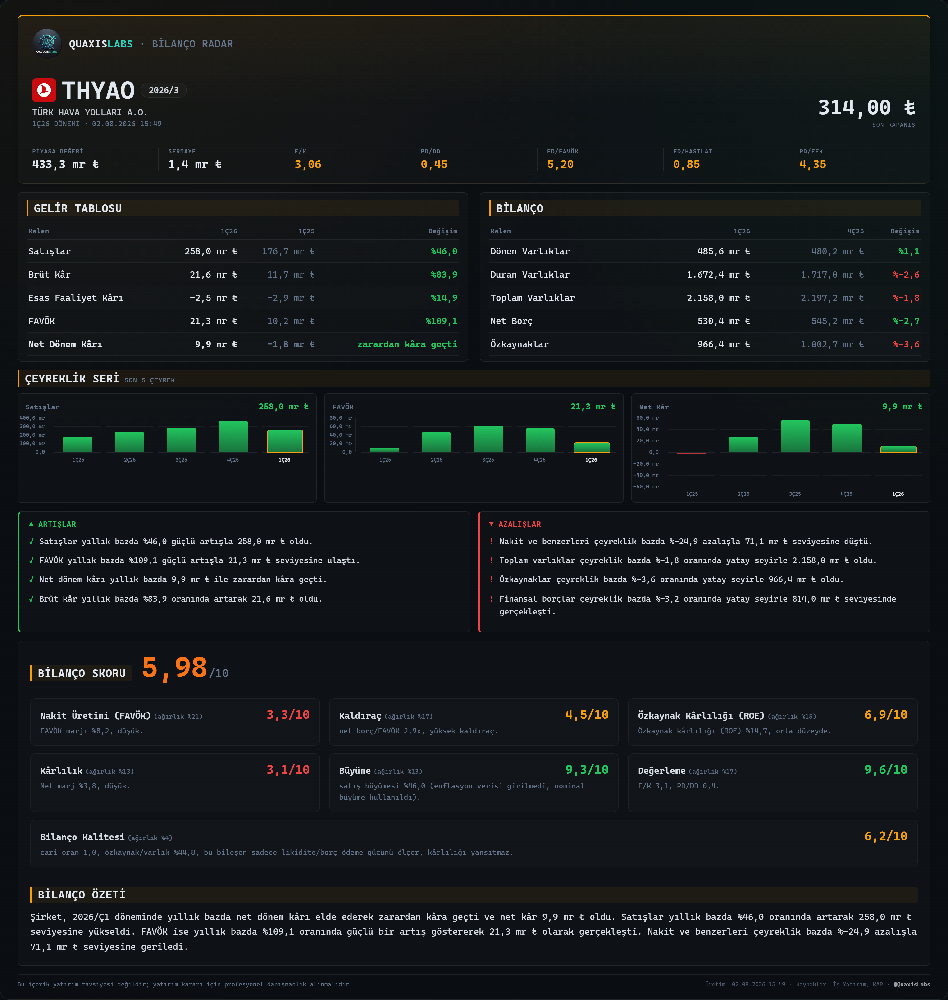
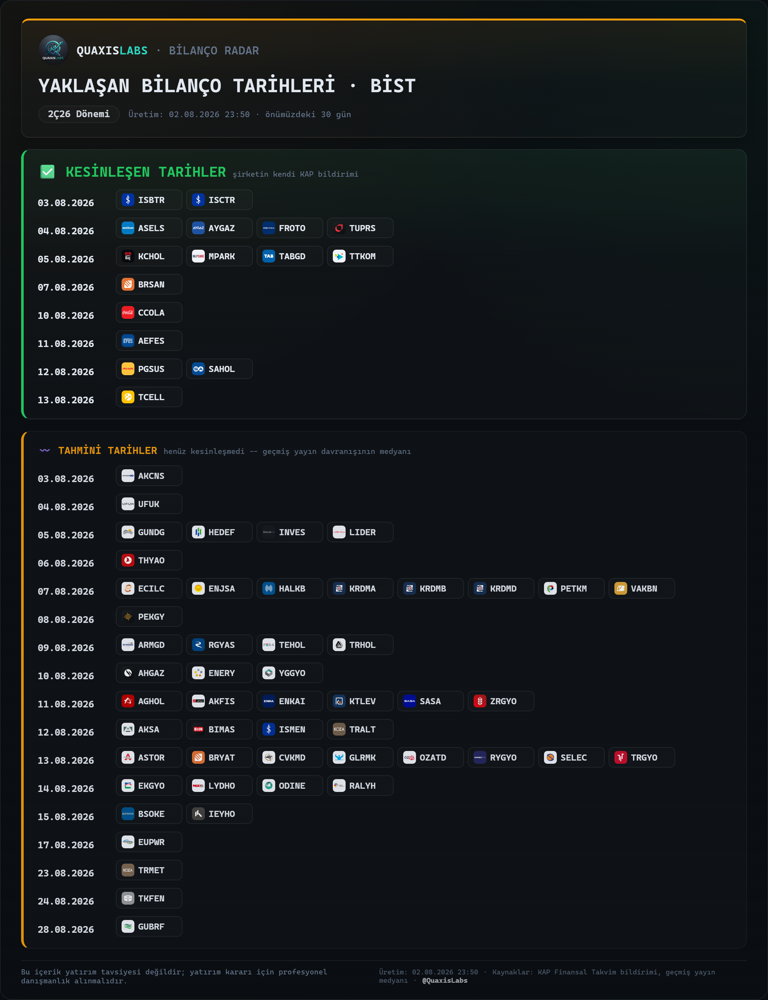
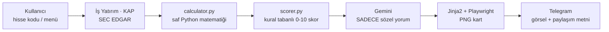

# 📊 Bilanço Radar

**QuaxisLabs** ürünü — BİST ve NASDAQ hisseleri için Telegram üzerinden çalışan,
**kural tabanlı** temel analiz botu. Kullanıcı bir hisse kodu yazar (veya bot
menüsünden seçer); sistem son çeyreklik finansal tabloları çeker (İş Yatırım +
KAP / SEC EDGAR), YoY/QoQ değişimlerini hesaplar, 10 üzerinden bir **Bilanço
Skoru** üretir, Gemini ile kısa sözel bir yorum ekler ve koyu temalı bir PNG
kart + paylaşıma hazır metin olarak Telegram'dan gönderir.

> ⚠️ Bu proje/repo yatırım tavsiyesi vermez; ürettiği her kart ve metin bunu
> açıkça belirtir. Amaç, dağınık finansal veriyi tek bakışta okunur hale
> getirmek — yatırım kararı vermek değil.

### 🧭 Öne çıkan ilke

> **Hiçbir sayıyı yapay zeka üretmez.** Yüzde değişim, oran, puan, tahmin —
> hepsinin arkasında test edilmiş, kural tabanlı Python matematiği var. Gemini
> API'si SADECE bu zaten hesaplanmış, Türkçe biçimlendirilmiş sayıları kısa bir
> cümleye çevirir; tek bir rakam bile üretmez, kopyalar. LLM devre dışı kalsa
> bile (kota, ağ hatası) kart yine üretilir — kural tabanlı bir yedek metinle.

## 🖼️ Ekran görüntüleri

<table>
<tr>
<td width="50%"></td>
<td width="50%"></td>
</tr>
<tr>
<td align="center"><b>Bilanço analizi kartı</b> — <code>THYAO</code> örneği:<br>gelir tablosu, bilanço, çeyreklik grafikler, artış/azalışlar, 6 bileşenli skor</td>
<td align="center"><b>/takvim</b> — Yaklaşan Bilanço Tarihleri:<br>kesinleşen (KAP bildirimi) ve tahmini (geçmiş davranış medyanı) tarihler ayrı bölümlerde</td>
</tr>
</table>

## ✅ Neler yapabiliyor

| Alan | Durum |
|---|---|
| **BİST** | Sanayi/ticaret (XI_29), konvansiyonel banka (UFRS), katılım bankası, sigorta (UFRS_K) — dördü de KAP tazelik yamasıyla |
| **NASDAQ/ABD** | SEC EDGAR üzerinden **herhangi bir ticker** (sabit bir listeyle sınırlı değil), $ para birimi, "FYyy Çn" mali dönem etiketi |
| **Değerleme** | Piyasa Değeri, F/K, PD/DD, FD/FAVÖK, FD/Hasılat, PD/EFK |
| **KAP entegrasyonu** | Son 90 günün önemli bildirimleri + kural tabanlı önem sınıflandırması |
| **Yorum** | Gemini ile sözel özet, LLM olmadan da çalışan güvenli yedek mod |
| **Takvim** | `/takvim` — kesinleşen (KAP) ve tahmini (istatistiksel) bilanço tarihleri, tek bakışta PNG kart |
| **Teknik Görünüm** | SMA/EMA/RSI/MACD/Bollinger/ATR/52 hafta/hacim — SKORSUZ, sinyalsiz, sadece olgu; temel analiz kartından görsel olarak ayrı bir kart |
| **Telegram UX** | Buton menüsü (`/menu`) + serbest metin ticker girişi, otomatik BİST/NASDAQ yönlendirmesi |
| **Kalite** | 569 test (gerçek Playwright render dahil), her yeni veri eşlemesi canlı bir referansla doğrulanır |

## 🔄 Nasıl çalışıyor



Hiçbir aşamada LLM'e ham finansal veri veya hesaplama görevi verilmez — 4.
aşamaya (Gemini) giden tek şey, 3. aşamada zaten üretilmiş, biçimlendirilmiş
bulgu listesidir.

## 🚀 Kurulum

```bash
cd bilanco-radar
python -m venv .venv
.venv\Scripts\activate        # Windows
pip install -r requirements.txt
playwright install chromium
copy .env.example .env        # ve API anahtarlarini gir (GEMINI_API_KEY, TELEGRAM_BOT_TOKEN)
```

## ▶️ Çalıştırma

```bash
python main.py
```

## 🧪 Test

```bash
pytest tests/ -v
```

## 📁 Daha fazla bilgi

Bu README genel bir tanıtımdır. Aşağıdaki "Faz Durumu" bölümü projenin faz faz
**detaylı değişiklik geçmişidir** — her fazda ne yapıldığı, hangi canlı hata
bulunup nasıl çözüldüğü, hangi kaynakla (Fintables, KAP, SEC EDGAR, kullanıcı
karşılaştırması) doğrulandığı satır satır kayıtlıdır. Modül modül mimari, veri
kaynağı eşlemeleri ve iş kuralları bu repoya dahil olmayan, geliştirme
sürecinde tutulan ayrı bir proje belleğinde tutulur.

## Faz Durumu

- [x] **Faz 1** — Proje iskeleti, config.py, loglama (dosya + konsol), .env
      yonetimi, temel test altyapisi.
- [x] **Faz 2** — `src/fetchers/isyatirim.py`: MaliTablo uc noktasindan
      ceyreklik bilanco/gelir tablosu cekme, XI_29/UFRS/UFRS_K otomatik
      grup tespiti, kumulatif->ceyreklik turetme, standart kalem eslemesi
      (sadece XI_29 dogrulandi). Demo: `python scripts/demo_fetch.py THYAO`.
      `src/fetchers/kap.py`: KAP'in guncel (Next.js) API'sinden bildirim
      cekme (`api/search/combined` + `api/disclosure/members/byCriteria`),
      kural tabanli onem siniflandirmasi, `get_top_disclosures()`. Demo:
      `python scripts/demo_kap.py TAVHL`.
- [x] **Faz 3** — `src/db/models.py`: Company/FinancialPeriod/Disclosure/
      GeneratedCard SQLAlchemy modelleri (PostgreSQL'e gecise hazir,
      `create_engine_and_session()` ile izole engine uretilebilir).
      `src/db/repository.py`: upsert_financials (mukerrer satir OLUSTURMAZ,
      var olan degeri gunceller), get_financials, save_disclosures (url
      benzersizligiyle dedup), get_recent_disclosures, is_data_fresh
      (onbellek kontrolu), save_generated_card. `src/analysis/calculator.py`
      henuz yapilmadi. Test: `pytest tests/test_db.py` (13 test, izole
      SQLite dosyasiyla, gercek data/bilanco_radar.db'ye dokunmaz).
- [x] **Faz 4 (kismi)** — `src/analysis/calculator.py`: LLM'siz saf matematik
      motoru. YoY (gelir tablosu) / QoQ (bilanco) degisim bloklari, marjlar
      (brut/FAVOK/net + puan degisimi), net borc/FAVOK (TTM), cari oran,
      ROE (yillikandirilmis/TTM), borc/ozkaynak, son 5 ceyrek serisi, LLM
      icin yapilandirilmis bulgu listesi. Kenar durumlari: zarar<->kar
      gecisleri (yuzde yerine ozel etiket), sifira bolme, eksik donem
      verisi, banka/sigortada FAVOK otomatik gizlenir (amortisman verisi
      yoksa). `src/analysis/scorer.py` (puanlama motoru) henuz yapilmadi.
      Test: `pytest tests/test_calculator.py` (40 test, esik sinirlari
      dahil elle hesaplanmis degerlerle).
- [x] **Faz 4** — `src/analysis/scorer.py`: kural tabanli, agirlikli 0-10
      puanlama motoru (LLM yok, gerekce metinleri f-string ile uretilir).
      Sanayi/holding varsayilan sablonu (6 bilesen, agirlik toplami %100):
      Nakit Uretimi/FAVOK %25, Kaldirac (net borc/FAVOK) %20, Karlilik %15,
      Buyume %15, Degerleme (F/K + PD/DD) %20, Bilanco Kalitesi %5. Fiyat
      verisi verilmezse Degerleme bileseni atlanir ve agirligi kalan
      bilesenlere orantisal yeniden dagitilir (ayni mekanizma her turlu
      eksik veri icin gecerli). Toplam skora gore rozet: 8+ SAGLAM, 6-8
      DENGELI, 4-6 KARISIK, <4 RISKLI. Esikler/agirliklar tek bir CONFIG
      sozlugunde. Banka (`score_bank`) ve sigorta (`score_insurance`) icin
      basit iskelet sablonlar da eklendi (ROE + degerleme + sektore ozgu,
      henuz fetcher katmaninda olmayan metrikler icin opsiyonel parametreler).
      Demo: `python scripts/demo_score.py` (fiyatli/fiyatsiz iki senaryo,
      bileşen tablosu). Test: `pytest tests/test_scorer.py` (39 test, esik
      sinirlari ve agirlik yeniden dagitimi dahil).
- [x] **Faz 5** — `src/ai/commentary.py`: hazir hesaplanmis rakamlari sozel
      yoruma cevirir. NOT: proje ilk tasarimda Anthropic Claude API'yi
      hedefliyordu; kullanicinin acik tercihiyle bu modul **Google Gemini
      API**'sine yazildi (REST generateContent, responseSchema ile
      yapilandirilmis JSON cikti). `config.py`'de ANTHROPIC_API_KEY/
      CLAUDE_MODEL -> GEMINI_API_KEY/GEMINI_MODEL olarak degistirildi.
      LLM'e HICBIR ham finansal tablo verilmez, sadece calculator/scorer
      ciktisindaki onceden Turkce formatlanmis (format_number_tr /
      format_currency_short) degerler + onemli KAP basliklari gonderilir;
      istemde "verilen sayilarin disinda sayi uretme" kurali acik yazili.
      Hata/yedek mod: ag hatasi/429/5xx'te 2 kez yeniden dene (toplam 3
      deneme), kalici hatada (401/400) hemen birak; JSON parse basarisiz
      OLURSA VEYA yanitta supheli bir metin artefakti (canli Gemini
      yanitinda gozlemlendi: modelin kendi kendine Ingilizce bir "dusunme
      notunu" bir alanin icine sizdirmasi) tespit edilirse BIR KEZ
      duzeltme istemi; tumu basarisiz olursa LLM'siz sablon tabanli
      mekanik ozete (`Commentary.source="fallback"`) duser -- bu fonksiyon
      hicbir kosulda bos donmez/hata firlatmaz. Zarardan kara / kardan
      zarara gecis bulgulari hem LLM istem kurallarinda hem de yedek
      modun kendi onceliklendirme mantiginda her zaman one alinir.
      Demo: `python scripts/demo_commentary.py` (API anahtari yoksa yedek
      modu, varsa gercek Gemini cagrisini gosterir). Test:
      `pytest tests/test_commentary.py` (26 test; JSON guvenligi, retry
      sayaci, 401'de yeniden denenmeme, supheli-artefakt tespiti, yedek
      mod oncelik kurali dahil, httpx.post monkeypatch ile ag istegi
      gondermeden).
- [x] **Faz 6** — `src/render/templates/card.html` (Jinja2) + `src/render/card.py`
      (Playwright chromium, device_scale_factor=2 PNG). Koyu "terminal
      rontgen" estetigi: sistem monospace font yigini (Google Fonts agi
      YOK -- cevrimdisi guvenilir render icin), uc bant (ust/acilis/alt),
      gelir tablosu + bilanco tablosu (renkli degisim sutunu), saf CSS
      mini bar grafikler (negatif ceyrekler kirmizi, sifir cizgisinin
      altinda), artis/azalis sutunlari, 6 bilesenli radar skoru tablosu
      (kullanici geri bildirimiyle rozet metni/basslik seridi kaldirildi,
      sadece sayi + renk ile ifade ediliyor), KAP notu kutusu. Banka/
      sigorta modunda (show_ebitda=False) FAVOK satiri/grafigi acik bir
      kosullu blokla gizlenir. `build_card_context()` domain nesnelerini
      (AnalysisResult/ScoreResult/Commentary) HICBIR sayi hesaplamadan
      duz bir context dict'ine cevirir. Kesif sirasinda `format_number_tr`'i
      "%" onekiyle zincirleyen her yerde (card.py/commentary.py/scorer.py)
      tutarli negatif yuzde bicimi icin `src/formatting.py`'ye paylasilan
      `format_percent_tr()` eklendi (formatting.py'nin hic testi yoktu,
      o da yazildi). Demo: `python scripts/demo_card.py`. Test:
      `pytest tests/test_card.py` + `tests/test_formatting.py` (26+16
      test; biri gercek Playwright PNG uretimini dogrular).
- [x] **Faz 7** — `src/bot/pipeline.py` (yeni orkestrasyon katmani) +
      `src/bot/telegram_bot.py` (python-telegram-bot v21+, async) +
      `main.py`. pipeline.py, Is Yatirim'in ham itemCode'lu verisini
      calculator.py'nin bekledigi standart alanlara cevirip DB'ye o
      sekilde yazar (repository.py'nin "orkestrasyon kataminda yapilacak"
      notunun karsiligi); SADECE XI_29 (sanayi/ticaret) semasi destekleniyor
      -- banka/sigorta/araci kurum (UFRS/UFRS_K) icin acik bir "desteklenmiyor"
      mesaji doner (varsayimsal parser yazilmadi). En guncel donem henuz
      aciklanmamissa bir ceyrek geriye kayip dener, basarili olursa
      kullaniciya inline Evet/Hayir butonuyla onceki donemi sorar. Butun
      senkron/agir isler (fetch, Playwright) `asyncio.to_thread` ile
      sarilir. Kullanici basina dakikada 3 istek siniri + ayni kullanicinin
      isi bitmeden ikinci istek atamamasi (bellek-ici). Komutlar: /start,
      /son (son 5 kart -- NOT: kullanici bazinda degil, bot genelinde;
      GeneratedCard semasinda chat_id yok), /hakkinda. Canli THYAO ile
      uctan uca dogrulandi (gercek Is Yatirim + KAP verisi, gercek Gemini
      yorumu, gercek PNG). Demo: `python scripts/demo_pipeline.py THYAO`
      (Telegram'siz). Test: `pytest tests/test_pipeline.py` (16 test,
      izole tmp_path DB + sahte fetcher'larla) + `tests/test_telegram_bot.py`
      (18 test, ticker normalizasyonu + hiz siniri).
- [x] **Faz 7 (kullanici geri bildirimi sonrasi duzeltmeler)** —
      (1) **Donem tespiti kritik hata duzeltmesi**: canli TAVHL testinde
      sirket, `guess_last_periods()`'un 75 gunluk tutucu tahmininden cok
      daha erken 2. ceyregi acikladigi halde bot hala 1. ceyregi
      gosteriyordu -- tahmin sadece "asiri iyimser" durumu (henuz
      aciklanmamis donem istemek) ele aliyordu, "asiri kotumser" durumu
      (sirket zaten daha yenisini acikladi) hic kontrol etmiyordu.
      `pipeline._find_true_newest_period()` artik tahminin 1-2 ceyrek
      ILERISINI de (bitmis ceyreklerle sinirli) hafif bir problama
      istegiyle kontrol ediyor. Kesif sirasinda bir API tuhafligi da
      bulundu: TEK BASINA bir donem sorulunca (baska donem eklenmeden)
      uc nokta o donem hicbir grupta yoksa TAMAMEN BOS yanit donuyor,
      bu da fetch_financials'i yanlislikla "sirket bulunamadi" sandiriyor
      -- duzeltme, probe isteklerine dogru financial_group + birkac
      bilinen-dolu donemi de ekliyor. (2) **Canli fiyat eklendi**:
      `isyatirim.fetch_latest_price()` (kesfedilen/dogrulanan uc nokta:
      HisseTekil, startdate/enddate DD-MM-YYYY zorunlu, son eleman en
      guncel kapanis) -- supplementary veri, basarisiz olursa kart
      fiyatsiz uretilir. (3) **Kart yeniden tasarlandi**: kullanici
      geri bildirimiyle DIKEY'den YATAY tek-kare (1600px genislik,
      CSS Grid, Fintables tarzi paylasim karti referans alindi) duzene
      gecildi; "BİLANÇO RADAR" markasi kaldirilip ticker kod kendisi
      buyuk/kalin baslik yapildi; fiyat basligin saginda gosteriliyor;
      radar skoru sutunu kompakt (sadece bilesen adi + puan, uzun
      gerekce metni karttan kaldirildi, sadece kod icinde/loglarda kalir).
      Test: `pytest tests/test_pipeline.py` guncellendi (TAVHL senaryosunun
      regresyon testi dahil, 18 test).
- [x] **Faz 8 (degerleme carpanlari + kart okunurlugu)** —
      (1) **Piyasa degeri artik gercekten hesaplaniyor**: `isyatirim.py`'ye
      odenmis sermaye (itemCode `2OA`) eklendi, `pipeline.py` bunu
      `_STOCK_FIELDS`'e ekleyip fiyatla birlikte `calculator.compute_valuation()`'a
      veriyor. Onceden Degerleme bileseni (agirlik %20) fiyat/sermaye hic
      pipeline'a verilmedigi icin HER ZAMAN atlaniyordu -- artik F/K ve
      PD/DD gercek veriyle hesaplanip `scorer.score_industrial()`'a
      besleniyor. (2) **Yeni carpanlar**: `Ratios`'a `net_debt`,
      `ttm_ebitda`, `ttm_revenue`, `ttm_operating_profit`, `ttm_net_income`
      eklendi; yeni `calculator.ValuationMetrics` + `compute_valuation()`
      Piyasa Degeri, Net Borc, F/K, PD/DD, FD/FAVOK, FD/Hasilat, PD/EFK
      hesaplar (BIST'te nominal pay degeri 1 TL oldugu icin sermaye = pay
      adedi varsayimiyla). Kart ustune yeni bir DEGERLEME bolumu eklendi.
      (3) **Kart okunurlugu**: bolum baslik fontlari buyutuldu/kalinlastirildi
      (arka plan vurgusuyla artik kaybolmuyor), gelir tablosu/bilanco
      bolumlerine tam cerceve + daha buyuk tablo fontu eklendi, RADAR SKORU
      panelinde her bilesenin **nominal agirligi** ve kisa gerekcesi artik
      gorunur (kullanicinin "hangi konuya ne kadar puan verdigimiz net
      olmali" talebi). Agirlik/esik gerekceleri `SCORING_METHODOLOGY.md`'de
      belgelendi. Test: `pytest tests/` (243 test, 8 yeni: compute_valuation
      + kart bicimlendirme).
- [x] **Faz 9 (NASDAQ/ABD veri katmani)** — SADECE veri katmani (analiz/kart
      Faz 10'da). `src/fetchers/sec_edgar.py`: SEC EDGAR companyfacts
      uc noktasindan (`data.sec.gov/api/xbrl/companyfacts/CIK##########.json`,
      API anahtari gerekmez) NASDAQ/ABD sirketlerinin ceyreklik finansal
      verisini ceker. AAPL (urun sirketi), NVDA (takvim yiliyla ORTUSMEYEN
      mali yil -- Ocak sonu biter) VE JPM (banka, XI_29/UFRS ayrimindaki
      gibi FARKLI kalem seti) ile CANLI dogrulandi (bkz.
      `data/exploration/{AAPL,NVDA,JPM}_ozet_*.txt`). **Kesifte bulunan
      canli hata**: SEC'in `fy`/`fp` alanlari fact'in KENDI donemine gore
      degil, ICINDE GECTIGI dosyalamaya (10-Q/10-K) gore atanmis -- bir
      ceyregin bilancosu HEM "bu ceyrek sonu" HEM "onceki mali yil sonu"
      (karsilastirma) kolonunu AYNI (fy,fp) etiketiyle tasiyabiliyor;
      `_select_best_fact()` bunu 'en buyuk end tarihi' kurallyla ayirt
      eder (regresyon testi: `test_aapl_ardisik_ceyreklerde_bilanco_degeri_TEKRARLANMAZ`).
      Kumulatif->ceyreklik turetme `isyatirim.quarterly_value_from_cumulative`
      ile AYNI ilkeyle (`quarterly_value_from_cumulative_us_gaap`) yapildi.
      `models.Company`'ye `market` sutunu ("BIST"/"NASDAQ", ALTER TABLE ile
      geriye donuk migrate edilir, gercek DB kopyasiyla canli test edildi) +
      `financial_group="US_GAAP"` eklendi; ticker cakisma riski (fetcher
      seviyesinde degil) `repository.TickerMarketConflictError` ile
      SESSIZCE EZMEK yerine REDDEDILEREK ele alindi (bkz. sinif docstring'i --
      composite PK'ye GECILMEDI, olgun BIST kod yolunun kapsam disi riskli
      refactoru olurdu). `pipeline._standardize_to_records_us_gaap()`
      DB'ye XI_29 ile AYNI alan adlariyla yazar. Fiyat: yfinance yerine
      onun da kullandigi ayni genel query1.finance.yahoo.com uc noktasina
      dogrudan httpx ile gidiliyor (stooq CSV CANLI denendi, artik JS
      bot-dogrulamasi donduruyor, REDDEDILDI). Demo:
      `python scripts/demo_fetch_us.py AAPL`. Test: `pytest tests/` (399
      test, 23 yeni: test_sec_edgar.py + test_pipeline.py/test_db.py ek).
- [x] **Faz 10 (NASDAQ/ABD analiz -> skor -> kart hattı)** — Faz 9'un veri
      katmanı analiz/skor/kart'a bağlandı. `calculator.analyze_us()`:
      `analyze()` ile TAMAMEN AYNI `_build_analysis_result()` çekirdeğini
      kullanır (KOPYALANMADI), sadece `currency='USD'` farklıdır (yeni
      `AnalysisResult.currency` alanı, varsayılan `'TRY'` — 399 BIST testi
      ETKİLENMEDİ). FAVÖK: US GAAP'te BIST'teki dar/geniş faaliyet kârı
      ayrımı YOK — `OperatingIncomeLoss + D&A` kullanıldı (CANLI doğrulandı:
      AAPL FY2024 = $134,66 mr, kamuya açık FAVÖK rakamıyla birebir eşleşti);
      `pipeline._standardize_to_records_us_gaap()` bu yüzden
      `operating_profit_ebitda_base`'i `operating_profit` ile AYNI yazar,
      `calculator.ebitda()` hiçbir değişiklik gerektirmeden çalışır. Enflasyon:
      BIST tarafında da reel büyüme düzeltmesi zaten UYGULANMIYOR (bilinen
      sınır B6) — ABD için bu doğru davranış (TÜFE ~%2-4, TL'ye kıyasla
      önemsiz), ek mantık EKLENMEDİ. `scorer.CONFIG['abd_sanayi']`: aynı 7
      bileşen/ağırlık (%100), SADECE değerleme (F/K ucuz 12/makul 20/pahalı
      30/tavan 50, PD/DD ucuz 1,5/makul 3/pahalı 6/tavan 12 — S&P 500 CANLI
      araştırıldı, GuruFocus/Multpl/MacroMicro) ve büyüme (güçlü eşik %15→%10,
      taban −20→−15 — enflasyon farkı) eşikleri kalibre edildi; kaldıraç AYNEN
      korundu (Moody's/S&P kaldıraç bantları evrensel). Gerekçeler:
      `SCORING_METHODOLOGY.md`. `card.build_us_card_context()`:
      `build_card_context()`'in `_line_item_row`/`_build_chart`/
      `_valuation_context` gibi TÜM yardımcılarını `currency_symbol="$"` ile
      ÇAĞIRIR — `card.html` şablonuna HİÇBİR satır EKLENMEDİ (`sector_template:
      "abd"` zaten var olan `` — sanayi şeklindeki — dala düşüyor,
      canlı doğrulandı: şablonda hiçbir yerde "₺" hardcode edilmemiş). Mali
      dönem takvim çeyreği yerine "FYyy Çn" (örn. "FY26 Ç3") gösterilir —
      NVDA gibi mali yılı takvim yılıyla örtüşmeyen şirketlerde "1Ç27" gibi
      bir etiket YANLIŞ (uydurma) takvim izlenimi verirdi.
      `commentary.py`: Gemini'ye gönderilen istem metnindeki para birimi
      sembolü artık `analysis.currency`'den okunuyor (CANLI hata bulundu:
      ÖNCEDEN `format_currency_short()` HER YERDE varsayılan "₺" kullanıyordu
      — ABD kartları için Gemini'ye YANLIŞ para birimli rakamlar
      gönderiliyordu, LLM bunu kendi Türkçe özetine SIZDIRABİLİRDİ).
      `run_pipeline(ticker, market="BIST"|"NASDAQ")`: NASDAQ dalında KAP/8-K
      YOK (kapsam dışı, `disclosures_db` her zaman boş liste), İş Yatırım'a
      özgü ileri-probe (`_has_newer_period_available`) SADECE BIST için
      çağrılır (SEC EDGAR zaten her seferinde gerçek en yeni dönemi bulur).
      **CANLI HATA bulundu ve düzeltildi** (`repository.upsert_financials`):
      brand-new bir NASDAQ ticker'ı ilk kez yazılırken Company satırı ÖNCE
      varsayılan `market="BIST"` ile oluşuyor, HEMEN ARDINDAN gelen
      `set_company_info(market="NASDAQ")` bununla ÇAKIŞIYOR ve HER TEK yeni
      NASDAQ ticker'ında `TickerMarketConflictError` fırlatıyordu —
      `upsert_financials(..., market=...)` parametresi eklenerek satır
      BAŞTAN doğru market'le oluşturulacak şekilde düzeltildi. Demo:
      `python scripts/demo_pipeline_us.py AAPL` — AAPL/NVDA/INTC (zarar
      açıklayan şirket, TTM net zarar) ile CANLI uçtan uca doğrulandı;
      üretilen F/K değerleri stockanalysis.com ile karşılaştırıldı (AAPL
      34,97 vs 35,44 — %1,3 fark; NVDA 30,44 vs 30,74 — %1,0 fark; INTC'nin
      TTM net zararı $-11,29 mr, stockanalysis.com'un belirttiği $11,29 mr
      zararla BİREBİR eşleşti) — ikisi de %5 eşiğinin ALTINDA. Test:
      `pytest tests/` (418 test, 19 yeni: test_calculator_us.py +
      test_scorer_us.py + test_card_us.py, hiçbir regresyon yok).
- [x] **Faz 10.1 (veri doğruluğu düzeltmeleri — kullanıcı raporu, 2026-08-02)** —
      Kullanıcı AAPL kartını sosyal medyada paylaşılan gerçek "Q3'26 earnings
      highlights" ile karşılaştırdı ve GELİR TABLOSU'ndaki rakamların (Satışlar
      $364,4 mr) gerçek çeyreklik rakamla ($109,42 mr) UYUŞMADIĞINI bildirdi.
      **Kök neden**: `analyze_us()` BIST'in KÜMÜLATİF (9 aylık YTD) gösterim
      konvansiyonunu miras almıştı — BIST'te doğru (Fintables/Matriks
      konvansiyonu) ama ABD earnings-raporlama kültüründe SADECE tek çeyreklik
      rakam "headline" sayılır. Çeyreklik türetme MATEMATİĞİ zaten baştan
      DOĞRUYDU ($109,417 mr — kullanıcının kaynağıyla 3 kuruş farkla eşleşti);
      sorun SADECE hangi rakamın öne çıkarıldığıydı. **Düzeltme**:
      `_build_analysis_result(..., use_cumulative_display=False)` — `analyze_us()`
      artık GELİR TABLOSU/bulgu listesinde TEK ÇEYREKLİK rakam gösterir,
      `analyze()` (BIST) DEĞİŞMEDİ. **Ek doğrulamalar**: MSFT (Q4, ANNUAL-9AY
      türetme yolu) — $90,01 mr hasılat/$35,77 mr net kâr/$40,6 mr esas
      faaliyet kârı, web araştırmasıyla BİREBİR eşleşti; Alphabet'in
      "$112,1 mr net kâr" gibi olağandışı görünen bir rakamının GERÇEK
      olduğu (tek seferlik $98 mr gerçekleşmemiş yatırım kazancı) canlı
      araştırmayla doğrulandı — VERİ HATASI değildi. **10 resmi NASDAQ
      hissesinin (AAPL/TSLA/NVDA/MSFT/GOOGL/AMZN/META/NFLX/AMD/PYPL) TAMAMI**
      canlı tarandı: hepsinde hasılat/net kâr/toplam varlık/pay adedi doğru
      geliyor; 5'inde (GOOGL/AMZN/META/NFLX/PYPL) "Brüt Kâr" N/A (bu
      şirketlerin XBRL verisinde GrossProfit tag'i güncel dönemde YOK —
      kod hatası değil, bilinen veri sınırı, bkz. `06_BILINEN_SORUNLAR.md`
      B13). **Ayrıca**: META'da Piyasa Değeri/F-K/PD-DD hiç hesaplanamıyordu
      (hem `dei:EntityCommonStockSharesOutstanding` hem `us-gaap:CommonStockSharesOutstanding`
      META'da YOK) — üçüncül yedek (`WeightedAverageNumberOfDilutedSharesOutstanding`,
      dönem ortalaması) eklendi, macrotrends.net ile BİREBİR eşleşti. Şirket
      logoları da düzeltildi: `company_logo.py` TradingView aramasını HER ZAMAN
      "BIST:" öneki ile yapıyordu, bu yüzden hiçbir NASDAQ kartında logo
      görünmüyordu — `market="NASDAQ"` için "NASDAQ:" sonra "NYSE:" fallback
      eklendi (JPM SADECE NYSE ile bulunuyor).
      **Devam eden düzeltmeler (kullanıcı yeniden istedi — "diğer 5 hissedeki
      brüt kârı da türetip doğrula")**: GOOGL/AMZN/META/NFLX'te "Brüt Kâr"ın
      HER ZAMAN N/A çıktığı bulundu (bu 4 şirket "GrossProfit" tag'ini güncel
      dönemde hiç kullanmıyor) — `gross_profit_us_gaap()` eklendi: doğrudan
      tag yoksa Hasılat − Maliyet (`CostOfRevenue`/`CostOfGoodsAndServicesSold`)
      türetir, stockanalysis.com ile BİREBİR doğrulandı (GOOGL $73,853mr,
      AMZN $104,828mr, NFLX $6,523mr). PYPL'de hiçbir maliyet tag'i yok, N/A
      doğru kalıyor. Ayrıca **kritik bir çeyreklik-türetme hatası** bulundu:
      GOOGL 2025 Ç1→Ç2 arasında XBRL etiketini değiştirmiş
      (`RevenueFromContractWithCustomer...` → `Revenues`) — eski kod iki
      dönemi AYNI tek etikette aradığı için "Satışlar (karşılaştırma)"
      satırı sessizce "veri yok" gösteriyordu; `quarterly_standardized_value_us_gaap()`
      artık her dönemi ayrı ayrı (tüm aday etiketleri deneyerek) çözüp SONRA
      çıkarıyor, etiket değişikliğine dayanıklı. Test: `pytest tests/`
      (432 test, 14 yeni, hiçbir regresyon yok).
- [x] **Faz 11 (buton menü arayüzü, 2026-08-02)** — Bot düz-metin-ticker'dan
      butonlu menüye taşındı: `/start`/`/menu` → 📊 Bilanço Analizi (🇹🇷 BİST /
      🇺🇸 NASDAQ) → 📅 Yaklaşan Bilanço Tarihleri (Faz 12/13 için iskelet,
      şimdilik "yakında" mesajı) → 🕘 Son Kartlar → ℹ️ Hakkında, her alt menüde
      "⬅️ Geri". Menü mantığı yeni `src/bot/menu.py` (123 satır) modülüne
      çıkarıldı: navigasyon TAMAMEN `callback_data` içine gömülü (örn.
      `"menu:analiz:nasdaq"`, hepsi 64 byte sınırının altında) — süreç yeniden
      başlasa bile butonlar çalışır. SADECE "hisse kodu bekleniyor" durumu
      `context.user_data["bekleyen_islem"]` içinde TTL'li (10 dk) tutulur;
      süresi dolarsa `handle_ticker_message` sessizce varsayılan BİST akışına
      döner. **Geriye uyumluluk KORUNDU**: kullanıcı menüye hiç girmeden
      doğrudan "THYAO" yazarsa aynen eskisi gibi çalışır (varsayılan market
      BİST, `normalize_ticker_input()` ikinci bir `market` parametresi aldı
      ama varsayılanı `"BIST"`). NASDAQ ticker doğrulaması ayrı bir regex
      (`^[A-Z]{1,5}(\.[A-Z])?$`) ile eklendi — BRK.B gibi sınıf ekli
      sembolleri destekler. `run_pipeline(..., market=...)` artık Telegram
      botundan da NASDAQ ile çağrılabiliyor (Faz 10'dan beri motor hazırdı,
      bota hiç bağlanmamıştı). Menü mesajları her tıklamada `edit_message_text`
      ile güncellenir, yeni mesaj atılmaz. **NASDAQ kapsamı doğrulandı**:
      SEC EDGAR fetcher `company_tickers.json` üzerinden CIK'i ARAR — sabit
      10 hisseyle SINIRLI DEĞİL, herhangi bir SEC'e kayıtlı ticker çalışır
      (canlı doğrulandı: `COST`, önceden test edilen 10 hissenin DIŞINDA,
      `scripts/demo_pipeline_us.py COST` ile uçtan uca başarılı). Bilinen
      sınır DEĞİŞMEDİ: bankalar/sigortalar için "revenue" gibi bazı kalemler
      N/A kalabilir (US GAAP şeması sadece sanayi/ürün şirketleri için
      doğrulanmış, bkz. `06_BILINEN_SORUNLAR.md` B11). Test:
      `pytest tests/` (485 test, 53 yeni — `tests/test_menu.py` + genişletilmiş
      `tests/test_telegram_bot.py`, hiçbir regresyon yok). Canlı doğrulama:
      `python main.py` ile bot başlatıldı, Telegram `getMyCommands` ile
      `/menu` komutunun kayıtlı olduğu doğrulandı.
- [x] **Faz 11.1 (MSFT FAVÖK eksikliği düzeltmesi — kullanıcı raporu, 2026-08-02)** —
      Kullanıcı MSFT kartında GELİR TABLOSU'nun 5 yerine 4 metrik gösterdiğini
      bildirdi (FAVÖK satırı tamamen kayboluyordu, tablo görsel olarak eksik/
      dengesiz görünüyordu). **Kök neden**: MSFT, AAPL/NVDA/JPM'nin kullandığı
      birleşik D&A tag'lerinin (`DepreciationDepletionAndAmortization`/
      `DepreciationAmortizationAndAccretionNet`) HİÇBİRİNİ raporlamıyor —
      amortismanı `Depreciation` (maddi duran varlık) + `AmortizationOfIntangibleAssets`
      (maddi olmayan duran varlık) olarak İKİ AYRI XBRL satırında tutuyor.
      **Düzeltme**: `sec_edgar.depreciation_amortization_us_gaap()`/
      `quarterly_depreciation_amortization_us_gaap()` eklendi — `gross_profit_us_gaap()`
      ile AYNI desen (birleşik tag öncelikli, yoksa iki bileşen TOPLANIR, sadece
      biri varsa None). CANLI DOĞRULANDI (web araması, gurufocus.com): MSFT
      FY26 Ç3 hesaplanan D&A $10,1mr, dış kaynağın raporladığı $10.167mr ile
      %1'in ALTINDA farkla eşleşti; kart yeniden render edildi, FAVÖK satırı
      artık görünüyor. Ayrıca kullanıcının "tüm NASDAQ hisseleri render
      edilebiliyor mu" sorusu için `COST` (önceden test edilmemiş) ve `ADBE`
      canlı test edildi — ikisi de 5/5 metrikle uçtan uca başarılı. Test:
      `pytest tests/` (488 test, 3 yeni — `tests/test_sec_edgar.py`, hiçbir
      regresyon yok).
- [x] **Faz 11.2 ("SKHY bulunamadı" mesaj netliği + AAPL logo araştırması, 2026-08-02)** —
      Kullanıcı "SKHY" (SK hynix) arattığında bot "bulamadım" diyordu; kök neden SK
      hynix'in SEC'te KAYITLI olması ama ABD GAAP/XBRL raporlamayan yabancı bir özel
      ihraççı olması (gerçek bir veri sınırı, kod hatası değil) — eski mesaj bunu
      "yazım hatası" gibi gösteriyordu. `pipeline.FinancialDataNotFoundError`
      eklendi (`TickerNotFoundError`'dan ayrı), bot artık sebebi açıkça belirten
      bir mesaj gösteriyor. AAPL logo şikayeti CANLI olarak reprodüklenemedi —
      hem doğrudan hem tam pipeline testinde logo doğru geldi; muhtemelen
      TradingView arama uç noktasının geçici bir hatasıydı (tasarım gereği
      kalıcı önbelleğe yazılmaz, kendiliğinden düzelir), bu yüzden kod
      değişikliği yapılmadı. Test: `pytest tests/` (491 test, 3 yeni —
      `tests/test_pipeline.py`, hiçbir regresyon yok).
- [x] **Faz 12 (Yaklaşan Bilanço Tarihleri — VERİ katmanı, 2026-08-02)** — BİST için
      "hangi şirket ne zaman bilanço açıklayacak" sorusuna cevap veren tek bir resmi
      API yok — üç yaklaşım araştırılıp (hepsi canlı doğrulandı) güven seviyesine göre
      birleştirildi: (1) KAP **"Finansal Takvim"** bildirimi — kesin ama opsiyonel
      (TAVHL/ASELS yayınlıyor, THYAO yayınlamıyor); (2) geçmiş **"Finansal Rapor"**
      yayın tarihlerinin medyanı — tahmini (THYAO ~37 gün, TAVHL ~27,5 gün, ASELS
      ~35,5 gün, dönem sonundan); (3) **SPK II-14.1 Tebliği** yasal son tarih — her
      zaman hesaplanabilir fallback (yıllık 60/70 gün, ara dönem 30/40+10 gün,
      resmi tatil kayması dahil). NASDAQ için üç aday karşılaştırıldı (Finnhub API
      anahtarı istiyor, Yahoo artık "crumb" oturum tokenı istiyor) —
      **`api.nasdaq.com/api/calendar/earnings`** seçildi (kayıtsız, günlük tüm
      piyasayı tek istekte döndürüyor). Yeni `src/fetchers/earnings_calendar.py`
      (490 satır) + `earnings_calendar` DB tablosu (`repository.upsert_earnings_calendar()`/
      `get_upcoming_earnings()`/`is_earnings_calendar_fresh()`). **Görsel/bot
      entegrasyonu bu fazın KAPSAMI DIŞINDA** (görev talimatı gereği — Faz 13'ün
      konusu; menü hâlâ "yakında eklenecek" gösteriyor). Demo:
      `python scripts/demo_takvim.py bist|nasdaq`. Test: `pytest tests/`
      (537 test, 46 yeni — `tests/test_earnings_calendar.py` + `tests/test_db.py`
      genişletmesi, hiçbir regresyon yok).
- [x] **Faz 13 (Takvim kartı görseli + bot entegrasyonu, 2026-08-02)** — Faz 12'deki
      takvim verisi paylaşılabilir bir PNG'ye ve bota bağlandı.
      **Render altyapısı genelleştirildi**: `card.render_card()`/`render_html()`
      artık `template_name`/`screenshot_selector` parametreleri alıyor (varsayılan
      `"card.html"`/`"#card"` ile TÜM mevcut çağrılar değişmeden çalışır) — bu,
      Faz 14/16/19'un da tabanı. Yeni `src/render/templates/calendar_card.html` +
      `src/render/calendar_card.py::build_calendar_context()`: 1200px sabit
      genişlik, yükseklik TAMAMEN içeriğe göre doğal oluşuyor (sabit bir
      min-height YOK — az kayıtla kart kısa kalır, boş alanla uzatılmaz; çok
      kayıtla doğal olarak büyür). **Kapsam kararı (kullanıcıyla netleştirildi)**:
      kart SADECE `kesin`+`tahmini` güven seviyelerini gösterir, `son_tarih`
      (SPK yasal fallback — taranan HER şirket için her zaman hesaplanabilir)
      BİLEREK dışlanır, yoksa kart pratikte taranan tüm evreni listeler ve
      "gerçek beklenti" ile "yasal tavan" arasındaki fark kaybolurdu. Tarihe
      göre gün gün gruplama, bugün amber sol bordürle vurgulanır, güven rozeti
      (kesin=yeşil dolu, tahmini=amber çerçeveli) + lejant. Yeni orkestrasyon
      (`src/bot/pipeline.py::refresh_earnings_calendar()`/`get_cached_earnings_calendar()`/
      `is_earnings_calendar_fresh()`): BIST100 yaklaşımı ticker başına 1-4 KAP
      isteği gerektirdiği için birkaç dakika sürebiliyor — bu yüzden **Telegram
      botu bunu ASLA senkron tetiklemez**, sadece DB önbelleğini okur; önbellek
      ayrı bir zamanlanmış script'le (`scripts/refresh_takvim_cache.py`, cron/Görev
      Zamanlayıcı ile günde 1-2 kez) doldurulur. `/takvim` komutu + `menu:takvim:bist/nasdaq`
      artık gerçek görsel + kopyala-yapıştır metni (X_BUYUME_RAPORU.md kalıp ⑤
      biçiminde) gönderiyor. Demo: `python scripts/demo_takvim_karti.py bist|nasdaq`.
      Test: `pytest tests/` (555 test, 18 yeni — `tests/test_calendar_card.py` +
      `tests/test_pipeline_takvim.py`, hiçbir regresyon yok).
- [x] **Faz 13.1 (kullanıcı ortamında canlı çökme düzeltmesi, 2026-08-02)** —
      `demo_takvim_karti.py nasdaq` **çöktü**: `fetch_upcoming_nasdaq()` NASDAQ-100 ile
      SINIRLI olmadığı için (bkz. `06_BILINEN_SORUNLAR.md` §B15) 10 günlük bir pencerede
      2287 kayıt döndü, Chromium bu kadar satırlı elementin ekran görüntüsünü alamadı
      (`CardRenderError: Page.captureScreenshot: Unable to capture screenshot`).
      `build_calendar_context(max_rows=60)` eklendi — tavanı aşan kayıtlar günü YARIDA
      keserek kırpılır, hem karta hem paylaşım metnine "+N kayıt daha" notu düşer. Kök
      sorun (NASDAQ kapsamının daraltılmaması) BİLEREK açık bırakıldı, bu sadece render
      katmanını KALICI olarak çökmeye karşı korur. Test: `pytest tests/` (559 test, 4
      yeni, hiçbir regresyon yok).
- [x] **Faz 13.2 (KRİTİK — "Türkçe I" hatası düzeltmesi, kullanıcı raporu, 2026-08-02)** —
      Kullanıcı gerçek bir X paylaşımıyla karşılaştırınca takvim kartımızda BİMAS/İş
      Bankası/Enka gibi dev şirketlerin HİÇ olmadığını fark etti. Kök neden: KAP'in
      arama API'si "I" harfini Türkçe kurala göre NOKTASIZ "ı"ya çevirip dönüyor
      (`BIMAS` → `bımas`), `kap.normalize_ticker()` ise düz Python `.lower()`
      kullandığı için `bimas` (NOKTALI i) üretiyordu — ikisi FARKLI karakter,
      `search_company()` SESSİZCE başarısız oluyordu. "I" harfi içeren HER ticker
      (BIMAS, ISCTR, ENKAI, ISBTR, SISE...) etkileniyordu. Modülde bu TAM sorunu
      çözen `_turkish_lower()` zaten VARDI ama `normalize_ticker()` onu
      KULLANMIYORDU. Düzeltildi + BİST önbelleği `--top 100` ile yeniden dolduruldu.
      Test: `pytest tests/` (561 test, 2 yeni, hiçbir regresyon yok).
- [x] **Faz 13.3 (KRİTİK — Telegram fotoğraf boyut sınırı, kullanıcı raporu, 2026-08-02)** —
      `/takvim` sadece metin gönderiyordu, görsel HİÇ gelmiyordu. Bot logları:
      `telegram.error.BadRequest: Photo_invalid_dimensions` — `max_rows=60` tavanına
      rağmen 57 satır/16 gün grubu içeren gerçek bir kart 2400x8924 piksele ulaşmıştı
      (Telegram sınırı: genişlik+yükseklik <= 10000). Kontrollü render'larla GERÇEK
      piksel yüksekliği kalibre edildi (`844 + 98×satır + 162×grup`, 4 nokta tam
      doğrusal) ve bu formülü kullanan bir piksel bütçesi eklendi — satır sayısı
      tavanı ve piksel bütçesinden hangisi önce dolarsa orada kesiliyor. Aynı 57
      satırlık veriyle şimdi 2400x7248 (toplam 9648) üretiliyor, sınırın altında.
      Test: `pytest tests/` (562 test, 1 yeni, hiçbir regresyon yok).
- [x] **Faz 13.4 (kullanıcı geri bildirimiyle yeniden tasarım, 2026-08-02)** — Takvim
      kartı "bir şirket bir satır" düzeninden "iki katmanlı + yan yana chip" düzenine
      geçti: **KESİNLEŞEN TARİHLER** üstte/büyük/yeşil, **TAHMİNİ TARİHLER** altta/
      küçük/amber, her gün içindeki şirketler logo+ticker "chip" olarak yan yana
      (flex-wrap) diziliyor. Paylaşım metni `#TICKER` formatına (eski `$TICKER`
      yerine) ve kullanıcının referans gösterdiği gerçek X paylaşımlarıyla aynı
      "GG.AA.YYYY - #TICK, #TICK" kalıbına geçti. Sonuç: gerçek 67 kayıtlı BİST
      verisiyle eski tasarım 2400x8924 piksele ulaşıp Telegram sınırını aşarken,
      yeni tasarım 2400x2724'e sığıyor — hiçbir kırpma gerekmedi. Chip genişliği
      CSS'te sabit tutularak piksel bütçesi deterministik hesaplanabiliyor.
      Test: `pytest tests/` (566 test, hiçbir regresyon yok).
- [x] **Faz 13.5 (kullanıcı raporu, 2026-08-03 — ASTS/genç NASDAQ şirketleri +
      menü UX)** — Üç ayrı sorun çözüldü: **(1)** ASTS gibi genç/küçük NASDAQ
      şirketlerinde Satışlar "veri yok" gösteriyordu — şirket 2025'ten itibaren
      3. bir SEC revenue tag'ine geçmişti, haritaya eklendi. **(2)** FAVÖK
      satırı hesaplanamadığında gelir tablosundan TAMAMEN gizleniyordu (5
      yerine 4 satır) — artık HER ZAMAN görünür (N/A dahil). **(3)** Skor
      paneli TÜM bileşenler N/A iken bile "10,00/10 SAĞLAM" gösterebiliyordu
      (sadece %4 ağırlıklı tek bileşenden) — `scorer.py`'ye veri-yeterlilik
      eşiği (%50) eklendi, altında kalınırsa "YETERSİZ VERİ" rozeti gösterilir,
      sayısal skor HİÇ basılmaz. **YENİ**: SEC'te hâlâ eksik kalan Brüt Kâr/
      Esas Faaliyet Kârı için `src/fetchers/stockanalysis.py` — stockanalysis.com'dan
      (investing.com/tradingview.com CANLI test edildi, ikisi de teknik
      olarak uygun değildi — bkz. `PROJE_HAFIZASI/02_VERI_KAYNAKLARI.md` §6.10)
      YEDEK veri çeker; FAVÖK bu sayede SIFIR ek kodla otomatik dolar. Ayrıca
      menüde "son kullanılan piyasa" hafızası + her analiz sonrası "tek
      dokunuşla yeni arama" butonları eklendi (kullanıcı geri bildirimi: menü
      akışı çok adımlıydı). Test: `pytest tests/` (594 test, 28 yeni, hiçbir
      regresyon yok).
- [x] **Faz 14 (X/Twitter Teaser Kartı, 16:9, 2026-08-05)** — Roadmap'in
      ana zincirindeki (9→10→11→12→13→14) eksik halkası: mevcut ana kart
      (dikey, ~2080px) X akışında 16:9'a kırpılıp okuma süresini
      sıfırlıyordu. `src/render/templates/teaser_card.html` (1600×900,
      cihaz ölçeği 2x → 3200×1800): sol logo+TICKER (~108px) + şirket adı
      + dönem + fiyat, sağ Radar Skoru dev punto (~210px), alt şeritte 3
      metrik kutusu (Satışlar/FAVÖK/Net Kâr YoY — banka/sigortada Faiz
      Geliri/Faaliyet Kârı, Prim Üretimi/Teknik Denge karşılıklarıyla),
      tek cümlelik hüküm + yasal uyarı. Roadmap kuralı: en fazla 7 sayı
      (skor+fiyat+3 metrik = 5). `card.py`: `build_teaser_context()`
      (sanayi+US_GAAP paylaşımlı) + `build_bank_teaser_context()` +
      `build_insurance_teaser_context()`, ortak alanlar `_teaser_base_
      fields()`'ta (kopyala-yapıştır yok); `_line_item_row()`'un renk
      mantığı paylaşılan `_item_color_class()`'a çıkarıldı. `pipeline.
      PipelineResult`'a `price` alanı eklendi (teaser'ın ikinci bir fiyat
      isteği atmasına gerek kalmasın diye). Telegram: `_gonder_teaser()`
      detay karttan ÖNCE gönderilir, ikincil olduğu için kendi try/
      except'i içinde (başarısız olursa detay kart/thread akışı
      etkilenmez). X paylaşımına hazır metin zaten mevcut thread
      post'larıyla (Bölüm 3 kalıp ①'e uygun, "Sizce bu skor adil mi?"
      ile biten) karşılanıyordu — yeniden icat edilmedi. CANLI THYAO
      (sanayi) ve GARAN (banka) ile doğrulandı. `pytest tests/ -q` →
      **942 test, hepsi yeşil** (yeni: `test_teaser_card.py`, 13 test).
- [x] **Faz 15 (Teknik Analiz Katmanı ve Kartı, 2026-08-03)** — BİST/NASDAQ
      için ayrı bir **teknik görünüm** hattı: `src/fetchers/price_history.py`
      (`fetch_ohlcv()`) BİST'te İş Yatırım HisseTekil'in düzeltilmiş
      (HGDG_*) OHLCV serisini, NASDAQ'ta Yahoo chart API'sini birleşik bir
      `OhlcvBar` tipine çevirir (keşif: `scripts/explore_price_history.py`).
      `src/analysis/technical.py` — SAF matematik (I/O yok, Decimal): SMA
      20/50/200, EMA 12/26, RSI(14) Wilder yumuşatması, MACD(12,26,9),
      Bollinger Bantları(20,2σ), ATR(14) Wilder, 52 hafta yüksek/düşük +
      konum%, 20 günlük ortalama hacim + oran, fiyat/SMA200 mesafesi — her
      formül docstring'inde kaynağıyla (Wilder 1978, Appel, Bollinger 2001)
      belgeli. **BAĞLAYICI KISITLAR**: hiçbir SKOR üretilmez (temel analiz
      skoruyla KARIŞTIRILMAZ), "Al/Sat/Tut" sinyali YOK — sadece olgu +
      RSI/Bollinger için klasik eşiklere göre nötr/aşırı bölge etiketi.
      `src/render/technical_card.py` + `technical_card.html` — temel analiz
      kartından GÖRSEL OLARAK AÇIKÇA AYRI kimlik (mor/indigo aksan,
      "TEKNİK GÖRÜNÜM" başlığı): son 6 aylık SAF SVG çizgi grafiği
      (SMA50/SMA200 overlay), gösterge tablosu, 52 hafta aralığı çubuğu,
      hacim şeridi, yasal uyarıya EK "geçmiş performans gelecekteki
      getirinin göstergesi değildir" uyarısı. Demo: `python
      scripts/demo_teknik.py THYAO` / `AAPL --market NASDAQ` (ikisi de
      canlı veriyle uçtan uca doğrulandı). Test: `pytest tests/` (649 test,
      52 yeni — RSI elle hesaplanmış kesir aritmetiğiyle, SMA/EMA/MACD/
      Bollinger/ATR bağımsız referans implementasyonlarıyla doğrulandı,
      hiçbir regresyon yok).
- [x] **FAVÖK N/A düzeltmesi — AMD/TSLA (2026-08-03)** — SEC'in ham XBRL
      verisi tam taranarak kök neden bulundu: AMD'nin `Depreciation` tag'i
      sadece yıllık, TSLA'nın `AmortizationOfIntangibleAssets` tag'i
      2021'den beri hiç raporlanmıyor. Bir bileşen yapısal olarak hiç
      raporlanmamışsa 0 sayılır (TSLA'yı TAM çözer); sadece yıllık
      raporlanan bir bileşen için en son gerçek yıllık değer TTM olarak
      kullanılır (AMD'de "FAVÖK (TTM)" olarak gösterilir, stockanalysis.com'un
      bağımsız TTM EBITDA rakamıyla %3 altında farkla çapraz doğrulandı).
      Test: `pytest tests/` (660 test, 11 yeni, hiçbir regresyon yok).
- [x] **Teknik Görünüm Telegram'a bağlandı (2026-08-03)** — `/teknik`
      komutu eklendi (BİST/NASDAQ seç → ticker yaz → fundamental pipeline'a
      hiç uğramadan doğrudan teknik kart); kök menüye ve her analiz
      sonucunun altına "📈 Teknik Görünüm" butonu eklendi. (Not: ayrıca
      eklenen `/temelanaliz` komutu -- mevcut "📊 Bilanço Analizi" akışına
      kısayoldu -- kullanıcı isteğiyle KALDIRILDI, "Temel Analiz" zaten
      "Bilanço Analizi" ile aynı kart/kavram olduğu için gereksiz/kafa
      karıştırıcı bulundu.)
- [x] **NASDAQ ADR/yabancı özel ihraççı desteği — NVO/TSM/SHEL/BABA
      (2026-08-03)** — bu şirketler SEC'e `us-gaap` yerine `ifrs-full`
      taksonomisiyle raporluyor VE sadece yıllık (20-F, `fp="FY"`) veri
      sunuyor. Yeni bir harita/modül yazılmadı — `ifrs-full` tag adayları
      mevcut `STANDARD_ITEM_MAP_US_GAAP` öncelik listelerine eklendi (us-gaap
      şirketleri etkilenmedi). "Annual-only" (sadece yıllık) şirketler
      otomatik tespit edilip tam yıl kümülatif değer doğrudan "güncel" alana
      yazılıyor (eskiden hem çeyreklik türetme hem de stockanalysis.com yedek
      yolu bu şirketlerde yanlış/eksik sonuç veriyordu — BABA'da canlı
      doğrulanan bir eşleşme hatası dahil). Kart etiketleri ("FY25") ve LLM
      özet metni artık doğru şekilde "yıllık" diyor, "çeyrek" kelimesi hiç
      geçmiyor. SKHY (SEC'e hiç veri yok) hâlâ düzeltilemez, SHEL'in
      yarı-yıllık hibrit deseni bilinçli olarak ayrı bırakıldı. Test:
      `pytest tests/` (698 test, 24 yeni, hiçbir regresyon yok). Detaylar:
      `PROJE_HAFIZASI/06_BILINEN_SORUNLAR.md` §B21.
- [x] **Menü simetrisi — Teknik Görünüm'den Temel Analiz'e dönüş (2026-08-03)** —
      "📊 Bilanço Analizi" sonucunun altında zaten "📈 Teknik Görünüm" butonu
      vardı, tersi yoktu. `menu.build_teknik_sonrasi_menu()` ile Teknik
      Görünüm kartının altına simetrik "📊 Temel Analiz" butonu eklendi
      (callback `temel:{market}:{ticker}` → `handle_temel_callback` →
      mevcut `_execute_and_send` tam pipeline'ı). Test: `pytest tests/`
      (705 test, 7 yeni, hiçbir regresyon yok).
- [x] **Teknik Görünüm kartı — ADX + Golden/Death Cross + kategorize
      gösterge tablosu + grafik ızgara çizgileri (2026-08-03)** — kullanıcı
      isteğiyle yapılan teknik analiz UI/gösterge araştırmasının (RSI/MACD/
      Bollinger eşikleri, SMA50/200 kesişimi, ADX trend gücü filtresi,
      kategorize dashboard tasarımı — bkz. sohbet geçmişi) sonuçları
      uygulandı: `src/analysis/technical.py`'ye `adx_wilder()` (Wilder 1978,
      ATR/RSI ile AYNI kaynak — <20 zayıf/yatay, 20-25 gelişen, >25 güçlü
      trend, K2'ye uygun sadece OLGU) ve `sma_cross_state()` (Golden/Death
      Cross — SMA50/200'ün göreceli konumu + son 20 barda "yakın zamanda"
      olup olmadığı) eklendi. `technical_card.py`: gösterge tablosu artık
      TEK düz liste değil, **Trend / Momentum / Volatilite** olarak
      kategorize (araştırma bulgusu: kategorize dashboard bilişsel yükü
      azaltır); fiyat grafiğine 3 hafif (recessive) yatay referans çizgisi +
      fiyat etiketi eklendi (dataviz skill ilkeleri: "recessive grid/axes",
      okumayı kolaylaştırır, mevcut renk paletini/kimliği DEĞİŞTİRMEZ).
      Test: `pytest tests/` (725 test, 20 yeni — ADX bağımsız float referans
      implementasyonuyla, cross durumu elle kurgulanan senaryolarla
      doğrulandı, hiçbir regresyon yok). Demo: `python scripts/demo_teknik.py
      THYAO` ile canlı veriyle uçtan uca doğrulandı.
- [x] **Faz 16 (Derin Kart — Çok Dönemli Temel Analiz, 2026-08-03, iki tur)** —
      kullanıcı geri bildirimi ("Temel Analiz butonu Bilanço Analizi ile
      AYNI görseli tekrarlıyor, içeriği farklı olsa daha iyi olur mu?")
      üzerine: "bu çeyrek ne oldu" sorusunu cevaplayan tek çeyreklik karta
      EK olarak, "bu şirket ZAMAN İÇİNDE nasıl bir seyir izliyor" sorusunu
      cevaplayan çok dönemli (8-12 çeyrek) bir kart eklendi. YENİ bir ağ
      isteği ATILMADI (sektör verisi HARİÇ, aşağıya bkz.) — DB'de zaten
      biriken (`repository.get_financials`) geçmiş dönemler kullanıldı.

      **1. tur:** `src/analysis/trends.py` (SAF matematik, I/O yok):
      `compute_multi_period_trend()` — her çeyrek için Hasılat/FAVÖK/Net
      Kâr/Özkaynak, marj trendi (brüt/FAVÖK/net), Cari Oran, TTM-bazlı
      Kaldıraç (Net Borç/FAVÖK) ve ROE trendi, mevsimsellik. Hesaplama
      mantığı KOPYALANMADI — `calculator.py`'ye eklenen PUBLIC sarmalayıcılar
      (`net_debt`, `margin_pct`, `safe_div`, `trailing_12m_from_cumulative`)
      zaten doğrulanmış tek kaynağı yeniden kullanır. `repository.
      get_score_history()` (YENİ) skor geçmişini okur.

      **2. tur (kullanıcının referans görseli — grafikler tam istenen
      stilde olsun + sektör ortalaması çizgisi + hızlı erişim komutu):**
      Grafikler TAMAMEN yeniden tasarlandı — her metrik (Çeyreklik
      Satışlar, Brüt/FAVÖK/Net Marj, Cari Oran, Kaldıraç Oranı, ROE) AYRI
      başlıklı bir grafik kartı; TAM ızgara (yatay+dikey), her noktada
      daire işaretleyici, x-ekseninde HER çeyrek etiketi, y-ekseninde
      "güzel" (1/2/5/10 katları) yuvarlak sayılarla tam eksen (`_nice_ticks()`
      — card.py'nin `_nice_axis_step()`'iyle AYNI ilke, ama negatif değerli
      serilere de genelleştirildi). **Sektör ortalaması (2. çizgi)**: KAP'ın
      `kap.org.tr/tr/Sektorler` sayfasının (ayrı bir API'si YOK, veri
      Next.js sunucu-taraflı render'a gömülü geliyor — canlı keşfedildi,
      bkz. `scripts/explore_kap_sektor.py`) 642 BIST şirketlik ince sektör
      sınıflandırmasından `src/fetchers/kap.py::fetch_sector_map()` +
      `scripts/refresh_sector_cache.py` (refresh_takvim_cache.py ile AYNI
      ilke — ayrı/zamanlanmış süreç, ana pipeline'ı BLOKLAMAZ) ile
      `Company.sector` dolduruluyor; `repository.get_sector_peer_tickers()`
      + `trends.compute_sector_average()` AYNI sektör+financial_group'taki
      DB'de zaten taranmış diğer şirketlerin ortalamasını (SADECE oran/marj
      alanları — mutlak/para birimi değerler KASITLI OLARAK hariç, bkz.
      modül notu) hesaplıyor; peer yoksa (henüz cache çalıştırılmamış/tek
      şirket taranmış) grafik otomatik TEK çizgiye düşüyor. **`/temel`
      komutu (YENİ)**: kullanıcı geri bildirimi ("bilanço bakmadan bu temel
      analiz kısmına gelemiyorum") üzerine — `/teknik`'in Derin Kart
      karşılığı, gerekirse önce fetch tetikleyip DOĞRUDAN Derin Kart'a
      gider (`_execute_and_send(..., output_mode="derin")`).

      Ayrıca AYNI oturumda kullanıcının canlı bot loglarından bildirdiği
      İKİ ayrı, önceden var olan hata bulunup düzeltildi: (1) `CONFIG["banka"]`/
      `CONFIG["sigorta"]["degerleme"]`'de F/K-PD/DD eşikleri hiç yoktu —
      fiyat verisi olan HERHANGİ bir banka/sigortada (ISCTR ile canlı
      doğrulandı) `KeyError: 'fk_ucuz'` ile çöküyordu; (2) `sonuc.analysis.
      is_annual_only`'ye koşulsuz erişim `BankAnalysisResult`/
      `InsuranceAnalysisResult`'ta bu alan OLMADIĞI için hem kart fotoğrafını
      hem özet metnini çökertiyordu — ikisi de düzeltildi, regresyon testleri
      eklendi (bkz. `06_BILINEN_SORUNLAR.md`).

      BİLEREK kapsam dışı bırakılan bölüm: değerleme çarpanlarının tarihsel
      bandı (güvenilir bir yöntem bu oturumda kurulamadı, bkz.
      `06_BILINEN_SORUNLAR.md` §B23). Test: `pytest tests/` (803 test,
      hiçbir regresyon yok). Demo: `python scripts/demo_derin_kart.py THYAO`
      / `TATGD` (gerçek 2 sektör peer'iyle, EFOR/BORSK) / `AAPL --market
      NASDAQ` ile canlı DB verisiyle uçtan uca doğrulandı; canlı görsel
      incelemede ÜÇ kenar durumu yakalanıp düzeltildi (mevsimsellik
      grubunda tek gerçek nokta varken yanıltıcı düz çizgi; sektör
      ortalaması peer sayısı dönem-bazlı örtüşmeme yüzünden başlıkta
      yanlış/düşük gösteriliyordu; **CIMSA canlı bot raporu**: 9 çeyrek +
      4/4 mevsimsellik grubu içeren bir kart 2400x8760'a ulaşıp
      Telegram'ın foto boyut sınırını — genişlik+yükseklik <= 10000 —
      aşarak `Photo_invalid_dimensions` ile çöküyordu; grafik/bölüm
      boyutları küçültülüp 12 blokluk TAVAN senaryo için güvenli marjla
      yeniden kalibre edildi, regresyon: `test_render_deep_card_en_kotu_durumda_telegram_boyut_sinirini_asmaz`).

- [x] **Faz 16.1 (Derin Kart 2 sütunlu ızgara + oran düzeltmesi + Telegram
      orijinal kalite, kullanıcı geri bildirimi, 2026-08-03)** — iki bağımsız
      düzeltme: (1) `deep_card.html` `.metric-grid`'i tek sütun
      (`flex-direction: column`) yerine 2 sütunlu bir `grid`'e çevrildi
      (`references/temel.png` referans alındı) — kart artık çok daha kısa;
      2 sütuna geçince satır sayısı yarıya indiği için doğan yükseklik payı
      `.chart-svg` yüksekliğini (CIMSA acil küçültmesinden kalan 145px'ten)
      230px'e geri çıkarmaya harcandı — her grafik artık references/temel.png'ye
      çok daha yakın, "kare"ye yakın bir oranda (tek grafiğin kalan tek
      satırda tam genişlik kaplaması için `:last-child:nth-child(odd)` kuralı
      eklendi); sektör ortalaması (2. çizgi) mantığına DOKUNULMADI. En-kötü-
      durum (7 metrik + skor geçmişi + 4/4 mevsimsellik) artık 2400x5260 —
      hâlâ Telegram'ın 10000 sınırının belirgin altında (regresyon:
      `test_render_deep_card_en_kotu_durumda_telegram_boyut_sinirini_asmaz`).
      (2) `telegram_bot.py`'deki 4 kart gönderim noktası (`send_photo`) —
      Telegram `sendPhoto`'nun görseli sunucu tarafında otomatik JPEG'e
      çevirip sıkıştırdığı, kullanıcının bunu X'e (Twitter) yeniden yükleyince
      ÇİFT kayıplı sıkıştırmaya (bulanıklaşmaya) yol açtığı tespit edildi —
      ortak `_send_card_photo()` yardımcı fonksiyonu eklendi: her kart artık
      `send_photo` (hızlı önizleme) YANINDA orijinal, sıkıştırılmamış dosyayı
      `send_document` ile de gönderiyor. Test: `pytest tests/` (803 test,
      regresyon yok). Demo: `python scripts/demo_derin_kart.py TOASO` (2
      sektör peer'iyle — canlı DB verisiyle uçtan uca render edilip ekran
      görüntüsü incelendi, 2400x5316). Bkz. `06_BILINEN_SORUNLAR.md` §B24/§B25
      (ikisi de artık ÇÖZÜLDÜ olarak işaretlendi).

- [x] **Faz 16.2 (Banka/sigorta skor kartına gerçek YoY trend, kullanıcı
      raporu — TURSG, 2026-08-03, ACİL)** — `score_insurance()`/`score_bank()`
      "iskelet şablon" olarak trend_puan'ı HER ZAMAN `None` geçiyordu, bu
      yüzden Teknik Denge Marjı/Net Faiz Marjı/Aktif Kârlılığı bileşenleri
      HER ZAMAN "trend verisi yok" diyordu. `calculator.py`'ye sanayinin
      gross/ebitda/net marj deseniyle AYNI ilkede `..._prior_year`/
      `..._change_points` alanları eklendi (`InsuranceRatios`/`BankRatios`),
      `scorer.py`/`pipeline.py` bunları gerçek trend_puan olarak geçiriyor.
      TURSG ile CANLI doğrulandı: "Teknik Denge Marjı %34,4, güçlü ve
      yükseliyor" (önce "trend verisi yok"). Üst karttaki "Sermaye" alanının
      banka/sigorta kartlarında GÖRÜNMEMESİ ayrı incelendi — bu `_valuation_context_bank/
      _valuation_context_insurance`'da BİLİNÇLİ bir tasarım (referans
      kartlar GARAN/ANSGR ile eşleşsin diye), bug değil, dokunulmadı. Test:
      `pytest tests/` (808 test, 5 yeni regresyon). Detay: `06_BILINEN_SORUNLAR.md`
      §A39.

- [x] **Faz 16.3 (Sektör ortalaması + mevsimsellik derinliği düzeltmesi +
      YENİ "Değerleme Analizi" paneli, kullanıcı raporu, 2026-08-04)** —
      kullanıcı Derin Kart'ta üç eksiklik bildirdi: (1) sektör ortalaması
      çizgisi hâlâ 1 çizgiye düşüyordu, (2) mevsimsellik grupları sadece
      1-2 yıl gösteriyordu (4 yıl istendi), (3) bilanço iyi olsa bile
      fiyatın "ucuz mu pahalı mı" olduğunu ayırt eden bir mekanizma yoktu.

      **(1) Sektör ortalaması:** kök neden `Company.sector`'ün 59 şirketin
      33'ünde HİÇ doldurulmamış olmasıydı (`scripts/refresh_sector_cache.py`
      eklendiğinden beri yeniden çalıştırılmamış) — çalıştırılınca TÜM BİST
      şirketlerinin sektörü doldu, THYAO/PGSUS gibi gerçek eşleşmeler
      ortaya çıktı (bug değildi, veri bakımı eksikti).

      **(2) Mevsimsellik derinliği:** kök neden pipeline'ın HER analizde
      sadece son 8 çeyrek (2 yıl) veri çekip saklamasıydı. İş Yatırım'ın ve
      SEC EDGAR'ın CANLI olarak 4+ yıl geriye veri verdiği doğrulandıktan
      sonra `isyatirim.DEFAULT_HISTORY_QUARTERS`/`sec_edgar.DEFAULT_HISTORY_QUARTERS`
      (YENİ, her ikisi 16 çeyrek = 4 yıl) eklendi, `pipeline.py`'deki 3 ayrı
      `count=8` referansı buna bağlandı; `trends.SEASONALITY_FETCH_PERIODS`
      (YENİ, 20) ile Derin Kart artık DB'den daha derin bir pencere okuyor
      (`MAX_TREND_PERIODS=12` ile gösterilen 7 sabit grafik ETKİLENMEDİ,
      SADECE mevsimsellik bundan faydalanıyor). THYAO ile CANLI doğrulandı:
      4 mevsimsellik grubunun hepsi artık 3-4 gerçek yıl gösteriyor (önceden
      2 yıl).

      **(3) YENİ "Değerleme Analizi" paneli:** `src/analysis/valuation.py`
      (YENİ, SAF matematik) — şirketin GÜNCEL F/K, PD/DD'sini AYNI sektördeki
      DİĞER taranmış şirketlerin GÜNCEL ortalama çarpanıyla kıyaslayıp
      "Sektöre Göre Ucuz/Makul/Pahalı" rozeti üretir (±%20 eşiği); son 1/3
      aylık fiyat değişimini (`price_history.fetch_ohlcv`, zaten Teknik
      Görünüm'de kullanılan fetcher) hesaplayıp %25'i aşan hızlı bir
      yükselişte "kısa vadede aşırı ısınmış olabilir" notu ekler (kullanıcının
      tam olarak tarif ettiği senaryo: "bilanço iyi ama son 1 ayda %50
      yükselmiş, pahalı olabilir"); GERÇEK bir analist hedef fiyatı YERİNE
      (böyle bir kaynak BİST için güvenilir/ücretsiz şekilde yok, kullanıcı
      onayıyla) mevcut fiyatı sektör ortalama çarpanına yeniden ölçekleyerek
      KENDİ hesapladığımız bir "ima edilen değer" üretir — kartta "gerçek bir
      analist hedef fiyatı DEĞİLDİR" diye AÇIKÇA etiketlenir. Mevcut Bilanço
      Skoru'na BİLİNÇLİ olarak DOKUNULMADI (kullanıcı tercihi: "şirket iyi mi"
      ile "şu an almak mantıklı mı" ayrı sorular) — deep_card.html'e SADECE
      YENİ, ayrı bir "Değerleme Analizi" bölümü eklendi (peer_count=0 ise
      panel gizlenir). `telegram_bot._compute_deep_card_valuation()` peer'lerin
      güncel fiyatını (hafif, ikincil istek — Kural 9: hata olursa panel
      SESSİZCE gizlenir, Derin Kart'ın geri kalanı ETKİLENMEZ) çekip
      `calculator.compute_valuation()`'ı (KOPYALANMADAN) yeniden kullanır.
      CANLI doğrulandı (THYAO/PGSUS): "Sektöre Göre Ucuz" (F/K 3,08x, sektör
      7,82x), 1 ay %-5,1, ima edilen değer 804₺ (F/K bazlı). Görsel inceleme
      sırasında yakalanan bir CSS hatası da düzeltildi: `.stat-value`/
      `.stat-sub` kuralı `.positive`/`.negative` renklerini kaynak sırası
      yüzünden EZİYORDU (1/3 ay değişimi hep nötr renkte görünüyordu) —
      bileşik seçiciyle (`.stat-value.positive` vb.) kesin olarak düzeltildi.

      Test: `pytest tests/` (826 test, 18 yeni: `tests/test_valuation.py`
      15 test + `tests/test_deep_card.py` 3 yeni test). Demo:
      `python scripts/demo_derin_kart.py THYAO --with-valuation` (opsiyonel
      bayrak, CANLI fiyat isteği gerektirir). Detay: `06_BILINEN_SORUNLAR.md`.

- [x] **Faz 16.4 (Telegram özet metni → X/Twitter thread formatı, kullanıcı
      isteği, 2026-08-04)** — kullanıcı, Telegram'a gelen tek bloklu özet
      metni yerine doğrudan bir X/Twitter thread'ine (4 ayrı gönderi)
      kopyalanabilecek bir format istedi, somut bir örnek paylaştı (gerçek
      #TURSG paylaşımı).

      **Format:** (1) Kanca — fotoğraf altyazısı, skor + tek cümlelik
      çarpıcı özet + "Detaylar thread'de 👇" + yasal uyarı; (2) Artışlar &
      Azalışlar; (3) Bilanço Özeti (daha DETAYLI — `commentary.summary`
      istem talimatı 3-5 cümleden 5-7 cümleye çıkarıldı); (4) Radar Skoru
      Detayı — kompakt "isim (%ağırlık) → skor/10" satırları (Değerleme
      bileşeninde kısa "(F/K X, PD/DD Y)" notu) + "Sizce bu skor adil mi?
      Hangi hisseyi analiz edeyim?" CTA'sı. Her gönderi AYRI bir Telegram
      mesajı olarak yollanır (`_gonder_thread_gonderileri()`, her biri
      kendi try/except'i içinde — biri başarısız olsa diğerleri denenir,
      OTKAR dersiyle AYNI ilke) ki kullanıcı bunları teker teker X'e
      kopyalayabilsin.

      **YENİ `Commentary.hook` alanı:** Gemini şemasına eklendi ("%X,Y"
      rakamlı format zorunlu, "yüzde" YAZILMAZ — SADECE bu alan için,
      diğer alanlar mevcut "yüzde X,Y" yazımını korur); LLM'siz yedek
      modda YENİ bir cümle UYDURULMAZ, ilk 2 öncelikli bulgu (`_fallback_sentence`
      ile AYNI kaynak) yeniden kullanılır. `CommentaryCache` tablosuna
      `hook` sütunu eklendi (idempotent ALTER TABLE migration, `models.
      _migrate_add_commentary_hook_column()` — `_migrate_add_market_column()`
      ile AYNI ilke); eski (bu alandan önce) önbelleklenmiş satırlar NULL
      kalır, `pipeline._get_or_generate_commentary()` bu durumda `positives`'ten
      yeniden kurar (YENİ bir Gemini çağrısı GEREKMEZ).

      CANLI doğrulandı (TURSG, gerçek Gemini yanıtıyla): skor/bileşen
      kırılımı kullanıcının paylaştığı örnekle BİREBİR eşleşti (8,55/10
      SAĞLAM, Prim Büyümesi/Teknik Denge Marjı/ROE/Değerleme hepsi %25,
      F/K 5,3 — PD/DD 2,1). Test: `pytest tests/` (828 test, `_bilanco_ozeti_metni`/
      `_score_caption` testleri 4 yeni thread-post fonksiyonu testiyle
      değiştirildi + `Commentary.hook` fallback testi eklendi).

- [x] **Faz 16.7 (Değerleme Analizi paneline Aswath Damodaran FCFE modeli,
      kullanıcı isteği, 2026-08-05)** — Graham/PEG'in yanına 4. bağımsız
      yöntem eklendi: Damodaran'ın "istikrarlı büyüme (stable growth)"
      tek-aşamalı FCFE modeli (`reinvestment_rate=g/ROE`,
      `FCFE=TTM_Net_Kâr×(1-reinvestment_rate)`, Gordon büyüme ile
      `Özkaynak Değeri=FCFE×(1+g)/(r-g)`). Tam çok-dönemli DCF (FCFF+WACC+
      terminal değer) için gereken capex/vergi gideri/işletme sermayesi/beta
      verisi hiçbir fetcher'da olmadığından (K3/K4), bu basitleştirilmiş
      model tercih edildi; `r`/`g` tavanı için risksiz faiz + özkaynak risk
      primi (TRY/USD ayrı) Graham'ın 22,5 sabiti gibi açıkça belgelenmiş,
      elle güncellenmesi gereken makro varsayımlar olarak eklendi
      (`valuation.py::_RISK_FREE_RATE_PCT`/`_EQUITY_RISK_PREMIUM_PCT`).
      Hem Bilanço kartına (`card.html`) hem Derin Kart'a (`deep_card.html`)
      Graham ile YAN YANA eklendi (aynı `compute_valuation_assessment_for_ticker`
      orkestrasyonu, kopyalama yok). Dört yöntemin (sektöre göre/Graham/PEG/
      Damodaran) tam formül/varsayım/sınır açıklaması YENİ
      `PROJE_HAFIZASI/09_DEGERLEME_YONTEMLERI.md` dosyasına kaydedildi.
      Test: `pytest tests/` (852 test, 9 yeni `test_valuation.py` testi —
      normal hesap, büyüme/risksiz-faiz tavanı, ROE≤0/büyüme≤0/g≥ROE edge
      case'leri, USD farklı makro varsayım seti).
- [x] **Faz 17** — Türk yatırım fonları (TEFAS/KAP) veri katmanı KURULDU,
      **hisse-bazlı fon içeriği DAHİL** (tahmin/kart YAPILMADI, bilinçli
      olarak Faz 18/19'a bırakıldı). İki turlu bir keşif oldu:
      **1. tur** — TEFAS'ın eski uç noktaları (fundturkey.com.tr) emekliye
      ayrılmış, yeni backend `tefas.gov.tr/api/funds/` +
      `/api/statistics/tefas/`. Sayfaları (`/tr/...`) bir F5/Distil bot
      koruması ARKASINDA ama JSON API'leri (`fonBilgiGetir`,
      `getFplFonList`) KORUMASIZ — düz `httpx` ile CANLI doğrulandı.
      `src/fetchers/tefas.py`: `search_fund()`/`fetch_fund_info()`
      (fiyat/toplam değer/yatırımcı sayısı/kategori) ÇALIŞIYOR;
      `fetch_fund_returns()`/`fetch_price_history()`/`FundInfo.allocation`
      için güvenilir bir TEFAS uç noktası bulunamadı (None/boş döner).
      **2. tur (kullanıcı düzeltmesi ile)** — kullanıcı fvt.com.tr
      üzerinden gerçek bir "Portföy Dağılım Raporu" örneği (PHE fonu)
      paylaşıp ilk turdaki "KAP'ta hisse bazlı içerik yok" sonucunun
      YANLIŞ olduğunu gösterdi. Kök neden bulundu: fon bildirimleri
      `disclosure/members/byCriteria` (BIST şirketleri için kullanılan uç
      nokta) İLE DEĞİL, KAP'ın klasik `bildirim-sorgu-sonuc?cat=2&m=<fon
      oid>` arama sayfasıyla sorgulanmalıymış — bu CANLI doğrulandı
      (TLY/AFA/PBR/PHE'nin hepsinde çalıştı, AYLIK yayınlanıyor).
      `src/fetchers/kap_fund_portfolio.py::fetch_latest_portfolio()`
      artık GERÇEKTEN çalışıyor: bildirimi bulur → ekli PDF'i indirir →
      `pdfplumber` ile hisse satırlarını (BİST kodu, ISIN, ağırlık%)
      ayrıştırır. **Öz-doğrulama** (Kural 3): PDF'in kendi "GRUP TOPLAMI"
      satırıyla karşılaştırılır (PHE Temmuz 2026: 21 hisse, toplam
      %77,05 — BİREBİR eşleşti); bazı fonlarda (örn. AFA'nın yabancı
      hisse bölümü, ya da nadir sayfa-sınırı kaynaklı ayrıştırma sapması)
      bu doğrulama tutmuyorsa güvenilmez sayılıp BOŞ liste döner, yanlış
      rakam ASLA üretilmez. Yeni DB tabloları: `fund`, `fund_holding`
      (`src/db/models.py`, `repository.save_fund_info`/`get_fund`/
      `save_fund_holdings`/`get_latest_fund_holdings`). Yeni bağımlılık:
      `pdfplumber`. Demo: `python scripts/demo_fon.py PHE` (gerçek 21
      hisseyle uçtan uca doğrulandı). Test: `pytest tests/` (884 test,
      GERÇEK bir KAP PDF'i test fixture'ı olarak kullanılıyor —
      `tests/fixtures/kap_portfoy_dagilim_phe_2026_07.pdf`, ağ isteği
      YOK). **3. tur (kullanıcı düzeltmesi #2):** kullanıcı raporun
      SADECE hisse değil fon-içinde-fon gibi başka enstrümanlar da
      içerdiğini, toplamın %77,05 değil (mümkün olduğunca) %100'e
      yaklaşması gerektiğini belirtti — PDF'in "IV-FON TOPLAM DEĞERİ
      TABLOSU"su incelenip parser "DİĞER" (fon-içinde-fon,
      `instrument_type="fon"`) bölümünü de ayrıştıracak şekilde
      genişletildi; PHE'de Hisse (%77,05) + Fon (%20,60) = %97,65 —
      PDF'in kendi "FON PORTFÖY DEĞERİ" (%97,66) rakamıyla ~1 baz puan
      farkla (yuvarlama) tutarlı. Kalan ~%2,3 nakit/alacak-borç kalemi
      doğası gereği "holding" olarak izlenemez. TÜREV (VIOP/futures,
      genelde ihmal edilebilir büyüklükte) bilinçli olarak kapsam
      dışında bırakıldı. 885 test, hepsi yeşil.
- [x] **Faz 18** — Fon günlük getiri TAHMİN motoru YAZILDI ve ZORUNLU
      geriye dönük doğrulaması ÇALIŞTIRILDI. **🚨 SONUÇ: MAE=1,3558 puan
      (hedef 0,15, kabul edilemez eşik 0,50) — bu özellik YAYINLANMADI,
      hiçbir bot/kart akışına bağlanmadı.** Yol boyunca iki önemli alt
      kazanım elde edildi: (1) `kap_fund_portfolio.py`'ye TÜREV bölümü
      (Futures + VIOP Nakit Teminatı) + "nakit" residual eklendi, portföy
      toplamı artık %100'e tamamlanıyor; (2) TEFAS'ın günlük fiyat
      geçmişi uç noktası (`fonFiyatBilgiGetir`) eksik bir "dil" parametresi
      yüzünden çalışmıyordu, TEFAS'ın kendi JS paketi incelenip düzeltildi
      — `tefas.fetch_price_history()`/`fetch_fund_returns()` artık
      ÇALIŞIYOR (hesaplanan günlük getiri TEFAS'ın kendi alanıyla BİREBİR
      eşleşti). `src/analysis/fund_estimator.py` (SAF matematik,
      ağırlıklı toplam − gider oranı, fon tipine göre uygulanabilirlik
      kontrolü, tazelik/kapsam/belirsizlik ağırlıklı güven skoru) +
      `scripts/validate_fon_tahmini.py` (10 fon × ~21 gün, 213 test
      noktası, look-ahead bias'sız gerçek geriye dönük test) yazıldı.
      En güçlü ipucu: en titiz doğrulanan fon (PHE, MAE=0,60) diğer 9
      fondan (MAE 1,06-1,73) belirgin ölçüde iyi çıktı — KAP PDF'inin
      yüzde kolonu anlamının farklı portföy yönetim şirketi şablonlarında
      farklı olabileceği hipotezi güçlendi; ayrıca güven kalibrasyonu
      TERS çıktı (yüksek güven MAE'si orta güvenden kötü). Detay:
      `data/exploration/fon_tahmini_dogrulama_raporu.txt`,
      `PROJE_HAFIZASI/06_BILINEN_SORUNLAR.md` §B28. 917 test, hepsi yeşil.
- [x] **Faz 19** — Telegram "💰 Fon Analiz" özelliği eklendi: tek fon
      kodu → detaylı kart (hisse bazında ağırlık/getiri/katkı, "en çok
      katkı sağlayan/kaybettiren" iki sütun), "öne çıkan fonlar" (6 fon)
      ve "tüm liste" (15 fon) → özet kartlar; her ikisi de "Quaxis Fon
      Tahmini" marka başlığını taşır. TÜREV desteği kaldırıldı, "Serbest
      Fon" kategorisi toptan redden orta güven adaylığına taşındı,
      PUK'taki çift-sayım hatası orantısal yeniden ölçeklemeyle
      düzeltildi.
      **Canlı kullanım turu (aynı gün, kullanıcı raporlarıyla):** (1)
      KAP PDF'inin 3 FARKLI şablonu olduğu keşfedildi (PBR sayfa-sınırı
      kaybı, DFI/SNY/RSK tamamen farklı "harfli liste" formatı) — YENİ
      bir fallback parser eklendi, 15 fonun 10'u artık ayrıştırılabiliyor
      (LTL/YIT/IJC/DKR/BMU hâlâ açık, bkz. §B29). (2) KAP portföyü artık
      veritabanında önbelleklenir + fiyat çekme PARALEL — TLY sorgusu 4
      dakikadan ~10-20 saniyeye indi. (3) **🚨 KRİTİK veri hatası
      bulundu ve düzeltildi:** `isyatirim.fetch_price_history()` bugünün
      kapanışını HİÇ yayınlamıyordu (her zaman bir gün gecikmeli) — kart
      dünkü getiriyi "bugünkü" gösteriyordu (OZATD örneği: %2,55 yerine
      gerçek %8,41). BİST hisse günlük getirisi artık Yahoo Finance'in
      public chart API'sinden (`src/fetchers/yahoo_quote.py`) çekiliyor,
      CANLI doğrulandı. (4) DB önbellek kısıtındaki bir hata (`name`
      benzersiz anahtar sanılıyordu, fon-içinde-fon holding'lerinde
      YÖNETİCİ ŞİRKET adı tekrarlanabiliyordu) PHE sorgusunu sessizce
      çökertiyordu — düzeltildi + gelecekte benzer hatalar için genel
      bir try/except güvenlik ağı eklendi. (5) Kullanıcı geri bildirimiyle
      "DENEYSEL TAHMİN" uyarı bandı ve güven/tazelik kutuları kaldırılıp
      kart sadeleştirildi.
      **MAE:** genişletilmiş 9 fon/119 test noktasıyla üçüncü doğrulama
      → **1,2076 puan** (0,50 eşiğinin hâlâ üstünde, ama 2,17'den
      İYİLEŞTİ) — kullanıcı bunu bilerek "🚨 DENEYSEL TAHMİN" etiketiyle
      yayınlamaya karar verdi (Faz 18 kuralının bilinçli istisnası).
      Detay: `PROJE_HAFIZASI/06_BILINEN_SORUNLAR.md` §B28/§B29/§B30,
      `08_DEGISIKLIK_GUNLUGU.md` "yirminci"/"yirmi birinci tur". 929
      test, hepsi yeşil.
- [x] **Faz 20** — (2026-08-06, iki tur) SPK onaylı, henüz işlem
      görmeyen YENİ halka arz izahnamelerinin incelemesi. **1. tur
      (veri katmanı):** `src/fetchers/kap_ipo.py` (YENİ) — izahnameyi
      halka arza ARACILIK EDEN kurumun (aday şirketin DEĞİL, henüz KAP
      profili/borsa kaydı OLMAYABİLİR) KAP profilinden "İzahname (SPK
      Tarafından Onaylanan)" kategorisiyle bulur (`UNDERWRITER_MEMBERS`,
      ~22 aracı kurum, CANLI doğrulandı); `IzahnameDisclosure`/`IpoFacts`
      dataclass'ları; "Sulanma Etkisi Analizi" tablosunu (Halka Arz
      Fiyatı/Büyüklüğü/Net Geliri, Özkaynak/Sermaye/Defter Değeri
      öncesi-sonrası, sulanma %) + tahsisat yüzdelerini + AYRI bir
      bildirim olan "Fon Kullanım Yeri Raporu"nu (Ek-5) ayrıştırır --
      HER alan kendi grup toplamıyla (~%100) öz-doğrulanır, tutmazsa
      None (Kural 3). CANLI KARCL (Kardemir Çelik) izahnamesiyle rakam
      rakam doğrulandı. **2. tur (analiz+render+bot, aynı gün, önceki
      turun tamamlanmamış hali):** `src/analysis/ipo_assessment.py`
      (YENİ) — SAF matematik, `IpoFacts`'ten sermaye artırımı/ortak
      satışı oranı, tahsisat gruplaması (bireysel/iç kurumsal/dış
      kurumsal/diğer), fon kullanım yeri sıralaması, Fiyat/Defter Değeri
      çarpanı, özkaynak büyümesi türetir (yargı/skor ÜRETMEZ, sadece
      izahnamenin KENDİ rakamlarından deterministik oran). `src/render/
      ipo_card.py` + `templates/ipo_card.html` (YENİ) — dark
      glassmorphism ailesinden (fund_card.html ile AYNI temel yapı),
      KENDİ aksan rengi (cyan); anahtar rakamlar şeridi, sermaye
      artırımı/ortak satışı barı, sulanma tablosu, tahsisat/fon kullanım
      yeri çubukları. `src/bot/ipo_pipeline.py` (YENİ) —
      `list_available_ipos()`/`compute_ipo_card_data()`; kalıcı DB
      önbelleği BİLİNÇLİ olarak eklenmedi (izahnameler fon portföyünün
      aksine kısa ömürlü/haftalık, bkz. modül üst notu, B26'daki
      "organik büyüme" kararıyla AYNI pragmatik tercih). Bot: kök menüde
      "🆕 Halka Arz İnceleme" + `/halkaarz` komutu → liste (buton başına
      bir izahname) → detay kart + kopyala-yapıştır metni. Kullanıcı
      listeden bir butona tıkladığında AYNI 22-aracı-kurum taramasının
      TEKRARLANMAMASI için `context.user_data["halkaarz_cache"]` ile
      disclosure ticker'a göre önbelleklenir (`ipo_pipeline.
      compute_ipo_card_data_from_disclosure()`). 🚨 CANLI HATA + DÜZELTME
      (`scripts/demo_halka_arz.py` ile bulundu): aracı kurum unvanına
      Python `.title()` uygulanınca "İ" harfi bozuluyordu (`06_BILINEN_
      SORUNLAR.md` #16 ile AYNI sınıf hata) -- kaldırıldı, unvan olduğu
      gibi gösterilir. CANLI doğrulandı: `scripts/demo_halka_arz.py
      KARCL` uçtan uca (KAP taraması → PDF indirme → PNG + paylaşım
      metni) ~2 dakikada tamamlandı, Fon Kullanım Yeri kırılımı test
      fixture'ıyla BİREBİR eşleşti. 1053 test, hepsi yeşil. Detay:
      `PROJE_HAFIZASI/02_VERI_KAYNAKLARI.md` §13,
      `05_BOT_VE_VERITABANI.md` "Faz 20" alt bölümü, `08_DEGISIKLIK_GUNLUGU.md`.
- [x] **Faz 20 devamı** — (2026-08-07, kullanıcı raporu: Çitlekçi hiç
      bulunamıyordu, Bewen/VEYAS tamamen boş kart veriyordu) 3 CANLI hata
      düzeltildi: (1) **Keşif artık `UNDERWRITER_MEMBERS` (~22 hardcoded
      kurum) TARAMIYOR** -- YENİ `kap.fetch_all_disclosures()` (üye
      kısıtlaması OLMADAN TÜM KAP'ı TEK istekte tarar, `kap.Disclosure.
      filer_name` YENİ alanı) kullanılıyor; Tera Yatırım gibi listede
      hiç olmayan kurumlar artık bulunuyor. Varsayılan pencere 7 gün
      (kullanıcı isteği + KAP'ın 2000-satır kesme sınırı). (2) `_EK_RE`
      SADECE "Ek-1" (tiresiz-bitişik) formatını tanıyordu -- Tera
      Yatırım'ın "Ek 1-"/"Ek -2"/"Ek 5-1" gibi boşluklu varyasyonları
      hiç eşleşmiyordu, Çitlekçi'nin 19 EKİ (ilgisiz finansal/gayrimenkul
      raporları) yanlışlıkla "ana parça" sayılıp TÜMÜ indiriliyordu (20
      PDF → artık 1). (3) Aynı başlığın kısa aralıklarla 6-13 kez
      resubmission edilmesi (Türker Vangölü Enerji) artık
      `_TITLE_REPEAT_RESUBMISSION_THRESHOLD` ile SADECE en yenisine
      indiriliyor. Ayrıca "Sulanma Etkisi Analizi" alan regex'lerine
      CANLI doğrulanmış Çitlekçi varyantları eklendi + `offering_size`
      artık "Halka Arz Büyüklüğü" etiketi hiç YOKSA tahsisat bloğunun
      toplam nominal tutarından türetiliyor (Çitlekçi: 36,5mn x 73,70 =
      2,69mr TL, kullanıcının referans görseliyle BİREBİR eşleşti).
      ⚠️ AÇIK KALAN: VEYAS'ın PDF'i muhtemelen taranmış/OCR'siz (bkz.
      `06_BILINEN_SORUNLAR.md` §B31); kullanıcının referans görselindeki
      Talep Toplama Tarihi/Yüksek Başvuru Şartı/Tahmini Dağıtım/T+1-T+2/
      Konsorsiyum Lideri alanları AYRI bir belge ("Tasarruf Sahiplerine
      Satış Duyurusu") gerektiriyor, BAŞLANMADI (bkz. §B32). 1069 test,
      hepsi yeşil.
- [x] **Faz 20.2** — (2026-08-07, kullanıcı isteği: Çitlekçi referans
      görseli + "sulanma ne demek anlamadım" geri bildirimi) §B32'nin
      DEVAMI. Araştırma: KAP'ın "Tasarruf Sahiplerine Satış Duyurusu"
      belgesi CANLI test edilen 3/3 örnekte (VEYAS/CITAS/BEWEN) taranmış
      görüntüden oluşuyor (pdfplumber: 0 karakter) -- OCR eklenmedi
      (yeni sistem bağımlılığı, kullanıcıya AÇIKÇA soruldu). Kullanıcı
      KARARI: bu alanlar için halkarz.com'u (İKİNCİL/gayriresmi kaynak)
      dene. YENİ `src/fetchers/ipo_broker_page.py` -- `article.index-list`
      (arama sonucu, ticker eşlemesi) + `table.sp-table`/`article.sp-arz-extra`
      (yapılandırılmış "Özet Bilgiler" widget'ı, CANLI Çitlekçi/VEYAS/BEWEN
      ile doğrulandı) -- talep toplama tarihi/günü, Katılım Endeksi
      uygunluğu, satış yöntemi, fiyat istikrarı notu okur; HERHANGİ bir
      hatada (Kural 9) sessizce None döner, ana kartı ETKİLEMEZ. `src/analysis/
      ipo_assessment.py`'ye SAF matematikle (Kural 1) toplam lot sayısı
      (`offering_size ÷ offering_price`) + her tahsisat grubunun lot sayısı +
      "Tahmini Dağıtım" senaryo tablosu (N kişi başvurursa kişi başına kaç
      lot -- ROUND_FLOOR, Çitlekçi referans görseliyle BİREBİR: 500.000
      kişi → 29 lot/2.137 TL) eklendi; "Yüksek Talepte Bulunacak Yatırımcı
      Grubu" artık "diğer"den AYRI kendi grubunda. Kart yeniden tasarlandı:
      talep toplama/katılım endeksi/satış yöntemi/fiyat istikrarı bilgi
      şeridi (İKİNCİL kaynak bulunamazsa TAMAMEN GİZLENİR, placeholder/N/A
      GÖSTERİLMEZ -- kullanıcı isteği), "Dağıtım Yapısı" artık % + lot
      sayısı tablosu, "Tahmini Dağıtım" YENİ tablo. "Sulanma Etkisi
      Analizi" başlığı "Halka Arz Öncesi/Sonrası Karşılaştırma"na
      yeniden adlandırıldı + "bu TÜM halka arzlarda SPK'nın zorunlu
      kıldığı standart bir tablodur, şirkete özgü değildir" açıklaması
      eklendi (kullanıcı bunu şirkete özgü bir şey sanmıştı); alanları
      TAMAMEN boş çıkan izahnamelerde (Çitlekçi -- "Sulanma Etkisi
      Analizi" başlığı hiç geçmiyor) bölüm TAMAMEN gizleniyor. YENİ
      `ipo_card.build_ipo_analysis_text()` -- kullanıcının paylaştığı
      örnek gibi paragraf biçiminde bir "inceleme" metni, ama BİLİNÇLİ
      OLARAK birinci şahıs kişisel bir yatırım kanaati (öznel "ben
      inandırıcı bulmadım" tarzı) ÜRETMEZ, sadece hesaplanmış rakamların
      nötr anlatısını verir (regresyon testiyle korunuyor). Ayrıca CANLI
      bulunan 2 küçük hata düzeltildi: `ipo_pipeline.list_available_ipos()`/
      `compute_ipo_card_data()`'nın eski varsayılan `days` değerleri (60/180)
      `kap.fetch_all_disclosures()`'ın YENİ güvenli sınırını (10) aşıp
      ValueError fırlatıyordu (demo scripti çökertiyordu); `_derive_company_name()`
      "Halka Arz" kelimesi hiç geçmeyen "... SPK Onaylı İzahname" başlıklarını
      (VEYAS) tanımıyordu. CANLI doğrulandı: `scripts/demo_halka_arz.py CITAS`
      (Çitlekçi referans görseliyle rakam rakam eşleşti) + `VEYAS` (OCR'siz
      PDF'te bile İKİNCİL kaynak sayesinde bazı alanlar doluyor, kalanı
      zarifçe "-" gösteriyor). 1086 test, hepsi yeşil.
- [x] **Faz 20.3** — (2026-08-07, aynı gün, kullanıcı raporu: "VEYAS için
      X'te herkes paylaşıyor ama bizim kartımızda neredeyse hiçbir bilgi
      çıkmadı" + "KPEKS'te de aynı sorun var") Faz 20.2'nin bıraktığı
      boşluk: VEYAS'ın izahnamesi (TÜM 8 resubmission'ı CANLI tek tek
      denendi) İSTİSNASIZ taranmış/OCR'siz çıktı -- fiyat/büyüklük/lot/
      tahsisat/tahmini dağıtım hiçbiri yoktu, kart neredeyse boştu.
      halkarz.com'un AYNI "Özet Bilgiler" widget'ının fiyat/lot/tahsisat/
      tahmini-dağıtım rakamlarını da içerdiği bulundu (Çitlekçi'de bizim
      SAF matematiğimizle BİREBİR eşleşerek zaten doğrulanmıştı) --
      `ipo_broker_page.SupplementaryIpoInfo`'ya `offering_price_text`/
      `total_lot_text`/`offering_size_text`/`allocation_lines`/`estimated_
      distribution_lines` eklendi (DÜZ METİN, Decimal'e ÇEVRİLMEZ -- Kural
      1/2'ye uygun, bizim hesabımız değil siteden alıntı). `ipo_card.py`:
      izahnameden gelen karşılığı (`facts.offering_price`/`assessment.
      total_lot_count`/`facts.offering_size`/`allocation_rows`/`estimated_
      distribution_rows`) `None`/boş ise BU fallback devreye girer, ASLA
      gerçek bir KAP rakamının ÜZERİNE YAZMAZ, kartta her fallback alanı
      "kaynak: halkarz.com" ile AÇIKÇA işaretlenir (küçük etiket/ayrı
      blok). CANLI 2 küçük hata daha düzeltildi: `total_lot_text`'in
      halkarz.com'dan "65.000.000 Lot" olarak (birim DAHİL) gelmesi
      `build_ipo_analysis_text()`'in kendi "Lot" ekiyle birleşip
      "65.000.000 Lot Lot" çift birimine yol açıyordu (`_strip_lot_suffix()`
      eklendi); `_derive_company_name()` "A.Ş.'nin SPK Onaylı İzahnamesi"
      gibi başlıklarda Türkçe iyelik ekini ("'nin") şirket adının parçası
      gibi bırakıyordu (Bewen/Kapeks'te CANLI görüldü). CANLI doğrulandı:
      `scripts/demo_halka_arz.py VEYAS` (artık fiyat 136,00 TL/toplam
      65.000.000 lot/tahsisat/tahmini dağıtım HEPSİ "halkarz.com" etiketiyle
      görünüyor) + `KPEKS` (kullanıcının bildirdiği AYNI sınıf sorun,
      aynı fallback ile çözüldü). 1090 test, hepsi yeşil.
- [x] **Faz 20.4** — (2026-08-07, aynı gün dördüncü tur) Kullanıcı 3 istek
      daha bildirdi: (1) Tahmini Dağıtım'daki katılımcı senaryoları (150
      Bin/2,2 Milyon gibi) "saçma kaçıyor", 300 Bin-1 Milyon arası yuvarlak
      adımlar istendi; (2) VEYAS'ta hâlâ eksik noktalar var (Sermaye
      Artırımı/Ortak Satışı bölümü boştu); (3) kart tasarımı 2 sütunlu bir
      referans görsele göre yenilensin. `ipo_assessment.
      _DISTRIBUTION_SCENARIO_PARTICIPANTS` 300 Bin-1 Milyon arası (100
      Binlik adımlarla) yapıldı, `estimate_retail_distribution()`/
      `estimate_capital_vs_partner_pct()` (YENİ, public) dışa açıldı.
      `ipo_broker_page.py`: "Tahmini Dağıtım" artık halkarz.com'un KENDİ
      (yuvarlak olmayan) senaryo tablosunu ALINTILAMIYOR -- bireysel grup
      lot sayısını + fiyatı Decimal'e çevirip AYNI standart senaryo
      listesiyle YENİDEN HESAPLIYOR (izahname okunsun/okunmasın TUTARLI
      tablo); "Halka Arz Şekli" bloğundan (Sermaye Artırımı/Ortak Satışı
      LOT'ları) sermaye artırımı yüzdesi de fallback olarak türetiliyor
      (VEYAS'ta CANLI: %57,7/%42,3). Kart 2 sütunlu ızgaraya çevrildi (sol:
      Dağıtım Yapısı + Tahmini Dağıtım, sağ: Sermaye Artırımı vs Ortak
      Satışı + Halka Arz Öncesi/Sonrası) -- kullanıcının paylaştığı
      referans görselle aynı yapı, "Şirket Faaliyet Alanı" paneli DAHİL
      EDİLMEDİ (güvenilir bir veri kaynağı bulunamadı, Kural 3). AYRICA:
      X/Twitter'da paylaşılan görsellerin bulanık çıkması şikayeti
      araştırıldı -- kök neden X'in KENDİ istemci tarafı sıkıştırması
      (kullanıcının "sağ üstten 4K seçince düzeliyor" gözlemi bunu
      doğruluyor), bizim render çözünürlüğümüz (device_scale_factor=2,
      zaten "retina") DEĞİL; çözünürlüğü daha da artırmak Derin Kart gibi
      halihazırda Telegram'ın foto boyut sınırına (10000px) yakın diğer
      kart tiplerini kırma riski taşıdığından YAPILMADI -- bunun yerine
      `send_document` altyazısına HER gönderimde "X'te paylaşırken kalite
      simgesinden HD seç" hatırlatması eklendi (proje geneli, tüm kart
      tipleri). CANLI doğrulandı: `scripts/demo_halka_arz.py VEYAS` (artık
      Sermaye Artırımı/Ortak Satışı + tutarlı 300 Bin-1 Milyon senaryo
      tablosu dolu) + `CITAS` (2 sütunlu tasarım birincil/KAP yoluyla da
      sorunsuz). 1090 test, hepsi yeşil.
- [x] **Faz 20.5** — (2026-08-07, otuzuncu tur) Kullanıcı bir VEYAS referans
      görseli paylaşıp Halka Arz kartına 4 yeni bölüm istedi: Öne Çıkan
      Noktalar, Halka Arz Gelirinin Kullanımı, Fiyat İstikrarı ve
      Taahhütler, Operasyonel ve Finansal Veriler (mevcut Tahmini Dağıtım
      korunarak). `kap_ipo.py`'ye SPK'nın standart 26.5 (Fiyat İstikrarı)/
      27.3 (Taahhütler)/28.2 (Gelir Kullanımı, Ek-5/Ek-7 yoksa ARALIK
      fallback) madde ayrıştırması eklendi -- ZATEN indirilen izahname
      metninden, ek indirme YOK, CITAŞ ile CANLI doğrulandı. YENİ
      `src/fetchers/ipo_price_report.py` -- "Fiyat Tespit Raporu" (şimdiye
      kadar hiç keşfedilmemiş bir belge) DAR kapsamlı ayrıştırma: SADECE
      Hasılat/Brüt Kâr/Toplam Varlıklar/Özkaynaklar, `scripts/
      explore_ipo_price_report.py` ile VEYAS verisi kullanıcının referans
      görselindeki GERÇEK rakamlarla (Hasılat 26.652.218 bin TL, Ciro artışı
      %13,6 vb.) BİREBİR doğrulandı (Kural 3). `ipo_assessment.py`'ye YoY
      büyüme oranları (SAF matematik). `ipo_card.py`/`ipo_card.html`'e 4
      yeni bölüm -- "Öne Çıkan Noktalar" SADECE zaten hesaplanmış
      rakamlardan NÖTR cümleler üretir, referans görseldeki öznel/yatırım-
      tavsiyesi niteliğindeki ifadeler ("dikkat çekicidir" gibi) BİLİNÇLİ
      OLARAK ALINMADI (K2/`build_ipo_analysis_text` ilkesiyle çelişirdi).
      **"Operasyonel Veriler" (nüfus/tüketici sayısı gibi) BİLİNÇLİ OLARAK
      kapsam dışı** -- sektöre özgü, standart olmayan serbest metin,
      genelleştirilmiş güvenilir bir eşleme yok (Kural 3). AYRICA aynı
      turda: X/Twitter bulanıklığı için 3 katmanlı render düzeltmesi
      (şeffaf köşe pikseli + kayıpsız PNG optimizasyonu + `device_scale_
      factor` 2→1, kartlar ~yarı boyuta indi) -- kullanıcı CANLI test etti,
      **KESİN olarak çözüldüğü doğrulanamadı** (bkz. `06_BILINEN_
      SORUNLAR.md` §B33, açık risk). 1117 test yeşil (27 yeni).
- [x] **Faz 20.6** — (2026-08-07, otuz birinci tur, kullanıcı raporu: "KPEKS
      ve VEYAS'ta hâlâ eksik geliyor, örnek görselden çok uzak") Faz 20.5'in
      vaat ettiği "📈 Operasyonel ve Finansal Veriler" bölümü İSTİSNASIZ HER
      halka arzda boş çıkıyordu -- kök neden `ipo_price_report.py`'nin
      Fiyat Tespit Raporu'nu YANLIŞ KAP kategorisinde (`"İzahname (SPK
      Tarafından Onaylanan)"`) aramasıydı; KAP bu belgeyi KENDİ AYRI
      kategorisinde (`"Fiyat Tespit Raporu"`) yayınlıyor -- CANLI 4/4
      örnekte (KPEKS/VEYAS/BEWEN/CITAS) doğrulandı. Düzeltme sonrası VEYAS
      artık kartta 5 satırlık tam finansal tabloyu (Hasılat/Ciro/Brüt Kâr/
      Toplam Varlık/Özkaynak, YoY büyüme dahil) kullanıcının referans
      görseliyle BİREBİR üretiyor; KPEKS'in raporu ise GERÇEKTEN
      taranmış/OCR'siz çıktı (67 karakter) -- bu durumda bölüm doğru
      şekilde gizli kalıyor (Kural 3, veri kaynağı sınırı, kod hatası
      DEĞİL). AYRICA 2 küçük hata: (1) `scripts/demo_halka_arz.py`
      (resmi teslim/doğrulama scripti) `price_report`'u fetch edip
      context builder'a HİÇ geçirmiyordu (gerçek Telegram bot yolu
      ETKİLENMEMİŞTİ, ama doğrulamayı güvenilmez kılıyordu) -- düzeltildi.
      (2) "Sermaye Artırımı vs Ortak Satışı" bölümü, arzın TAMAMI sermaye
      artırımıysa (ortak satışı hiç YOKSA -- KPEKS gibi) TAMAMEN
      GİZLENİYORDU ("- / -") -- `ipo_broker_page._parse_capital_structure()`
      artık "Ortak Satışı" satırının YOKLUĞUNU "%0" olarak yorumluyor.
      CANLI doğrulandı: KPEKS artık "%100,0 / %0,0" + "✓ Arzın tamamı
      sermaye artırımı" rozetini gösteriyor. Ayrıca KPEKS'in ana
      izahnamesinin (önceki turda "VEYAS gibi taranmış" sanılmasının
      AKSİNE) aslında TAM okunabilir olduğu bulundu -- "Sulanma Etkisi
      Analizi" tablosunun FARKLI bir sütun düzeni kullanması nedeniyle
      mevcut regex'ler eşleşmiyor (gelecek faz adayı, bkz.
      `06_BILINEN_SORUNLAR.md` §B32 devamı). Regresyon: 3 yeni/yeniden
      yazılan test (`test_ipo_price_report.py`, `test_ipo_broker_page.py`).
      1119 test yeşil.
- [x] **Faz 20.7** — (2026-08-07, otuz birinci tur devamı) Kullanıcı GERÇEK
      referans görseli (VEYAS infografiği) paylaşıp "hâlâ eksik, internette
      mevcut demek ki araştır ve bul" dedi. halkarz.com'un TAM sayfası
      incelenip 6 yeni alan eklendi: İskonto, Halka Açıklık, Pazar, Ek Pay
      (greenshoe), Fonun Kullanım Yeri (Gelir Kullanımı'nın 3. kademe
      yedeği), Finansal Tablo (Fiyat Tespit Raporu taranmışsa Hasılat/Brüt
      Kâr yedeği). CANLI 2 hata bulunup düzeltildi: `_parse_financial_table()`
      Türkçe ondalık virgülünü alan ayracıyla karıştırıyordu ("794,1 Milyon
      TL" -> "1 Milyon TL"); `_operational_financial_rows()`'ta `is None`
      kontrolü "bulundu ama hiçbir alanı dolduramadı" (KPEKS'in taranmış
      raporu) durumunu yakalamıyordu, halkarz.com yedeğine hiç düşülmüyordu.
      YENİ `src/fetchers/pdf_ocr.py` (kullanıcı onayıyla) -- Tesseract +
      Türkçe dil paketi + PyMuPDF ile taranmış PDF'ler için OCR yedeği,
      `kap_ipo.py`'ye bağlandı; `ipo_price_report.py`'ye BİLİNÇLİ OLARAK
      bağlanmadı (CANLI test: OCR yoğun sayısal tablolarda rakam kaydırıyor,
      Kural 1/2/3 riski). Sayfa tavanı CANLI ölçümle 25'ten 8'e düşürüldü
      (25 sayfa hiçbir örnekte hedef bölüme ulaşamadı, sadece gecikme
      ekledi). Referans görseldeki "%70 fiyat istikrarı" rakamı
      halkarz.com'un kendisiyle (%20) çeliştiği için kullanılmadı; "Neden
      Dikkat Çekiyor" bölümü + öznel "Öne Çıkan Noktalar" cümleleri
      BİLİNÇLİ OLARAK kopyalanmadı (K2/Kural 10 ile çelişir, yatırım
      tavsiyesi izlenimi hukuki risk taşır). Operasyonel veriler (nüfus/
      tüketici sayısı) ve kesin Yüksek Başvuru eşiği hâlâ kapsam dışı
      (bkz. `06_BILINEN_SORUNLAR.md` §B34, gelecek faz adayı). 1130 test
      yeşil (13 yeni).
- [x] **Faz 19.1** — (2026-08-06, kullanıcı raporu) TLY fon tahmini
      fvt.com.tr'nin "AI Tahmini"nden (%0,17) ~18 kat büyük (%3,14)
      çıkıyordu. Kök neden: `yahoo_quote.fetch_daily_return()`'ün "close"
      dizisindeki None'ları FİLTRELEYİP son iki GEÇERLİ değeri kullanan
      eski davranışı — CANLI teşhis: 2026-08-06'da Yahoo'nun TÜM `.IS`
      sembolleri (THYAO/GARAN dahil, borsa geneli bir veri boşluğu) için
      bir önceki günün kapanışı None geliyordu, eski kod bu durumda 2 gün
      öncesine atlayıp aradaki günün ZATEN gerçekleşmiş fiyat hareketini
      "bugünkü" getiriye sızdırıyordu (OZATD tek başına +%7,4 "bugünkü
      değişim" gösteriyordu, gerçek anlık değişim -%0,06 idi — B30'da
      çözülen isyatirim hatasıyla AYNI sınıfta, farklı kaynaktan gelen
      tekrar). Düzeltme: artık SADECE dizinin son iki POZİSYONU (bugün +
      dün) kullanılıyor, biri None ise 2 gün öncesine ATLANMADAN None
      dönülüyor (Kural 3). CANLI doğrulandı: aynı TLY sorgusu düzeltme
      sonrası %0,097 çıktı (fvt.com.tr %0,166 ile aynı mertebede, HEDEF/
      PEKGY gibi kalemlerin günlük getirisi fvt.com.tr ile BİREBİR eşleşti).
      Ayrıca fon içeriğinin (hisse/ağırlık listesi) fvt.com.tr ile
      karşılaştırması istendi — ağırlıklar KAP'ın aylık raporuyla tutarlı
      (küçük farklar rapor tazeliğinden, bkz. §B27), bir eşleme hatası
      BULUNMADI. Detay: `PROJE_HAFIZASI/06_BILINEN_SORUNLAR.md` §B30,
      `08_DEGISIKLIK_GUNLUGU.md`. 957 test, hepsi yeşil.
- [x] **Faz 19.2** — (2026-08-06, aynı gün, kullanıcı fvt.com.tr'yi
      tarayıcı eklentisiyle 15 hedef fonun TAMAMI için tek tek inceletip
      iki ek eksik buldurdu): (1) **`src/fetchers/tradingview_quote.py`**
      (YENİ) — `yahoo_quote` az işlem gören hisselerde (OZATD gibi)
      dakikalarca bayat kalıyordu (CANLI gözlemlendi: 20 dakika hiç
      değişmedi); `scanner.tradingview.com/turkey/scan` TEK istekte TÜM
      portföyün 15-dakika-gecikmeli CANLI değişimini veriyor
      (`update_mode: "delayed_streaming_900"`, fvt.com.tr'nin belirttiği
      gecikmeyle BİREBİR) — artık birincil kaynak, `yahoo_quote` sadece
      yedek. CANLI doğrulandı: TLY tahmini fvt.com.tr'nin "KAP Dağılımına
      Göre" rakamıyla 0,04 puana kadar yakınlaştı (TMV/PHE/PBR/PUK/DFI
      için de 0,02-0,4 puan farkla YAKIN). (2) **KAP "DİĞER" bölümünde
      tiresiz fon kodu ayrıştırma** (Kullanıcı Kararı #9) — TLY'nin HMV/
      T3B'si (Sabit Getiriler altında fon-içi-fon, fvt.com.tr'nin "AI
      Tahmin Ağı" görselinde fiyatlandığı görüldü) PHE'nin tireli
      formatından ("PCS-PUSULA...") FARKLI, tiresiz ("HMV") yazıldığı için
      `_FUND_TICKER_RE` eşleşmiyordu — düzeltildi, TLY'nin kapsanan
      ağırlığı %81,83'ten %87,46'ya çıktı. Detay:
      `PROJE_HAFIZASI/02_VERI_KAYNAKLARI.md` §10-11,
      `06_BILINEN_SORUNLAR.md` §B30 (yirmi üçüncü tur). 968 test, hepsi
      yeşil.
- [x] **Faz 15.1** — (2026-08-06, kullanıcı iki referans görsel paylaşıp
      `/teknik` kartının MACD/RSI/Hacim'i GÖRSEL grafik olarak göstermesini
      ve bilançodaki gibi bir "değerlendirme metni" içermesini istedi;
      karışık/aşırı dolu OLMAMASI özellikle vurgulandı):
      **`src/analysis/technical.py`**: `rsi_series()`/`macd_series()`
      (YENİ) — mevcut `rsi_wilder()`/`macd()` ile AYNI formül ama TEK
      değer yerine TAM seri döner; `TechnicalSnapshot`'a `chart_rsi`/
      `chart_macd_line`/`chart_macd_signal`/`chart_macd_histogram`/
      `chart_volumes` alanları eklendi (fiyat/SMA50/200 serisiyle AYNI
      6 aylık pencereye hizalı). **`src/render/technical_card.py`**: 3
      YENİ kompakt (~90px, ana fiyat grafiğinin ~1/3'ü) grafik builder'ı
      — MACD (çizgi+sinyal+histogram, sıfır çizgisi HER ZAMAN görünür
      aralığa dahil edilir), RSI (SABİT 0-100 ölçek + Wilder'in 70/30
      eşiği, K2: sinyal değil sadece referans), Hacim geçmişi (bar +
      20 günlük ortalama çizgisi, mevcut tek-oran şeridinin YANINA).
      **`src/ai/commentary.py`**: `generate_commentary_technical()` +
      `_fallback_commentary_technical()` (YENİ) — bilançodaki
      `Commentary` şeması/altyapısı AYNEN yeniden kullanılır (yeni
      dataclass YOK), AYRI bir sistem istemi (`_SYSTEM_INSTRUCTION_TECHNICAL`)
      ile K2 (Al/Sat/Tut sinyali ÜRETİLMEZ) kuralı burada da BİREBİR
      korunur — LLM sadece ÖNCEDEN hesaplanmış gösterge/bölge etiketlerini
      (`technical_card.build_commentary_inputs()`) sözel olarak
      sentezler. 🚨 CANLI HATA + DÜZELTME (aynı gün, `scripts/
      demo_teknik.py THYAO` ile gerçek bir Gemini yanıtında bulundu):
      proje çapında paylaşılan "ASCII'ye indirgenmiş Türkçe" tespit
      regex'i (`_ASCII_DEGRADED_TR_RE`) SADECE bilanço kelime köklerini
      kapsıyordu — teknik kelime dağarcığı ("üzerinde"→"uzerinde",
      "nötr"→"notr", "gösterge"→"gosterge") HİÇ YAKALANMIYORDU, gerçek
      bir yanıt bu şekilde sızdı. Kök sete teknik köklar eklendi (bkz.
      modül üst notu) — bu düzeltme fundamental yorum akışını da
      GÜÇLENDİRİYOR (aynı paylaşılan regex). **`src/db/models.py`+
      `repository.py`**: `TechnicalCommentaryCache` (YENİ tablo) —
      `CommentaryCache` ile AYNI amaç (Gemini günlük kota sınırı) ama
      tazelik anahtarı ÇEYREK değil işlem günü (`as_of_date`).
      **`telegram_bot.py`**: `_gonder_teknik()` artık yorumu (önbellek→
      Gemini→yedek) üretip karta ekliyor, hata olursa (Kural 9) yorum
      bölümü SESSİZCE gizlenir, kart YİNE DE gönderilir. CANLI doğrulandı
      (`demo_teknik.py THYAO`, gerçek Gemini yanıtıyla, ekran görüntüsü
      incelendi): kart CWENE referansına yakın yoğunlukta, "AL/SAT" dili
      YOK. Yeni regresyon: `test_render_technical_card_en_kotu_durumda_
      telegram_boyut_sinirini_asmaz` (260 günlük tam veri + 4/4 maddelik
      en uzun yorumla bile 2400x4632, Telegram sınırının (10000) belirgin
      altında). 1009 test, hepsi yeşil.

- [x] **Faz 22** — (2026-08-08, kullanıcı isteği: 30 BİST hissesi için toplu
      temel analiz + "ünlü finansçıların sistemleri") **İKİ YENİ, saf
      matematik modül** eklendi (Faz 21'in Graham/Greenblatt/Carlisle/
      Piotroski'sini KOPYALAMADAN tamamlar): **`src/analysis/merton.py`** —
      Merton (1974) yapısal kredi riski modeli, özkaynağı bir call opsiyonu
      gibi modelleyip (Black-Scholes) KMV/Vassalou-Xing iteratif çözümüyle
      örtük varlık değeri/oynaklığını geri çıkarır, Mesafe-i Temerrüt (DD)
      ve Beklenen Temerrüt Sıklığı (EDF) üretir. Borç noktası = kısa vadeli
      yükümlülük + 0,5×uzun vadeli finansal borç (Moody's KMV standardı);
      özkaynak oynaklığı ~1 yıllık günlük fiyat serisinden. **Kural 2'nin
      BİLİNÇLİ, dar kapsamlı istisnası**: iteratif çözüm (normal dağılım
      CDF'i + Newton-Raphson) `float`/`statistics.NormalDist` ile yapılır
      (Decimal'de erf/kök-bulma desteği yok, standart kantitatif finans
      pratiği budur), SADECE nihai DD/EDF/varlık değeri tekrar `Decimal`'e
      yuvarlanarak döner — modül üst notunda gerekçesi tam açıklanmıştır.
      Kullanıcının kendi elle çalıştığı örnekle (A0=100, σA=%25, D=80, r=%5
      → DD=0,97, EDF=%17) hem ileri hem GERİ (E/σE'den A0/σA'yı iteratif
      geri çıkarma) yönde doğrulandı (`tests/test_merton.py`, 5 test).
      **`src/analysis/multi_scenario_valuation.py`** — kullanıcının
      paylaştığı referans konsol aracıyla (ASUZU örneği) AYNI ilke: F/K,
      PD/DD, FD/FAVÖK'ün her biri için Sektör Ortalaması + Kısa Dönem (şirketin
      kendi son ~1 yıllık ort.) + Uzun Dönem (mevcut veri derinliği, en fazla
      4 yıl/16 çeyrek) senaryoları IQR (k=1,5) ile aykırı değerden
      arındırılıp ortalanır; üç çarpanın hedef fiyatlarının ortalaması "A"
      fiyatını verir. **Bilinçli kapsam farkı**: kullanıcının aracı 8Ç/36Ç
      pencere kullanıyordu, bu proje `isyatirim.DEFAULT_HISTORY_QUARTERS=16`
      sınırı yüzünden 4Ç/16Ç kullanır — modül üst notunda açıkça belgelendi.
      🚨 **CANLI HATA + DÜZELTME** (KORDS ile toplu raporda bulundu): TTM
      bazda zarar eden bir şirkette F/K bazlı hedef fiyat negatif (-121 TL,
      anlamsız) çıkıyordu — `own_fundamental` artık pozitif olmalı şartı
      eklendi, zarar eden şirketlerde o çarpanın hedefi `None` kalır (Kural
      3), diğer çarpanlar etkilenmez (`tests/test_multi_scenario_valuation.py`,
      6 test, 1'i bu regresyon). **YENİ `scripts/batch_report_2026Q2.py`** —
      30 hisseyi (23 XI_29 + 4 UFRS banka + 3 UFRS_K sigorta) tazeleyip
      FAVÖK marjı/net borç-FAVÖK/ROE/büyüme (calculator.py, KOPYALANMADI) +
      Graham/Greenblatt/Carlisle/Piotroski (fundamental_screens.py,
      KOPYALANMADI) + Damodaran DCF (valuation.py, KOPYALANMADI) + Merton +
      çoklu senaryo çarpan hedefini tek bir JSON'a yazar — LLM SADECE bu
      hazır JSON'u sözel olarak yorumlar (Kural 1). CANLI doğrulandı: 30/30
      hisse başarıyla işlendi (~50 dk, İş Yatırım/KAP nezaket beklemeleri
      dahil — bkz. `06_BILINEN_SORUNLAR.md`). Rapor: `../temel/
      30_Hisse_Temel_Analiz_Raporu_2026Q2.md` + Artifact tablo. 1140 test,
      hepsi yeşil (10 yeni).

- [x] **ACİL düzeltme** — (2026-08-10, kullanıcı raporu: AHSGY kartında
      anlamsız "Değişim" yüzdeleri, "sistem genelinde büyük sorun olabilir"
      endişesi) **KAP tazelik yaması ölçek (birim) hatası** bulundu ve
      düzeltildi. Kök neden: `pipeline._kap_patch_records_for_xi29`, KAP
      "Finansal Rapor" sayfasının "Sunum Para Birimi: 1.000.000 TL"
      başlığına güvenip TÜM kalemleri ×1.000.000 ölçekliyordu — AHSGY'nin
      bu SPESİFİK disclosure'ında (disclosure_index=1645956) gömülü ham
      rakam ZATEN tam TL cinsindendi (KAP tarafındaki başlık/veri
      tutarsızlığı, filer kaynaklı), Nakit "1 katrilyon TL" gibi gerçek dışı
      bir değere sıçradı. 163 şirketlik DB'de CANLI tarama yapıldı — bu hata
      SADECE AHSGY'de bulundu, sistem geneli DEĞİLDİ. **YENİ**
      `pipeline._kap_patch_is_plausible()` — KAP'tan patchlenen
      `total_assets`/`equity`, İş Yatırım'ın son bilinen dönemine göre 50
      katını aşan/altına inen bir sıçrama gösterirse TÜM KAP yaması (XI_29/
      UFRS/UFRS_K'nin üçünde de) reddedilir, İş Yatırım'ın eski ama TUTARLI
      verisiyle devam edilir (Kural 3). AHSGY'nin DB'de zaten kirli duran
      (2026,6) 24 satırı elle temizlendi. Canlı doğrulandı: kart artık 1Ç26'yı
      tutarlı ölçekte gösteriyor. 1142 test, hepsi yeşil (2 yeni). Detay:
      `06_BILINEN_SORUNLAR.md` #49.

- [x] **Faz 23** — (2026-08-10, kullanıcı raporu: "KTLEV hissesini bilanço için
      bulamadı") **Tasarruf Finansman Şirketleri (`XI_29K`) desteği** eklendi.
      KTLEV (Katılımevim Tasarruf Finansman A.Ş.) BIST'te sanayi/banka/sigorta
      değil, üyelerin aylık tasarrufuyla faizsiz konut/araç finansmanı sağlayan
      YENİ bir BDDK-lisanslı şirket tipi — İş Yatırım bunu `XI_29` yerine
      `XI_29K` ("Seri XI No:29 Konsolide") financialGroup'unda döndürüyor,
      itemCode sıralaması sanayi/bankadan TAMAMEN FARKLI (canlı keşfedildi,
      `data/exploration/KTLEV_XI_29K_raw_2026Q1.json`). **YENİ**
      `isyatirim.STANDARD_ITEM_MAP_FINANSMAN` — Kural 3 gereği SADECE açıkça/
      tek anlamlı etiketli kalemler eşlendi (Esas Faaliyet Gelirleri/Giderleri,
      Net Faaliyet Kârı, Net Dönem Kârı, Nakit, Takipteki Alacaklar, Aktif
      Toplamı, Özkaynaklar) — bileşik/yorum gerektiren kalemler (örn. "Gerçeğe
      Uygun Değer Farkı K/Z'a Yansıtılan Finansal Varlıklar") BİLİNÇLİ OLARAK
      haritaya EKLENMEDİ. **YENİ** `calculator.analyze_financing()`/
      `FinancingAnalysisResult` (banka desenindeki AYNI ilke, ama "cari oran"/
      "kaldıraç" gibi girdi kalemi olmayan rasyolar ÜRETİLMEZ),
      `scorer.score_financing()` (5 bileşen: Kârlılık/ROE/ROA/Özkaynak-Aktif
      Oranı/Değerleme, ağırlık toplamı 100, HENÜZ gerçek veriyle kalibre
      edilmedi), `card.build_financing_card_context()` + `card.html`'e yeni
      `sector_template: "finansman"` dalı, `ai/commentary.py`'ye
      `generate_commentary_financing()`. `pipeline.py`: yeni `is_financing`
      dalı + `_standardize_to_records_financing()`. Net kâr rakamı
      (3.361.411.828, 2026/Ç1) KAP'ın kendi XBRL kaydıyla (disclosure_index=
      1605385) birebir doğrulandı. Canlı doğrulandı: `demo_pipeline.py KTLEV`
      uçtan uca çalışıyor (1Ç26, Skor 8,21/10, gerçek Gemini yorumuyla).
      1165 test, hepsi yeşil (23 yeni). Detay: `01_MIMARI.md` §5.

- [x] **Faz 23.1** — (2026-08-10, aynı gün, kullanıcı raporu: "KTLEV 2Ç
      bilançosu geldi ama hâlâ 1Ç gösteriyor" + "Net Faaliyet Kârı veri
      yok") **KAP tazelik yaması `XI_29K`'ya bağlandı.** Faz 23'te bilinçli
      olarak ertelenmişti — KTLEV'in 2Ç26 KAP raporu zaten vardı ama İş
      Yatırım işlememişti (TATGD/RAYSG deseni). **YENİ**
      `kap_financials.STANDARD_ITEM_MAP_KAP_FINANSMAN_BALANCE`/`_INCOME` +
      `fetch_latest_financing_financials()`/`standardized_record_values_financing()`,
      `pipeline._kap_patch_records_for_financing()` (AHSGY'nin #49 ölçek-
      koruması `_kap_patch_is_plausible()` otomatik bağlı). TÜM 5 bilanço
      kalemi İş Yatırım'ın (2025,12) dönemiyle TL'ye kadar birebir eşleşti;
      `net_operating_profit` için tek bir KAP tag'i (`kap-fr_OperatingProfitLoss`)
      İş Yatırım'ın "I+II+III+IV+V+VI" formülünün hazır subtotal'ı olarak
      Ç1(bilinen)+Ç2(KAP)=H1(KAP kümülatif) kesin toplama yöntemiyle
      keşfedildi. Canlı doğrulandı. 1167 test, hepsi yeşil (2 yeni). Detay:
      `06_BILINEN_SORUNLAR.md` #50.
- [x] **Faz 2 (Sektör/Evren)** — `docs/spec/spec_sektor_evren.md` onaylanmış
      spec'i kod'a geçirildi. **YENİ** `Company` alanları: `ust_sektor`,
      `sirket_turu`, `sic_code`, `exchange`, `cik`, `index_memberships`
      (JSON, bu fazda DOLDURULMUYOR), `sector_updated_at`
      (`_migrate_add_sector_taxonomy_columns`, `_migrate_add_market_column`
      ile AYNI idempotent ALTER TABLE deseni). `src/fetchers/kap.py`:
      `KAP_SEKTOR_TO_UST_SEKTOR` (48 ince sektör -> ortak 11-grup üst-sektör,
      kap.org.tr/tr/Sektorler'den canlı türetildi), `KAP_TICKER_SECTOR_OVERRIDES`
      (TUPRS -> Enerji), `ust_sektor_for_kap()`, `sirket_turu_on_tahmin_from_kap()`
      (BANKALAR/SİGORTA/FİNANSMAN/GYO KAP'ta zaten ayrık — analiz öncesi
      KESİN; diğer Finans/GYO alt-kategorileri belirsiz kalır, None döner).
      `src/fetchers/sec_edgar.py`: `fetch_exchange_listings()`
      (`company_tickers_exchange.json`, exchange+cik), `fetch_sic_info()`
      (`submissions/CIK{cik}.json`, sic+sicDescription — CANLI doğrulanmış
      User-Agent/retry deseni AYNEN kullanıldı), `SIC_RANGE_TO_UST_SEKTOR`
      (dar aralıklar önce) + `SIC_TICKER_SECTOR_OVERRIDES`
      (GOOGL/GOOG/GOOGM/GOOGN/META -> İletişim, PYPL -> Finans — GICS 2018
      "Communication Services" ayrımı SIC'te yok), `ust_sektor_for_sic()`,
      `sirket_turu_for_sic()`. `src/db/repository.py::upsert_sector_taxonomy()`
      (set_company_info ile AYNI ilke, TickerMarketConflictError sessizce
      yutulmaz). **YENİ** `scripts/refresh_universe.py` — BİST kolu (tek
      istekle ~640 şirket, checkpoint gerekmez) + NASDAQ kolu (Adım 1: bulk
      exchange listesi, Adım 2: `_next_batch()` ile checkpoint'li SIC
      zenginleştirme, `--limit`, `SEC_BULK_PACING_SECONDS=0.12`, 404'te satır
      `sector_updated_at` ile kalıcı işaretlenir). CLI:
      `python scripts/refresh_universe.py [--market bist|nasdaq] [--limit N] [--dry-run]`.
      Kullanıcı onayı: NASDAQ kapsamı SEC `exchange=="Nasdaq"` (NYSE hariç),
      `index_memberships` bu fazda boş, `get_sector_peer_tickers()` n≥5
      eksikliği Faz 3'e ertelendi (dokunulmadı). Test: `pytest tests/test_sector_universe.py`
      (44 yeni test — KAP/SIC eşleme doğruluğu, SIC aralık çakışma/sıra
      kontrolü, 10 canlı NASDAQ tickerının regresyonu, `_next_batch()`
      sorgusu, migration idempotentliği, `TickerMarketConflictError`).
      `scripts/refresh_universe.py` sadece import/`--help` ile doğrulandı —
      tam canlı NASDAQ taraması (binlerce istek) bu fazın kapsamı DIŞINDA,
      ayrı bir adımda çalıştırılacak. 1211 test, hepsi yeşil (44 yeni).
- [x] **Faz 3 (Temel Analiz v2 — çok-mercekli skorlama)** — `docs/spec/
      spec_mercek_{deger,kalite,buyume,guvenlik}.md` + `spec_bilesik_skor.md`
      onaylanmış spec'leri (Faz 3a denetiminden geçmiş, `quant_denetim_01.md`
      bulguları işlenmiş) kod'a geçirildi. Mevcut 7-bileşenli v1 Radar Skoru
      (`scorer.score_industrial()` vb.) **DEĞİŞTİRİLMEDİ** — v2 tamamen AYRI,
      YENİ modüller olarak eklendi (persona kural 8: "genişleyerek taşı,
      çöpe atma").
      **YENİ** `src/analysis/lens_common.py`: `seviye_trend_skoru_v2` —
      `quant_denetim_01.md` K1 bulgusunun (`scorer._seviye_trend_skoru`'nun
      "bozuluyor" dalında trend işareti sıfırı geçince ~5+ puanlık sert
      skor uçurumu, ayrıca bant sınırlarında süreksizlik) SÜREKLİ düzeltmesi
      — v1'in `_seviye_trend_skoru`'su DOKUNULMADAN bırakıldı (davranışı
      ASLA değişmedi), yeni bir kardeş fonksiyon eklendi; 4 mercek modülünün
      TAMAMI SADECE bunu kullanır. Ayrıca robust (medyan+MAD, winsorize)
      sektör istatistiği + n≥5 kuralı (`MIN_SECTOR_N`, sektor-siniflandirma
      skill'in n≥3'ten YÜKSELTİLMİŞ hali).
      **YENİ 4 mercek modülü** (`src/analysis/lens_deger.py`,
      `lens_kalite.py`, `lens_buyume.py`, `lens_guvenlik.py`) — her biri
      kendi 0-10 skoruna + `data_coverage_pct`/rozete normalize edilir
      (v1'in `_agirlik_dagit_ve_hesapla`'sı İTHAL edilir, KOPYALANMAZ):
      *Değer* (Mutlak Ucuzluk %35 [v1 çekirdeği], Sektöre Göreli Konum %20
      [gerçek MAD-normalize z-skoru, quant_denetim_01.md Y2 düzeltmesi],
      Kazanç Getirisi vs Risksiz Oran %15, Graham Çarpanı %10, Greenblatt
      Kazanç Getirisi %10, Carlisle Acquirer's Multiple %5, NCAV/Net-Net
      Bonus %5 [K2 düzeltmesi: negatif net işletme sermayesinde bonus
      SESSİZCE atlanır, ceza YOK]); *Kalite* (Nakit Üretimi %25, ROE %20,
      Net Marj %15, Brüt Marj %15 [YENİ], Greenblatt ROC %10, ROA %5
      [YENİ], Nakit Kâr Kalitesi %10 [YENİ, x-katı oran — K4 düzeltmesi:
      `format_percent_tr` yerine `oran_str` ile "1,00x" biçiminde]; banka/
      sigorta için `hesapla_kalite_mercegi_banka()` — ROE/ROA nominal
      ağırlıkları orantısal dağıtım motoruyla OTOMATİK %80/%20 verir, Y1
      düzeltmesi); *Büyüme* (Hasılat Büyümesi %55 [v1 çekirdeği], PEG
      Oranı %25 [Lynch, kanonik ev BURASI], Marjinal ROE + Verimlilik
      Kaynaklı Büyüme %20 [YENİ, Damodaran FORMÜL-42/43, K5a/K5b
      düzeltmeleri: `equity_t-1<=0` guard + somut sürekli `fark_puan`
      formülü]); *Güvenlik* (Kaldıraç %30 [v1 çekirdeği], Bilanço Kalitesi
      %20 [v1 çekirdeği], Piotroski F-Skoru %25 [sürekli hale getirildi],
      Toplam Yükümlülük/Özkaynak %15 [YENİ, K3a düzeltmesi: `equity<=0`
      guard — negatif özkaynaklı şirket artık YANLIŞLIKLA "güçlü" çıkmıyor],
      Merton Temerrüt Olasılığı (EDF) %10 [YENİ orkestrasyon — BAYRAK-79/80:
      `merton.py` PROJENİN HİÇBİR yerinde çağrılmıyordu, ilk kez bir
      skorlama motoruna bağlandı]).
      **YENİ** `src/analysis/lens_bilesik_skor.py`: 4 merceğin (Değer %30/
      Kalite %30/Güvenlik %25/Büyüme %15) şeffaf ağırlıklı ortalaması —
      ince orkestrasyon katmanı, kendi hesap mantığı TAŞIMAZ; Y4 düzeltmesi
      (Σ(ağırlık)=0 guard, sıfıra bölme yerine YETERSİZ VERİ rozeti).
      **YENİ** `src/db/models.py::SectorMetricCache` + `src/db/repository.py`
      (`get_sector_peer_tickers_v2` — `(ust_sektor, sirket_turu)` gruplama
      anahtarı, `spec_sektor_evren.md`'nin "mevcut sınırlama tespiti"
      düzeltmesi; `get_sector_metric_cache`/`save_sector_metric_cache` —
      DÖNEM BAZLI robust dağılım önbelleği, hesaplama repository'de
      YAPILMAZ, sadece CRUD/cache).
      **YENİ** `src/bot/pipeline.py::compute_multi_lens_score_for_ticker()`
      — v2'nin BAĞIMSIZ giriş noktası, v1 `run_pipeline()` akışına HİÇ
      DOKUNMAZ. Bu turda SADECE `sanayi`/`abd_sanayi` şablonları desteklenir
      (banka/sigorta/finansman v2 desteği `UnsupportedCompanyTypeError` ile
      AÇIKÇA ertelendi). `_STOCK_FIELDS`'e `long_term_liabilities` eklendi
      (isyatirim.py'de ZATEN eşliydi, sadece whitelist'e eksikti — sıfır
      maliyetli "quick win", Güvenlik merceğinin Toplam Yükümlülük/Özkaynak
      bileşenini BİST'te çalışır hale getirdi).
      Canlı doğrulandı: `python scripts/demo_v2_skor.py` (THYAO/BİST +
      AAPL/NASDAQ, gerçek İş Yatırım/SEC EDGAR/KAP verisiyle) — THYAO
      Bileşik 6,1 DENGELİ (Değer 7,5/Kalite 3,5/Büyüme 9,2/Güvenlik 5,7),
      AAPL Bileşik 6,2 DENGELİ (Değer 1,6 RİSKLİ/Kalite 8,8 SAĞLAM/Büyüme
      6,5/Güvenlik 8,3) — AAPL'ın Değer-Kalite ayrışması `spec_bilesik_
      skor.md`'nin kendi test senaryosunun ("Buffett-tipi dayanıklı
      avantajlı ama Graham'a göre pahalı") CANLI kanıtını üretti. Bu turda
      DIŞARIDA bırakılan (bilinçli, `bilgi-bankasi/_ilerleme.md`'de
      belgeli, gerçek veri-bloker'ı) kalemler: 10+ yıllık trend serisi,
      harici kredi notu API'si, BİST faiz gideri/SG&A/Ar-Ge (sanayi XI_29
      şemasında yok) — bu bileşenler spec'lerin "VERİ EKSİK" davranışıyla
      (`None`, bileşen atlanır, ağırlık yeniden dağıtılır) idare edilir.
      1270 test, hepsi yeşil (59 yeni — `test_lens_common.py`,
      `test_lens_deger.py`, `test_lens_kalite.py`, `test_lens_buyume.py`,
      `test_lens_guvenlik.py`, `test_lens_bilesik_skor.py`,
      `test_sector_metric_cache.py`, `test_pipeline_multi_lens.py`).
      Detay: `docs/spec/quant_denetim_01.md`, `docs/spec/veri_tamlik_notu.md`.
- [x] **Faz 3.1 (Temel Analiz v2 — banka/sigorta/finansman desteği)** —
      önceki turda bilinçli olarak `UnsupportedCompanyTypeError` ile
      ertelenen banka (`UFRS`+`UFRS_KATILIM` katılım bankası)/sigorta
      (`UFRS_K`)/finansman (`XI_29K`) v2 desteği bitirildi — 4 spec'in
      "Sektör ayarlaması" bölümleri AYNEN uygulandı, v1 (`scorer.score_bank()`
      vb.) DOKUNULMADI.
      *Kalite*: bu şablonlarda SADECE ROE+ROA (`lens_kalite.
      hesapla_kalite_mercegi_banka()` artık `template` parametresiyle
      DOĞRU CONFIG eşiklerini okuyor — ÖNCEKİ sürüm banka eşiklerini
      sigorta/finansman için de SESSİZCE kullanıyordu, `CONFIG["sigorta"]
      ["ozkaynak_karliligi"]` güçlü=%25 vs banka güçlü=%20 gibi somut
      farklar CANLI doğrulandı).
      *Değer*: NCAV/Net-Net Bonus bu şablonlarda "YAPISAL OLARAK
      UYGULANAMAZ" (bilanço şeması `current_assets` taşımıyor), diğer 6
      bileşen (Mutlak Ucuzluk kendi `CONFIG["banka"/"sigorta"/"finansman"]
      ["degerleme"]` eşikleriyle zaten v1'de MEVCUTTU) DEĞİŞMEDEN çalışır.
      *Büyüme*: Hasılat Büyümesi bileşeni Prim Büyümesi (sigorta, zaten
      `InsuranceRatios.premium_growth_yoy_pct`) / Kredi Büyümesi (banka) /
      Finansman Geliri Büyümesi (finansman) ile DEĞİŞTİRİLİR — kredi/
      finansman geliri büyümesi `BankRatios`/`FinancingRatios` HİÇ
      DEĞİŞTİRİLMEDEN, ham `financials_by_period` + `calculator.
      classify_change()` ile pipeline.py'de türetilir (`lens_guvenlik`'in
      Toplam Yükümlülük/Özkaynak bileşeniyle AYNI "ham dict + aritmetik"
      deseni).
      *Güvenlik*: Kaldıraç/Toplam Yükümlülük-Özkaynak KAVRAMSAL OLARAK
      UYGULANAMAZ — `lens_guvenlik.hesapla_guvenlik_mercegi_finans()`
      SADECE özkaynak/aktif oranı (CAMELS sermaye yeterliliği proxy'si,
      `scorer.CONFIG["banka"]["ozkaynak_aktif_orani"]`) + (henüz
      kodlanmamış, spec'in kendi "iskelet" notuyla tutarlı) Piotroski-
      benzeri bir sağlık taramasından oluşur; sigorta (`UFRS_K` şemasında
      `total_assets` HİÇ YOK) bu bileşenin KENDİSİ de None döndüğü için
      dürüstçe "YETERSİZ VERİ" döner (CANLI ANSGR ile doğrulandı) —
      Bileşik Skor ağırlığı diğer 3 merceğe otomatik devreder.
      **CANLI HATA DÜZELTMESİ** (bu turda ANSGR ile tetiklendi):
      `scorer._agirlik_dagit_ve_hesapla()`'nın hiçbir bileşen skor
      üretmediği durumda `sum()` çağrısı `start` parametresi olmadan
      Python'un yerleşik `int(0)`'ını (Decimal DEĞİL) döndürüyordu —
      `data_coverage_pct.quantize(...)` çağrıları bu durumda
      `AttributeError` fırlatıyordu; değer değişmedi (`Decimal(0)==0`),
      sadece tip tutarlılığı düzeltildi (v1 testleri `==` kullandığı için
      etkilenmedi).
      **Ayrıca giderilen iki "nominal ağırlık toplamı %100 değil" hatası**
      (`min_veri_agirlik_yuzdesi=%50` kontrolü nominal ağırlıkların
      TOPLAMDA %100'e tamamlandığı varsayımıyla çalışır): `hesapla_kalite_
      mercegi_banka()`'nin nominal ağırlıkları (20,5) → (80,20) ve
      `hesapla_guvenlik_mercegi_finans()`'in Piotroski-benzeri bileşeni
      (henüz hep `None`) artık `None` iken bileşen LİSTESİNDEN TAMAMEN
      ÇIKARILIYOR (nominal ağırlık %100 tek bileşende) — aksi halde her
      iki mercek de veri TAM olsa BİLE hep "YETERSİZ VERİ" dönüyordu.
      Canlı doğrulandı: `python scripts/demo_v2_skor.py AKBNK BIST` (Kalite
      SADECE ROE %20,6/ROA %1,8'den, Güvenlik SADECE özkaynak/aktif oranı
      %8,7'den oluşuyor, Bileşik 6,0 KARIŞIK), `ANSGR BIST` (sigorta,
      Güvenlik dürüstçe YETERSİZ VERİ, Bileşik 7,5 DENGELİ — 3 mercek
      üzerinden), `KTLEV BIST` (finansman, Bileşik 8,1 SAĞLAM) — üçü de
      gerçek İş Yatırım/KAP verisiyle, DB'de dolu veri `repository.
      get_financials()` ile doğrulanarak seçildi.
      1287 test, hepsi yeşil (17 yeni —
      `test_lens_kalite.py`/`test_lens_buyume.py`/`test_lens_guvenlik.py`/
      `test_lens_bilesik_skor.py`/`test_scorer.py` genişletildi,
      `test_pipeline_multi_lens.py`'ye banka/sigorta/finansman/katılım
      bankası uçtan uca testleri eklendi).
- [x] **Faz 5 devamı (Şirket Detay Sayfası + Dashboard bağlantısı)** —
      (2026-08-12, kullanıcı isteği: dashboard'daki her satıra tıklanınca
      açılan, hisseye özel detay sayfası) 3 alt-görev:
      1. **`src/render/company_detail.py`** (YENİ modül) — `dashboard.py`
         ile AYNI iki-aşamalı desen (`build_company_detail_data()` +
         `render_company_detail_html()`). `output/detay/{market}_{ticker}.html`
         tek-dosyalık HTML üretir: ticker/şirket adı/sektör/tür + bileşik
         skor rozeti (kahraman), **4 mercegin HER bileşenini** (skor/nominal
         ağırlık/efektif ağırlık/katkı + hazır Türkçe `reasoning_tr`)
         `MarketScanResult.mercekler_detay` JSON'undan (zaten `scripts/
         tarama_toplu.py::_mercekler_detay()` tarafından doldurulmuş)
         okuyup tabloya döker — kullanıcının "hangi formülle, hisseye özgü
         hangi değerle hesaplandı" sorusunun DOĞRUDAN cevabı. Ana çarpanlar
         (F/K, PD/DD, FD/FAVÖK) + `repository.get_financials()`'tan
         (I/O YOK, DB'de zaten var) beslenen, `calculator.analyze()`/
         `analyze_bank()`/`analyze_insurance()`/`analyze_financing()`/
         `analyze_us()` (şablona göre seçilir, YENİ formül İCAT EDİLMEDİ)
         ile üretilen gelir tablosu/bilanço/çeyreklik seri özeti. "Faaliyet
         Raporu Bulguları" bölümü dürüst bir placeholder ("henüz
         araştırılmadı") — uydurma veri YOK.
      2. **Dashboard bağlantısı** — `dashboard.py::_serialize_row()`'a
         `detail_url` alanı eklendi (`company_detail.detail_relative_path()`
         TEK kaynağından), `dashboard.html`'de ticker hücresi artık
         `<a href="detay/..." target="_blank">` linki. YENİ
         `build_and_write_dashboard_with_details()` dashboard.html'in
         yanında TÜM taranan şirketler için detay sayfalarını da üretir
         (`build_and_write_dashboard()`'ın MEVCUT davranışı/testleri
         DEĞİŞMEDİ — geriye dönük uyumlu, ayrı bir fonksiyon).
      3. **BIST30/BIST100 filtre çipleri** — bu oturumda WebSearch ile
         infoyatirim.com'dan doğrulanan (2026-08-12 itibarıyla anlık
         görüntü, periyodik doğrulama önerilir) gerçek endeks listeleri
         `BIST30_INDEX`/`BIST100_INDEX` olarak `dashboard.py`'ye eklendi
         (`scripts/tarama_toplu.py::BIST30_PILOT` 32'lik PİLOT/doğrulama
         kümesiyle KARIŞTIRILMASIN — o ayrı bir amaca hizmet eder). Her
         satıra `in_bist30`/`in_bist100` bayrakları eklendi; `dashboard.html`
         SADECE BİST panelinde iki tıklanabilir çip gösterir, arama +
         sektör grubu filtreleriyle AYNI ANDA çalışır (istemci-içi vanilla
         JS, hesaplama YOK).
      Canlı doğrulandı: `python -m src.render.company_detail THYAO BIST`
      (gerçek `data/bilanco_radar.db`'den THYAO'nun 4 mercek × tüm
      bileşenlerini, gerçek F/K=3,1 / PD-DD=0,4 gibi hisseye özgü
      `reasoning_tr` metinleriyle render etti) ve
      `dashboard.build_and_write_dashboard_with_details()` (475 taranmış
      şirketin TAMAMI için, ~11 saniyede, tek tek ağa GİTMEDEN DB'den —
      hem BIST/sanayi hem NASDAQ hem banka şablonlarında test edildi).
      Yeni `tests/test_company_detail.py` (15 test) + `tests/test_dashboard.py`'ye
      6 yeni test (toplam 1377 test yeşil — repoda AYRICA, bu turdan
      BAĞIMSIZ, eşzamanlı geliştirilmekte olan bir capex/temettü oranı
      özelliğine ait 2 test kırık kalmıştı, BU FAZIN kapsamı/dokunduğu
      dosyalar DIŞINDA).
- [x] **Veri Tamlığı İlk Dalga** — (2026-08-12, `docs/spec/
      spec_veri_tamlik_yol_haritasi.md` onaylandı, kod-geliştirici'ye
      devredilen 9 görevden 8'i bu oturumda tamamlandı) NASDAQ (SEC EDGAR
      `us-gaap:*`, AAPL/JPM companyfacts fixture'larıyla CANLI kayıtlı
      doğrulandı) ve BİST (İş Yatırım) tarafında daha önce "VERİ EKSİK"
      işaretli ham kalemler açıldı:
      1. **V-04 (skorlanan)** — `sec_edgar.STANDARD_ITEM_MAP_US_GAAP`'a
         `us-gaap:TreasuryStockValue` eklendi; `lens_kalite.py`'nin
         "Özkaynak Kârlılığı (ROE)" bileşeni artık `treasury_stock`
         mevcutsa (JPM gibi hazine hissesi TUTAN şirketlerde) 02/FORMÜL-21
         (Net Kâr/(Özkaynak+Hazine Hissesi)) ile beslenir — AYNI %20
         ağırlık, YENİ ağırlık İCAT EDİLMEDİ. AAPL (payları İPTAL ediyor,
         hazine hissesi TUTMUYOR) davranışı DEĞİŞMEDİ (regresyon kilidi).
      2. **V-01/V-02/V-03/V-08/V-09 (bilgi amaçlı, BİLİNÇLİ SKORLANMADI)** —
         `sga_expense`, `research_development_expense`, `interest_expense`,
         `capex`, `dividend_per_share` NASDAQ tarafında DB'ye yazılıyor;
         `calculator.Ratios`'a `sga_to_gross_profit_pct`/
         `rd_to_gross_profit_pct`/`interest_expense_to_operating_profit_pct`/
         `capex_to_net_income_pct`/`ttm_dividend_per_share` eklendi. Bu
         alanlar BİLİNÇLİ olarak `lens_kalite.py`/`lens_deger.py`/
         `lens_buyume.py`/`lens_guvenlik.py`'nin ağırlıklı `bilesenler`
         listesine EKLENMEDİ — ilgili mercek spec'lerinin KENDİ metni
         ("şimdilik SKORLANMAZ", "yer tutucu — veri gelince skorlanan
         bileşene YÜKSELTİLİR") bu ağırlık kararının bir SONRAKİ
         mercek-spec revizyonuna bırakıldığını AÇIKÇA belirtiyor (ağırlık
         İCAT ETMEK persona kuralı ihlali olurdu).
      3. **V-07** — `isyatirim.STANDARD_ITEM_MAP_XI_29`'a `pretax_profit`
         ("3I") + `tax_provision` ("3IA") eklendi — THYAO VE BIMAS (iki
         bağımsız XI_29 şirketi) canlı kayıtlı yanıtlarıyla doğrulandı,
         `STANDARD_ITEM_MAP_FINANSMAN`'daki emsalin genişletilmesi.
      4. **V-05** — Yeni `src/analysis/liquidity.py` (sıfır yeni fetcher):
         `price_history.py`'nin hacim serisi + piyasa değeri arasında
         devir hızı (03/Ch.14) + Amihud (2002) illikidite köprüsü. Aynı
         gerekçeyle (hangi mercege ekleneceği henüz KARARLAŞTIRILMADI)
         SKORLAMAYA BAĞLANMADI.
      **Blocker'la kalan görevler:** V-10 (BİST Capex/Net Kâr, KAP XBRL
      `ifrs-full_PurchaseOfPropertyPlantAndEquipment`) bu turda YAPILMADI
      — gerçek canlı KAP isteğiyle doğrulama + İş Yatırım'ın nakit akış
      tablosu (Capex) itemCode'unun AYRICA araştırılması gerekiyor (spec'in
      kendi "ORTA maliyet" etiketiyle tutarlı, zaman bütçesi nedeniyle bir
      sonraki dalgaya bırakıldı).
      37 yeni test (`test_sec_edgar.py`, `test_calculator_us.py`,
      `test_lens_kalite.py`, `test_isyatirim.py`, `test_liquidity.py`) —
      tam suite 1395 test yeşil. 3 ayrı commit (nasdaq/bist/likidite).
- [x] **Düzeltme — "Sektöre Göreli Konum" HER ZAMAN N/A gösteriyordu** —
      (2026-08-12, kullanıcı raporu: hisse detay sayfasında bu bileşen
      sektörde 10-20+ şirket taranmış olsa BİLE hep "yetersiz örneklem"
      gösteriyordu) **Kök neden doğrulandı:** `pipeline.py::
      compute_multi_lens_score_for_ticker()` `lens_deger.DegerGirdisi(...)`
      çağırırken `sektor_pe`/`sektor_pb` parametrelerini HİÇ GEÇMİYORDU
      (varsayılan `None` kalıyordu) — `SectorMetricCache` tablosu VE
      `get_sector_metric_cache`/`save_sector_metric_cache` (repository.py)
      ZATEN vardı ama `lens_common.SektorIstatistigi` docstring'inin vaat
      ettiği `get_sector_metric_distribution()` HİÇ YAZILMAMIŞTI — cache
      hiçbir yerden BESLENMİYORDU. `scripts/refresh_sector_cache.py`
      (Faz 16) BAŞKA bir işi yapar (`Company.sector`'ı KAP'tan günceller),
      bu tabloya hiç dokunmaz — ilk teşhisteki varsayım (bu script'in
      cache'i doldurduğu) YANLIŞ çıktı. **Düzeltme:** (1) YENİ
      `repository.get_sector_metric_distribution()` — `MarketScanResult`
      (scripts/tarama_toplu.py'nin ZATEN doldurduğu tablo)'tan
      `(ust_sektor, sirket_turu)` grubunun `pe_ratio`/`pb_ratio`
      dağılımını okur (scan_status="ok", None hariç). (2) `pipeline.py`'ye
      YENİ `_sektor_istatistigi_getir()` — önce `SectorMetricCache`'i
      (taze ise, 12 saat) okur, yoksa/eskiyse dağılımı çekip SADECE
      pozitif değerleri (own_pe>0 ile AYNI ilke) `lens_common.
      robust_istatistik()`'e (YENİDEN YAZILMADI, mevcut fonksiyon
      kullanıldı) verir, sonucu önbelleğe YAZAR. Şema/DB migrasyonu
      YOK (tablo zaten vardı). **Tazeleme stratejisi:** AYRI bir
      cron/script GEREKMEZ — cache tamamen TEMBEL (lazy) ve
      kendi-kendini-onaran: `compute_multi_lens_score_for_ticker()`
      HER çağrıldığında (tarama_toplu.py'nin toplu taraması VEYA canlı
      bot komutu) ilgili `(ust_sektor, sirket_turu, metric)` grubunun
      cache'i 12 saatten eskiyse otomatik yeniden hesaplanır — `tarama_
      toplu.py`'ye ayrı bir "tarama sonu cache tazele" adımı EKLENMEDİ
      (gereksiz karmaşıklık, zaten her taramada kendiliğinden tazeleniyor).
      **Canlı doğrulama:** EREGL (Ana Metaller ve Madencilik/sanayi, DB'de
      129 taranmış peer) yeniden tarandı — düzeltme ÖNCESİ üretilmiş
      `output/detay/BIST_EREGL.html`'de bileşen "yetersiz örneklem"
      gösteriyordu; düzeltme SONRASI aynı sayfa "Sektöre Göreli Konum:
      5,7/10" ile "F/K sektör medyanından (n=62) %0,5 sapıyor ... PD/DD
      sektör medyanından (n=127) %-41,0 sapıyor" gösterdi.
      `SectorMetricCache`'te 2 yeni satır oluştu (pe_ratio n=62,
      pb_ratio n=127). 15 yeni test (`test_sector_metric_cache.py`:
      `get_sector_metric_distribution` — ok/hata filtreleme, None
      dışlama, market/exclude_ticker filtresi, desteklenmeyen metric
      hatası; `test_pipeline_multi_lens.py`: uçtan uca peer≥5 ve peer<5
      senaryoları) — tam suite 1404 test yeşil. 2 ayrı commit
      (repository katmanı / pipeline kablolaması).
- [x] **Düzeltme — Kapsam-cezalı mercek skoru (N/A yerine dürüst S′)** —
      (2026-08-12, `docs/spec/spec_kapsam_cezali_skor.md`, aynı gün acil
      yamanın [`c5c8499`] devamı) Kullanıcı c5c8499'daki "badge=YETERSİZ
      VERİ ise skor tamamen N/A" yamasını da reddetti ("N/A tamamen yazsın
      demedim... ölçebildiğimiz değerler nominal ağırlığa göre saysın").
      quant-uzmani matematiksel bir özdeşlik buldu ve kalibrasyon script'iyle
      (`scripts/kalibrasyon_kapsam_cezali_skor.py`, 557 gerçek DB satırı)
      kanıtladı: nominal-ağırlıklı/eksik=sıfır skor (S′) MEVCUT skorun
      (S) kapsam yüzdesiyle çarpımına CEBİRSEL OLARAK EŞDEĞER
      (**S′ = S × kapsam/100**) — sıfırdan yeniden hesaplama GEREKMEDİ.
      **Uygulama:** (1) `src/analysis/lens_common.py::kapsam_cezali_skor()`
      — SAF matematik, tek satır (mevcut `_agirlik_dagit_ve_hesapla`'ya
      DOKUNULMADI, YENİ paralel bir yardımcı). (2) `src/render/
      render_common.py` (YENİ, dashboard.py/company_detail.py'nin ORTAK
      kullandığı) — `mercek_score_display()` eşik kararını (spec §3) verir:
      badge≠YETERSİZ VERİ → değişiklik yok; badge=YETERSİZ VERİ VE
      kapsam=%0 (veya score/coverage None) → "N/A" AYNEN kalır ("veri yok"
      ile "şirket kötü" KARIŞTIRILMASIN, kalibrasyon TBORG/MPARK/ODAS gibi
      satırların aksi halde "RİSKLİ"ye düştüğünü kanıtladı); badge=YETERSİZ
      VERİ VE 0<kapsam<%50 → S′ + tam açıklama cümlesi ("Kalite: 2,3/10
      (YETERSİZ VERİ — kapsam %25 — sadece 2/7 bileşen ölçülebildi)").
      Kompozit (4 mercek→tek sayı) seviyesi bu turda BİLİNÇLİ olarak
      DOKUNULMADI (spec §5: farklı bir dahil-etme mantığı var, Değer/Büyüme
      merceklerinde kapsam≥%50'de bile S′ rozet bandının %42-53'ünü
      değiştiriyor — kalibrasyonsuz taşınması güvenli değil). **Canlı
      doğrulama:** AYES (Kalite, kapsam %25) DÜZELTME ÖNCESİ "N/A"
      gösteriyordu, SONRASI "2,3" + kapsam notu gösteriyor (aynı hissenin
      Büyüme merceği de aynı desende: "2,0/10, kapsam %20, 1/3 bileşen").
      TBORG (Değer, kapsam %0) hem ÖNCESİ hem SONRASI "N/A" — özel durum
      korunuyor. 5 yeni test (`test_lens_common.py`, `test_render_common.py`
      — YENİ dosya) + 2 güncellenmiş regresyon testi (`test_dashboard.py`,
      `test_company_detail.py`, isimleri `..._kapsam_cezali_skor_gosterir`
      olarak yeniden adlandırıldı) + kapsam=%0 için AYRI birer test — tam
      suite 1418 test yeşil.
- [x] **Veri Tamlığı GRUP 2 (ORTA) ikinci dalga — V-10/V-11/V-12/V-13** —
      (2026-08-12, aynı gün, İlk Dalga'da BLOKE kalan/YAPILMAYAN 4 görev)
      `docs/spec/spec_veri_tamlik_yol_haritasi.md`'ye spec-eki eklendi
      (kaynak kararları + V-12'nin "küçük karar"ı belgeli):
      1. **V-10 (BİST Capex)** — kaynak KAP XBRL'den `isyatirim.py`'ye
         değişti (`kap_financials.py` sadece TEK çeyrek "tazelik yaması"
         sağlıyor, TTM için yetersiz) — canlı keşfedilen itemCode "4CAI"
         ("Sabit Sermaye Yatırımları"/"CapEx", `thyao_items_readable.txt`
         satır 132) eklendi. Alan adı NASDAQ (V-09) ile AYNI ("capex") —
         `calculator.py`'nin `ttm_capex`/`capex_to_net_income_pct` rasyosu
         ek kod GEREKMEDEN BİST'te de çalışıyor.
      2. **V-11 (BİST Temettü/Payout)** — 3 canlı KAP sayfası (TATGD/BORSK/
         TUPRS) taranarak doğrulandı: BİST'te hisse-başına DPS XBRL etiketi
         YOK (gerçek yapısal kısıt, `veri_tamlik_notu.md` ile TUTARLI).
         Bunun yerine `isyatirim.py` "4CBB" (Temettü Ödemeleri, TOPLAM nakit)
         + `payout_ratio_pct` (Graham 01/İLKE-178) eklendi.
      3. **V-12 (Ödenen Temettü + Finansman Faaliyetleri)** — BİST "4CBA"
         (net finansal borç değişimi, işaret KORUNUR) + NASDAQ
         `us-gaap:PaymentsOfDividends`/`PaymentsForRepurchaseOfCommonStock`
         (AAPL fixture'ıyla CANLI doğrulandı). BİST'te buyback için standart
         bir XBRL etiketi BULUNAMADI (gerçek bloker). Küçük karar: kalemin
         kanonik gelecek evi Güvenlik merceği (V-04'ün hazine hissesi
         mantığıyla AYNI ruh) olarak belirlendi, bu turda skorsuz kaldı.
      4. **V-13 (NASDAQ opsiyon/warrant seyreltme kaba vekili)** —
         `us-gaap:WeightedAverageNumberOfSharesOutstandingBasic` eklendi,
         mevcut `WeightedAverageNumberOfDilutedSharesOutstanding` ile FARKI
         `calculator.Ratios.diluted_dilution_pct` olarak hesaplanıyor.
      **TÜMÜ (V-08/V-09 örneğindeki gibi) BİLİNÇLİ OLARAK skorlanmayan**
      (`calculator.Ratios`'a bilgi amaçlı eklenen) alanlardır — ilgili
      mercek spec'lerinin ağırlık tabloları zaten %100 dağıtılmış, yeni
      bileşen için ağırlık İCAT ETMEK persona kuralını ihlal ederdi.
      19 yeni test (`test_isyatirim.py`, `test_calculator_us.py`,
      `test_sec_edgar.py`) — tam suite 1432 test yeşil, 1 commit.
- [x] **Faaliyet Raporu / Kâr Kaynağı Nitel Bulguları (BİST)** —
      (2026-08-12, `docs/spec/spec_veri_tamlik_yol_haritasi.md` §Faaliyet
      Raporu bölümü uygulandı) kullanıcının "kâr nereden geliyor" sorusu
      için, mimari kural 1'e ("LLM asla sayı üretmez") TAM UYUMLU, SKOR
      OLMAYAN bir "Nitel Bulgular" bölümü:
      1. `src/fetchers/kap.py::find_latest_annual_report_disclosure()` /
         `fetch_latest_annual_report_pdf()` — MEVCUT `fetch_disclosures()`
         + `fetch_disclosure_attachment_pdf()`'i birleştiren küçük yardımcı
         (kategori adı CANLI doğrulandı: "Faaliyet Raporu (Konsolide)";
         `days=400` KAP'ta HTTP 500 veriyor, `days=365` güvenli sınır).
      2. `src/fetchers/pdf_ocr.py::extract_native_pages()` — PyMuPDF
         `get_text()` ile sayfa-sayfa metin (OCR'a hiç düşmeden — KAP
         faaliyet raporları CANLI doğrulandı native metin katmanı taşıyor).
      3. `src/ai/kar_kaynagi.py` (YENİ, `src/ai/commentary.py` İLE AYNI
         katman — analysis/ DEĞİL, LLM+I/O orkestrasyonu içerdiği için):
         anahtar-kelime tabanlı sayfa seçimi (`_select_relevant_text`, ham
         PDF'in TAMAMI ASLA LLM'e gitmez) + checklist sistem istemiyle
         Gemini'ye yorumlatma (`commentary.call_llm_json()` — bu görev için
         `_call_gemini_raw()`'a `response_schema` parametreleştirmesi
         eklenip genel amaçlı bir yardımcı olarak dışa açıldı, KOD TEKRARI
         YOK). GEMINI_API_KEY yoksa/hata verirse kural tabanlı, dürüst bir
         "şu an kullanılamıyor" yedek metne düşer (ASLA çökmez/uydurmaz).
      4. `MarketScanResult.faaliyet_raporu_bulgulari` (YENİ JSON sütun,
         migration'lı) + `repository.update_faaliyet_raporu_bulgulari()`
         (SADECE bu sütunu günceller, ana v2 skor alanlarını EZMEZ — `upsert_
         market_scan_result()`'tan KASITLI OLARAK farklı).
      5. `src/render/company_detail.py` + `company_detail.html` — veri
         VARSA gerçek bulguları ("SKOR/PUAN DEĞİLDİR" uyarısıyla, mercek
         kartlarından görsel olarak AYRI) gösterir, YOKSA MEVCUT dürüst
         placeholder KORUNUR.
      6. `scripts/kar_kaynagi_toplu.py` (YENİ, AYRI pilot script — sıcak/
         ağır işlem HER taramada çalışmaz, `tarama_toplu.py`'ye BAĞLANMADI;
         tam evren modu BİLİNÇLİ OLARAK YOK, sadece `--tickers`/`--universe
         pilot`).
      **CANLI DOĞRULANDI** (THYAO — 01.01-30.06.2026 Yönetim Kurulu Faaliyet
      Raporu: esas faaliyet zararının akaryakıt birim maliyet artışından
      kaynaklandığı; SAHOL — 30.06.2026 Konsolide Faaliyet Raporu: net kâr
      artışının enerji/malzeme teknolojileri operasyonel iyileşmesi VE
      Akçansa pay devri/taşınmaz satışı/sigorta tazminatı gibi TEK SEFERLİK
      kalemlerden geldiği doğru şekilde ayrıştırıldı) — `scripts/kar_kaynagi_
      toplu.py --tickers THYAO` ile üretim DB'sine yazılıp `company_detail.py`
      ile uçtan uca render edildi. NASDAQ tarafı (SEC 10-K MD&A metni için
      sıfırdan yeni fetcher gerekiyor) BİLİNÇLİ OLARAK sonraki bir tura
      bırakıldı (spec'in kendi önerisiyle TUTARLI). 35 yeni test
      (`test_kap.py`, `test_pdf_ocr.py`, `test_kar_kaynagi.py`,
      `test_commentary.py`, `test_market_scan_result.py`,
      `test_company_detail.py`) — tam suite 1488 test yeşil.
- [x] **Skor Geçmişi (şirket detay sayfası, çok dönemli trend)** —
      (2026-08-12, kullanıcı isteği: "sadece güncel dönem değil, son 3+
      dönemin Değer/Kalite/Büyüme/Güvenlik + Bileşik skorlarını görmek
      istiyorum"):
      1. `src/bot/pipeline.py::_hesapla_mercek_anlik_goruntu()` — 4-mercek/
         Bileşik Skor hesaplama çekirdeği `compute_multi_lens_score_for_
         ticker()`'ın gövdesinden (davranış BİREBİR AYNI kalacak şekilde)
         çıkarıldı; YENİ `compute_historical_lens_scores_for_ticker()` AYNI
         çekirdeği güncel dönem + en fazla 3 geçmiş dönem için (`financials_
         by_period`'ı o döneme KIRPARAK) TEKRAR çağırır — sıfır ek ağ
         isteği (o çağrı içinde zaten çekilmiş `financials_by_period`/
         `own_bars` reuse edilir, sadece CPU maliyeti ~4 katına çıkar).
         Geçmiş dönemlerde "Sektöre Göreli Konum" (Değer) ve "Merton
         Temerrüt Olasılığı (EDF)" (Güvenlik) bilinçli olarak atlanır —
         güncel sektör medyanını/fiyat oynaklığını geçmiş bir dönemle
         kıyaslamak kavramsal olarak yanlış olurdu; ağırlık diğer
         bileşenlere orantısal dağıtılır (mevcut desen). Fiyata bağlı
         bileşenler için dönemin bitişine en yakın OHLCV kapanışı kullanılır
         (`_price_at_period_end`, zaten çekilmiş ~400 günlük fiyat serisiyle).
      2. `MarketScanResult.tarihsel_skorlar` (YENİ JSON sütun, idempotent
         migration) — `scripts/tarama_toplu.py::_scan_one()` HER taramada
         (mercekler_detay ile AYNI zamanlama) yazar; bu hesaplama PATLARSA
         ana "ok" tarama sonucu ETKİLENMEZ (Kural 9, loglanır).
      3. `src/render/company_detail.py` + `company_detail.html` — yeni
         "Skor Geçmişi" bölümü, dönem sütunlu/renk kodlu bir TABLO (harici
         SVG/CDN yasağı altında düşük riskli seçim; mevcut mercek/finansal
         tablo/faaliyet raporu bölümlerine dokunulmadı).
      **CANLI DOĞRULANDI**: TOASO için 4 anlık görüntü (2Ç26 güncel +
      1Ç26/4Ç25/3Ç25) üretildi, `scripts/tarama_toplu.py`'nin gerçek
      `_scan_one()` çağrısıyla DB'ye yazılıp `company_detail.py` ile uçtan
      uca render edildi (skorlar dönemler arasında anlamlı şekilde
      değişiyor: 3,7 → 4,7 → 4,7 → 4,5). Şu an çalışan tam evren taramaları
      bu değişiklikten etkilenmez (Python zaten yüklenmiş eski kodu bellekte
      tutar) — bir SONRAKİ tarama turunda otomatik devreye girer. 24 yeni
      test (`test_pipeline_historical_scores.py` + `test_tarama_toplu.py`/
      `test_company_detail.py` eklemeleri) — tam suite 1510 test yeşil.

## Dizin Yapisi

```
bilanco-radar/
├── .env.example
├── requirements.txt
├── config.py                # Ayarlar, sabitler, loglama kurulumu
├── main.py                  # Giris noktasi
├── data/                    # SQLite dosyasi + loglar + onbellek
├── src/
│   ├── fetchers/             # isyatirim.py, kap.py, sec_edgar.py (NASDAQ), earnings_calendar.py (takvim), price_history.py (teknik), tefas.py + kap_fund_portfolio.py (fonlar)
│   ├── db/                   # models.py, repository.py
│   ├── analysis/              # calculator.py, scorer.py, technical.py (teknik göstergeler)
│   ├── ai/                    # commentary.py, kar_kaynagi.py (faaliyet raporu nitel bulguları)
│   ├── render/                 # templates/, card.py, dashboard.py (piyasa dashboard'u), company_detail.py (şirket detay sayfası), calendar_card.py (takvim kartı), technical_card.py (teknik kart)
│   └── bot/                    # pipeline.py (orkestrasyon), telegram_bot.py, menu.py (buton menü)
└── tests/
```

## Onemli Kurallar

- Sayisal hesaplamalar (yuzde degisim, rasyo, puan) LLM'e yaptirilmaz; Claude
  API sadece hazir hesaplanmis rakamlari sozel olarak yorumlar.
- Turkce sayi formati: binlik ayraci nokta, ondalik virgul (orn. 54.189.705.323).
- Para birimleri milyar/milyon TL olarak kisaltilir (orn. 54,2 mr ₺).
