# 10 Yeni Strateji -- Tam BIST Backtest + Ornek Sinyaller

Olusturulma: 2026-08-19 21:11 UTC

## Kapsam

Sembol: 657 · TF: 1D (+240 sadece Wavelet Trend Rider icin) · Derinlik: ~1200 bar

## Ozet Tablo

| Strateji | n_sinyal (ham) | n_islem (backtest) | Win Rate % | Profit Factor | Beklenti (R) | Guven |
|---|---|---|---|---|---|---|
| WAVELET_TREND_RIDER | 44423 | 7191 | 59.31 | 2.21 | 0.498 | guvenilir (n>=50) |
| VCP_BREAKOUT | 59 | 57 | 42.11 | 1.32 | 0.167 | guvenilir (n>=50) |
| VOL_BREAKOUT_KESTNER | 55977 | 32205 | 51.60 | 0.96 | -0.022 | guvenilir (n>=50) |
| MOMENTUM_LADDER | 104644 | 26465 | 51.37 | 1.02 | 0.021 | guvenilir (n>=50) |
| FAILED_BREAKOUT_REVERSAL | 28809 | 18953 | 47.85 | 0.85 | -0.074 | guvenilir (n>=50) |
| EXTREME_CLOSE_FADE | 169019 | 46628 | 47.91 | 1.00 | 0.023 | guvenilir (n>=50) |
| DOUBLE_RSI_MTF | 510 | 502 | 47.21 | 0.84 | -0.092 | guvenilir (n>=50) |
| RSI_MW_PATTERN | 5596 | 5039 | 49.65 | 0.99 | -0.009 | guvenilir (n>=50) |
| CPR_REGIME_ROUTER | 74524 | 30023 | 54.47 | 1.14 | 0.084 | guvenilir (n>=50) |
| HALFLIFE_MEAN_REVERSION | 121133 | 28319 | 28.74 | 0.91 | -0.175 | guvenilir (n>=50) |

## Strateji Detaylari + Ornek Sinyaller

### WAVELET_TREND_RIDER

- n_islem: 7191 · Win Rate: 59.31% · Profit Factor: 2.21 · Beklenti: 0.498R · Guven: guvenilir (n>=50)

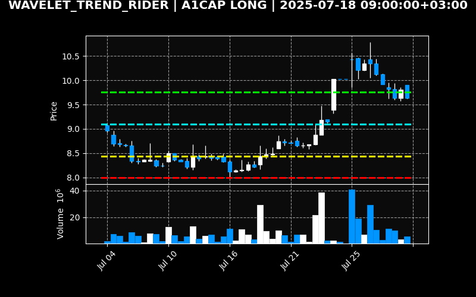

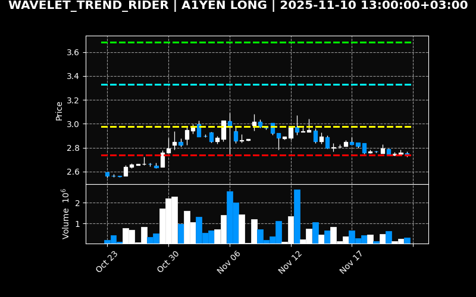

### VCP_BREAKOUT

- n_islem: 57 · Win Rate: 42.11% · Profit Factor: 1.32 · Beklenti: 0.167R · Guven: guvenilir (n>=50)

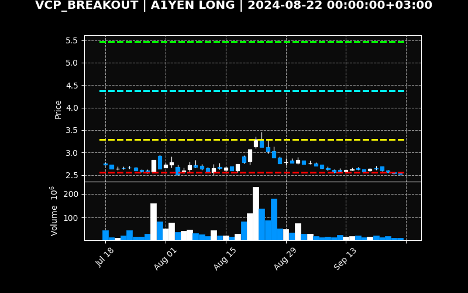

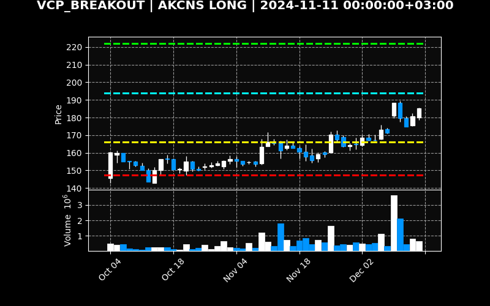

### VOL_BREAKOUT_KESTNER

- n_islem: 32205 · Win Rate: 51.60% · Profit Factor: 0.96 · Beklenti: -0.022R · Guven: guvenilir (n>=50)

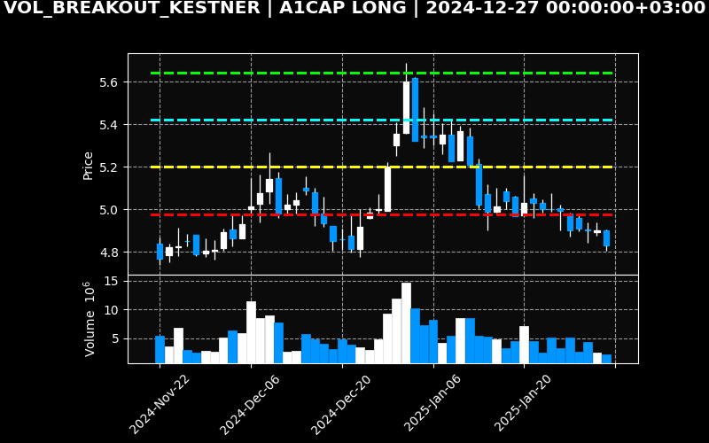

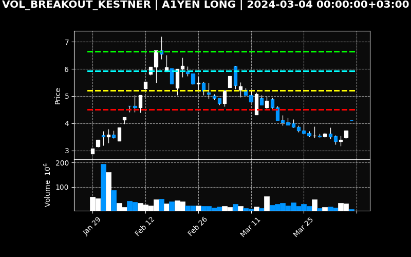

### MOMENTUM_LADDER

- n_islem: 26465 · Win Rate: 51.37% · Profit Factor: 1.02 · Beklenti: 0.021R · Guven: guvenilir (n>=50)

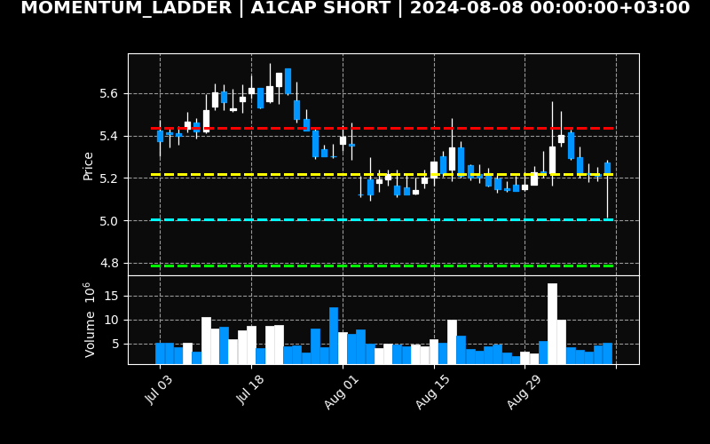

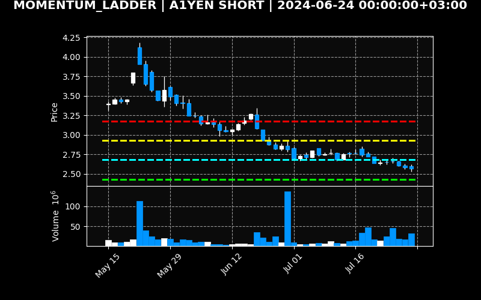

### FAILED_BREAKOUT_REVERSAL

- n_islem: 18953 · Win Rate: 47.85% · Profit Factor: 0.85 · Beklenti: -0.074R · Guven: guvenilir (n>=50)

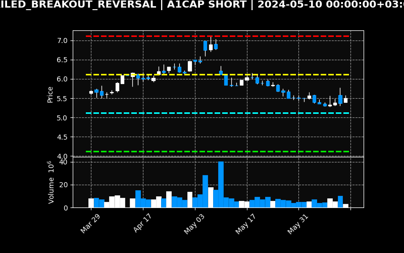

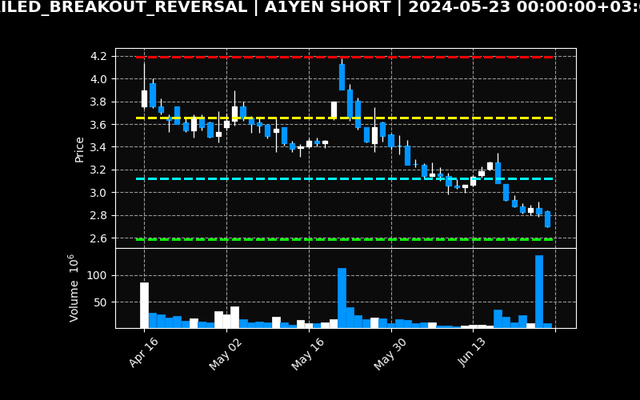

### EXTREME_CLOSE_FADE

- n_islem: 46628 · Win Rate: 47.91% · Profit Factor: 1.00 · Beklenti: 0.023R · Guven: guvenilir (n>=50)

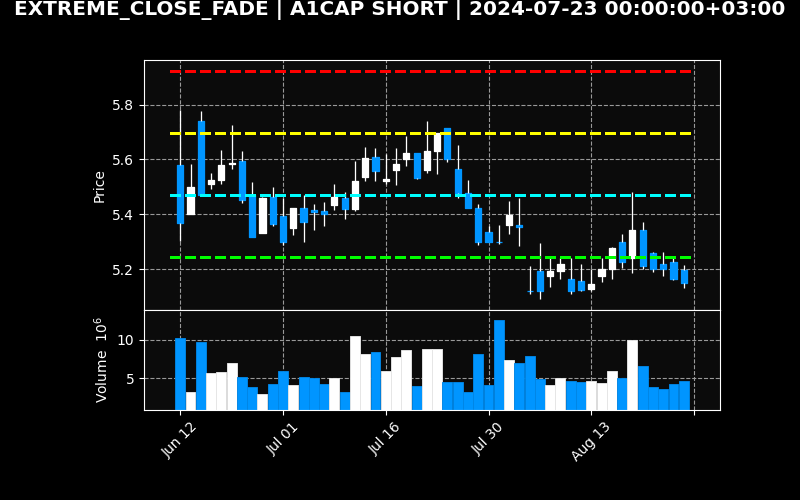

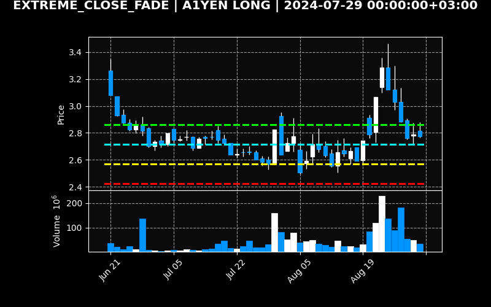

### DOUBLE_RSI_MTF

- n_islem: 502 · Win Rate: 47.21% · Profit Factor: 0.84 · Beklenti: -0.092R · Guven: guvenilir (n>=50)

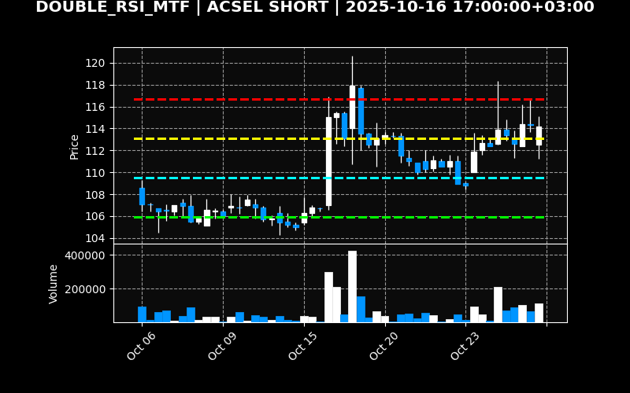

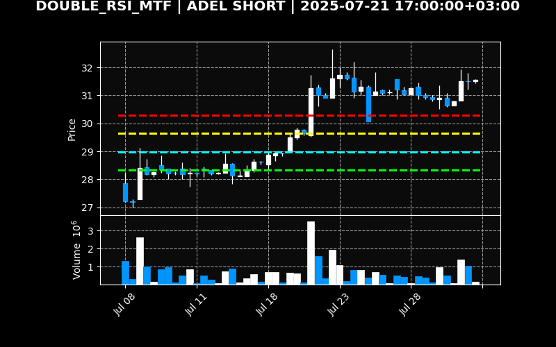

### RSI_MW_PATTERN

- n_islem: 5039 · Win Rate: 49.65% · Profit Factor: 0.99 · Beklenti: -0.009R · Guven: guvenilir (n>=50)

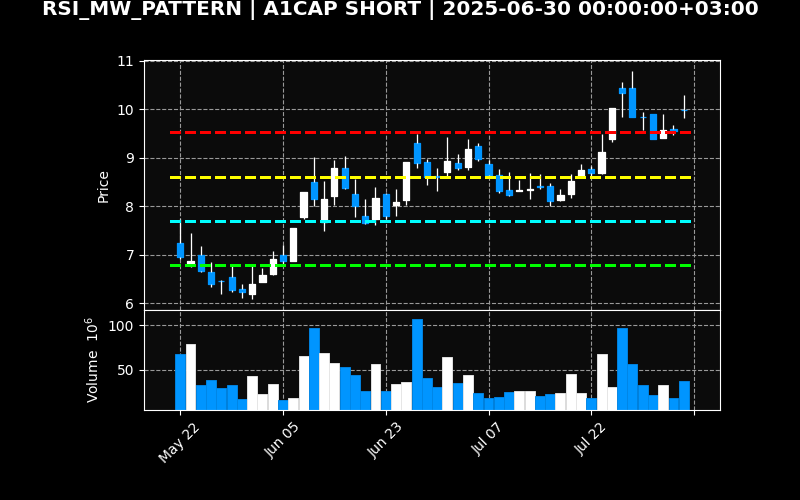

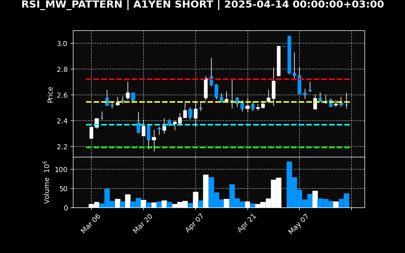

### CPR_REGIME_ROUTER

- n_islem: 30023 · Win Rate: 54.47% · Profit Factor: 1.14 · Beklenti: 0.084R · Guven: guvenilir (n>=50)

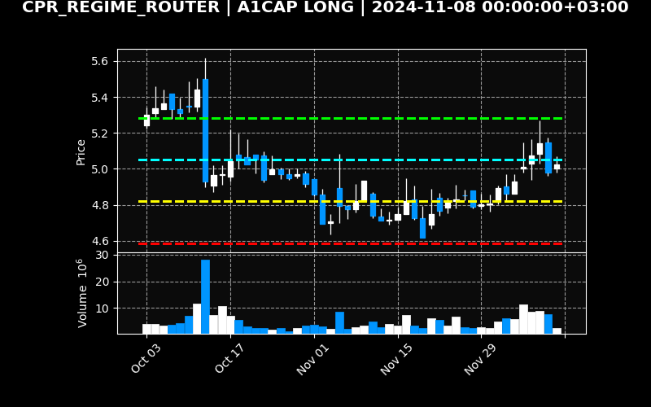

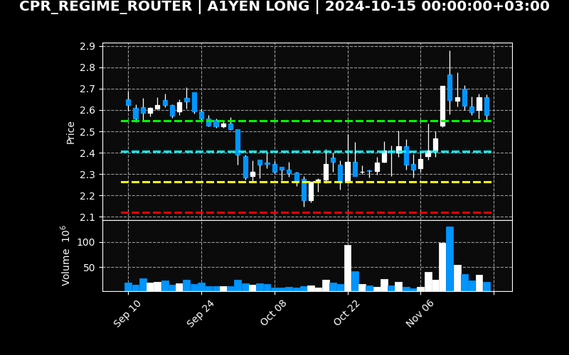

### HALFLIFE_MEAN_REVERSION

- n_islem: 28319 · Win Rate: 28.74% · Profit Factor: 0.91 · Beklenti: -0.175R · Guven: guvenilir (n>=50)

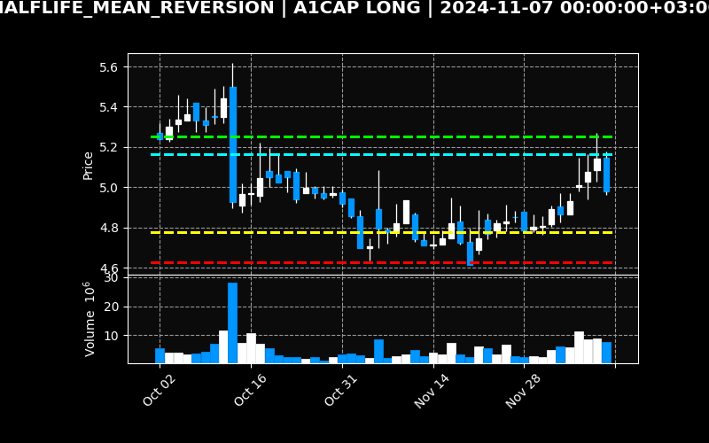

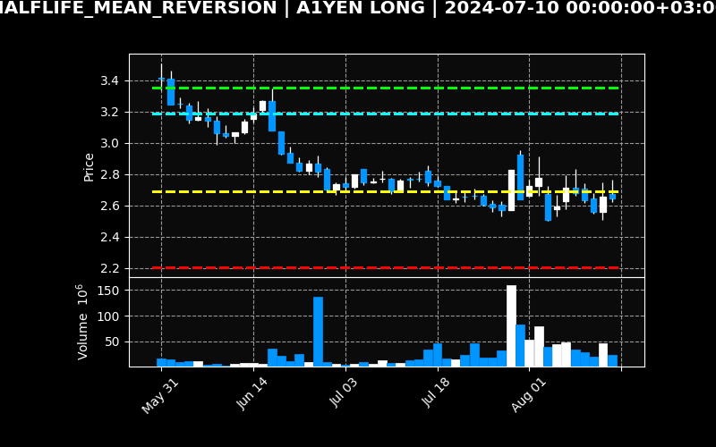

## Ham Veri

Tum sinyaller: `C:\Users\Samet\Desktop\Temel Analiz\bilanco-radar\data\abcd_cache\yeni_10_strateji_sinyaller.csv`
